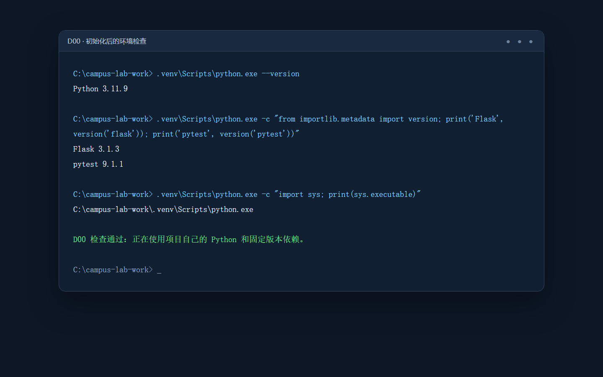
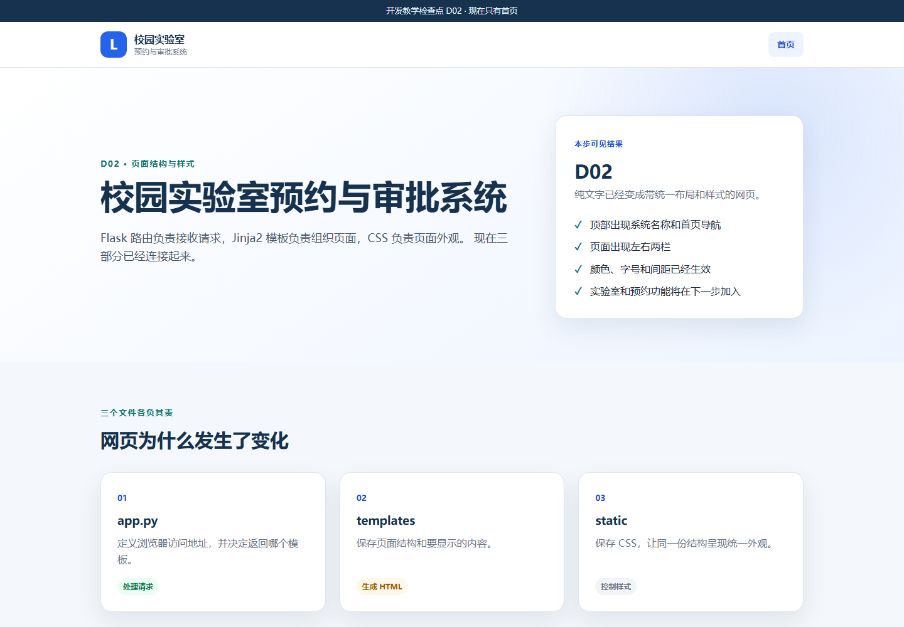
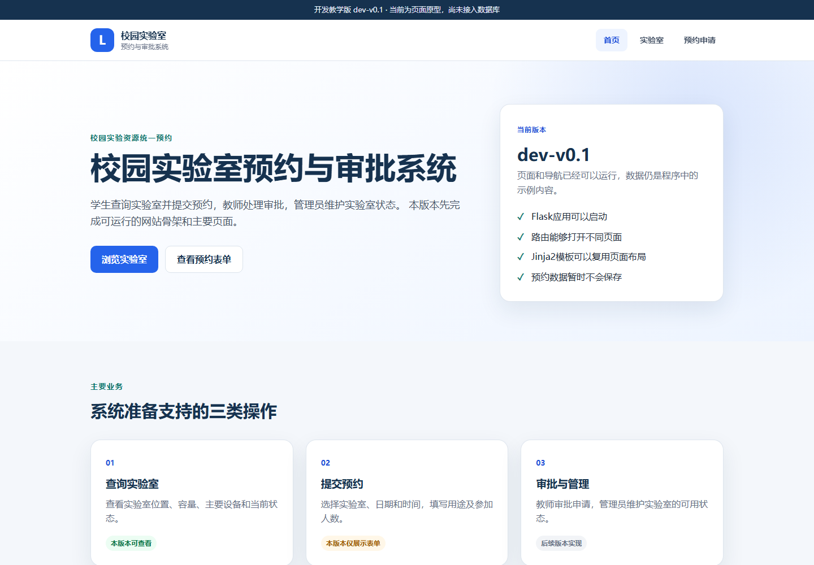
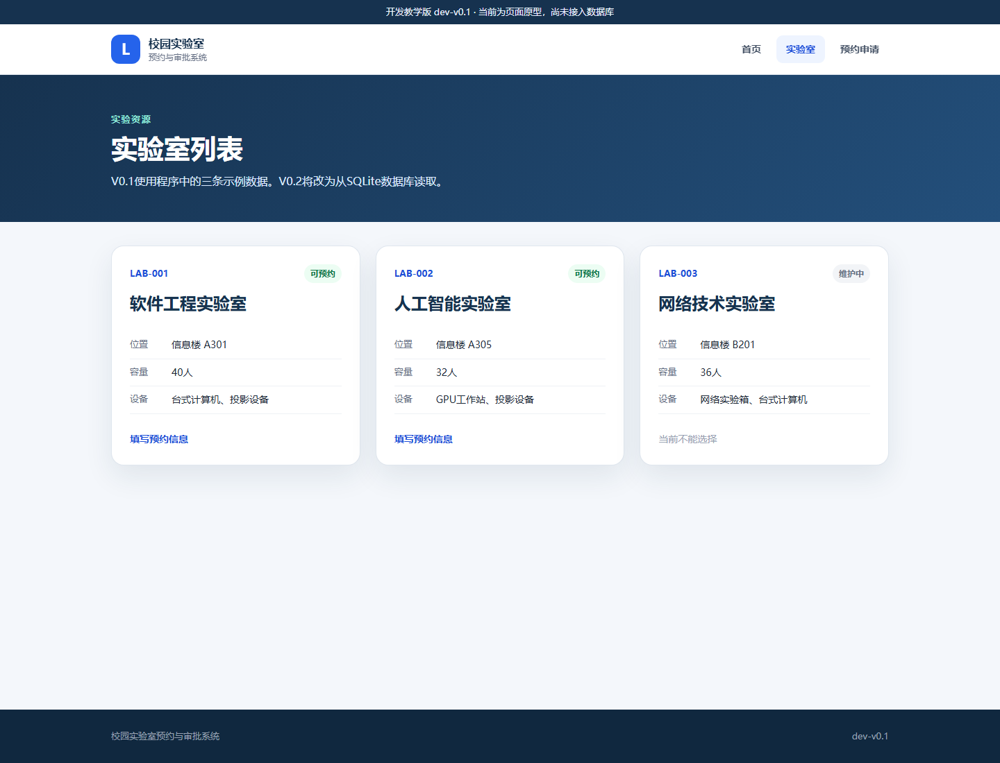
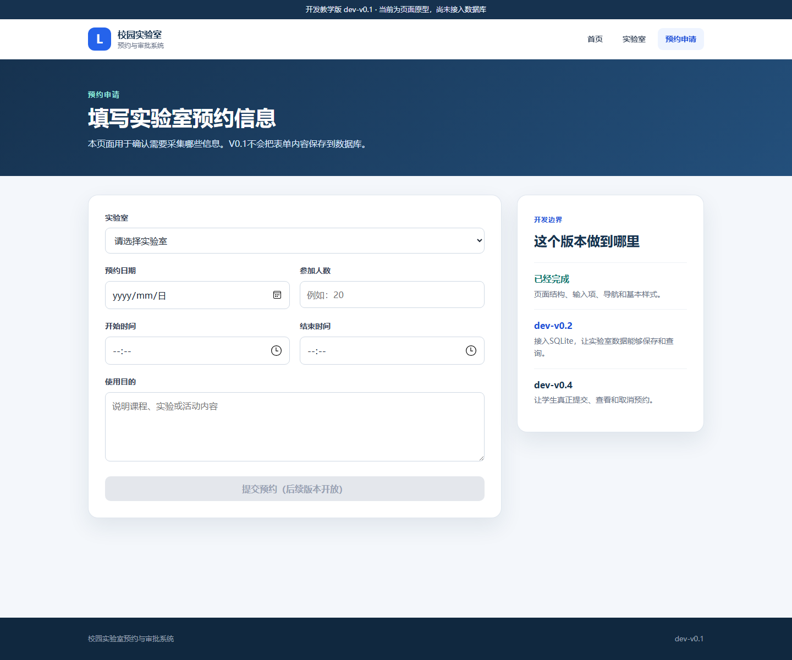

# 第1章　D00—D03：从空文件夹到 V0.1 静态原型

## 1. 本章最终要做到什么

本章从一个空项目文件夹开始，依次得到四种清楚可见的状态：

```text
D00 只有环境，没有程序
  ↓
D01 浏览器能访问第一个 Flask 页面
  ↓
D02 页面使用 Jinja2 模板并具有 CSS 样式
  ↓
D03 出现实验室列表和预约表单，形成 dev-v0.1 静态原型
```

学生不需要自己设计代码。每次只从课程资料中复制指定的完整文件，再启动、观察和解释结果。不要整章一次性复制完成；每完成一步都应启动一次，亲眼看到系统发生变化。

本章预计用时 90—120 分钟。D03 结束时，系统只有页面和示例数据，预约表单还不能保存。这是有意设计的版本边界，不是程序故障。

## 2. 统一文件位置

为了避免“文件到底放在哪里”的问题，本课程统一使用下面两个位置：

- `<课程资料>`：教师发放或从仓库下载的 `campus-lab-development` 文件夹。
- `C:\campus-lab-work`：每位学生自己的项目文件夹。

例如，手册中的源文件：

```text
<课程资料>\教学资源\逐步开发代码\D01_第一个Flask页面\app.py
```

要复制到：

```text
C:\campus-lab-work\app.py
```

除非手册明确写“删除”，否则不要删除已有文件。写“整文件替换”时，打开源文件后使用 `Ctrl+A`、`Ctrl+C`，再打开目标文件使用 `Ctrl+A`、`Ctrl+V`、`Ctrl+S`；不要寻找行号，也不要粘贴到某一段代码中间。

---

# D00　建立 S0 开发起点

## 3. D00 先看懂

### 3.1 起点与终点

- 起点：电脑已安装 Python 3，尚无项目文件夹。
- 终点：`C:\campus-lab-work` 中有项目专用虚拟环境 `.venv`，Flask 和 pytest 已安装。
- 本步不会出现网站，因为 `app.py` 还没有创建。

### 3.2 三个文件分别做什么

| 文件 | 作用 |
|---|---|
| `.gitignore` | 告诉 Git 不要收集虚拟环境、缓存和个人数据库 |
| `requirements.txt` | 准确记录本阶段要安装的第三方库及版本 |
| `初始化开发环境.bat` | 创建 `.venv` 并安装 `requirements.txt` 中的依赖 |

教师讲解重点：Python 是运行程序的基础；虚拟环境把本项目的依赖与电脑中的其他 Python 项目隔离；`requirements.txt` 让不同电脑安装相同版本的软件包。

## 4. D00 逐步操作

### 操作 D00-1　创建学生项目文件夹

1. 打开 Windows 文件资源管理器。
2. 进入 `C:\`。
3. 新建文件夹 `campus-lab-work`。
4. 确认地址栏显示 `C:\campus-lab-work`。

不要在课程资料的 D00 文件夹中直接操作。课程资料要保持只读，后续出错时才能作为恢复来源。

### 操作 D00-2　复制起点文件

打开下面的源文件夹：

```text
<课程资料>\教学资源\逐步开发代码\D00_S0起点
```

把下列三个文件复制到 `C:\campus-lab-work`：

| 操作 | 完整源文件 | 目标文件 |
|---|---|---|
| 新增 | [`.gitignore`](../../教学资源/逐步开发代码/D00_S0起点/.gitignore) | `C:\campus-lab-work\.gitignore` |
| 新增 | [`requirements.txt`](../../教学资源/逐步开发代码/D00_S0起点/requirements.txt) | `C:\campus-lab-work\requirements.txt` |
| 新增 | [`初始化开发环境.bat`](../../教学资源/逐步开发代码/D00_S0起点/初始化开发环境.bat) | `C:\campus-lab-work\初始化开发环境.bat` |

### 操作 D00-3　初始化项目专用环境

1. 在 `C:\campus-lab-work` 中双击 `初始化开发环境.bat`。
2. 保持网络连接，等待脚本创建环境并安装依赖。
3. 看到“环境初始化完成”后按任意键关闭窗口。
4. 回到文件资源管理器，确认项目中新增 `.venv` 文件夹。

### 操作 D00-4　用三条命令核对环境

1. 在 `C:\campus-lab-work` 文件夹空白处单击鼠标右键，选择“在终端中打开”。
2. 依次运行下面三条命令；每输入一条就按一次回车。

```powershell
.venv\Scripts\python.exe --version
.venv\Scripts\python.exe -c "from importlib.metadata import version; print('Flask', version('flask')); print('pytest', version('pytest'))"
.venv\Scripts\python.exe -c "import sys; print(sys.executable)"
```

正确结果应与下图中的关键信息一致。Python 的小版本号可以不同；Flask 应为 3.1.3，pytest 应为 9.1.1，最后一条路径应指向当前项目的 `.venv`。



## 5. D00 出错时怎么处理

- 提示“找不到 Python”：重新安装 Python，并在安装界面勾选 `Add Python to PATH`。
- 安装依赖长时间不动：检查网络，关闭窗口后重新双击脚本。
- 看不到 `.venv`：确认脚本确实位于 `C:\campus-lab-work`，不要在压缩包预览窗口中运行。
- 路径出现异常：确认项目路径是英文且没有空格，即 `C:\campus-lab-work`。

仍无法解决时，删除学生项目中本次创建失败的 `.venv`，重新复制 D00 的三个文件并再次初始化。不要改动课程资料中的 D00 完整恢复包。

D00 完成标志：项目专用 Python 环境已经存在；依赖版本已固定；此时没有网站是正确结果。

---

# D01　第一个 Flask 页面

## 6. D01 先看懂

### 6.1 起点与终点

- 起点：D00，只有环境和依赖。
- 终点：启动本机服务器后，浏览器能访问一个简单页面。
- 本步只解释一个最小过程：浏览器发出请求 → Flask 路由接收请求 → 函数返回 HTML。

### 6.2 本步文件

| 文件 | 本步动作 | 作用 |
|---|---|---|
| `app.py` | 新增 | 创建 Flask 应用、定义首页路由、启动服务器 |
| `VERSION` | 新增 | 记录当前课堂检查点 D01 |
| `启动dev-v0.1.bat` | 新增 | 使用项目自己的 `.venv` 启动系统并打开浏览器 |

完整源代码位于 [D01 完整项目快照](../../教学资源/逐步开发代码/D01_第一个Flask页面/)。其中 `app.py` 已用中文注释标出“应用对象”“路由”“服务器”三个关键位置。

## 7. D01 逐步操作

### 操作 D01-1　复制三个完整文件

打开源文件夹：

```text
<课程资料>\教学资源\逐步开发代码\D01_第一个Flask页面
```

完成下列操作：

| 操作 | 完整源文件 | 目标文件 |
|---|---|---|
| 新增 | [`app.py`](../../教学资源/逐步开发代码/D01_第一个Flask页面/app.py) | `C:\campus-lab-work\app.py` |
| 新增 | [`VERSION`](../../教学资源/逐步开发代码/D01_第一个Flask页面/VERSION) | `C:\campus-lab-work\VERSION` |
| 新增 | [`启动dev-v0.1.bat`](../../教学资源/逐步开发代码/D01_第一个Flask页面/启动dev-v0.1.bat) | `C:\campus-lab-work\启动dev-v0.1.bat` |

不要复制源文件夹中的 `.venv`；课程资料中本来就不提供 `.venv`。

### 操作 D01-2　认识 app.py 的四个组成部分

打开目标文件 `C:\campus-lab-work\app.py`。此时只需要找到下面四个结构，不要求背诵语法：

```python
from flask import Flask             # 1. 使用 Flask
app = Flask(__name__)                # 2. 创建应用

@app.get("/")                       # 3. 把地址 / 交给首页函数
def index():
    return "..."                     # 4. 返回浏览器要显示的内容
```

文件末尾的 `app.run(...)` 会在本机 `127.0.0.1` 的 5000 端口启动开发服务器。`127.0.0.1` 只代表当前电脑，不会把学生的程序发布到互联网。

### 操作 D01-3　启动并核对结果

1. 双击 `C:\campus-lab-work\启动dev-v0.1.bat`。
2. 保持黑色命令窗口打开；关闭它就等于停止服务器。
3. 若浏览器没有自动打开，手动访问 `http://127.0.0.1:5000/`。
4. 页面必须出现“校园实验室预约系统”和“D01 已完成”。


这张页面很简单，但已经包含了一个可运行 Web 应用的最小闭环：服务器启动、地址可访问、请求有响应。

## 8. D01 出错时怎么处理

- 双击后立即关闭：先确认 D00 的 `.venv\Scripts\python.exe` 存在。
- 页面显示“无法访问”：查看黑色窗口是否仍然打开，网址是否为 `http://127.0.0.1:5000/`。
- 提示 `Address already in use`：另一个旧服务器占用了 5000 端口，找到旧黑色窗口并按 `Ctrl+C`。
- 提示 `No module named flask`：重新运行 D00 的初始化脚本。
- 页面仍是旧内容：在浏览器按 `Ctrl+F5` 强制刷新。

无法判断哪里改错时：先保留 `.venv`，再用 [D01 完整项目快照](../../教学资源/逐步开发代码/D01_第一个Flask页面/) 中除 `.venv` 外的全部文件覆盖学生项目，然后重新启动。

D01 完成标志：浏览器可以访问首页；Flask 路由已经工作；现在的 HTML 仍直接写在 Python 字符串中。

---

# D02　Jinja2 首页与 CSS 样式

## 9. D02 先看懂

### 9.1 起点与终点

- 起点：D01 的纯文字页面。
- 终点：页面有统一页头、导航、内容区、页脚、颜色和卡片布局。
- 本步把不同职责分开：`app.py` 处理请求，`templates` 保存页面结构，`static` 保存样式。

### 9.2 本步新增的目录关系

```text
C:\campus-lab-work
├─ app.py
├─ VERSION
├─ static
│  └─ style.css
└─ templates
   ├─ base.html
   └─ index.html
```

`base.html` 是所有页面都可以复用的公共外壳，`index.html` 只写首页内容。`` 表示首页继承公共外壳，`{{ checkpoint }}` 表示由 Python 把数据传给模板。

## 10. D02 逐步操作

### 操作 D02-1　停止 D01 服务器

回到运行 D01 的黑色窗口，按 `Ctrl+C`。看到命令提示符重新出现，或窗口关闭后，再进行文件替换。不要让两个服务器同时占用 5000 端口。

### 操作 D02-2　替换 Python 文件和检查点

源文件夹：

```text
<课程资料>\教学资源\逐步开发代码\D02_Jinja首页与样式
```

| 操作 | 完整源文件 | 目标文件 |
|---|---|---|
| 整文件替换 | [`app.py`](../../教学资源/逐步开发代码/D02_Jinja首页与样式/app.py) | `C:\campus-lab-work\app.py` |
| 整文件替换 | [`VERSION`](../../教学资源/逐步开发代码/D02_Jinja首页与样式/VERSION) | `C:\campus-lab-work\VERSION` |

新的 `app.py` 不再直接返回 HTML 字符串，而是执行：

```python
return render_template("index.html")
```

这表示 Flask 会到 `templates` 文件夹中寻找 `index.html`，处理模板中的数据后再返回浏览器。

### 操作 D02-3　创建模板和静态资源目录

1. 在 `C:\campus-lab-work` 新建文件夹 `templates`。
2. 在 `C:\campus-lab-work` 新建文件夹 `static`。
3. 名称必须为英文，不能写成 `template`、`statics` 或中文。

### 操作 D02-4　复制三个页面文件

| 操作 | 完整源文件 | 目标文件 |
|---|---|---|
| 新增 | [`templates/base.html`](../../教学资源/逐步开发代码/D02_Jinja首页与样式/templates/base.html) | `C:\campus-lab-work\templates\base.html` |
| 新增 | [`templates/index.html`](../../教学资源/逐步开发代码/D02_Jinja首页与样式/templates/index.html) | `C:\campus-lab-work\templates\index.html` |
| 新增 | [`static/style.css`](../../教学资源/逐步开发代码/D02_Jinja首页与样式/static/style.css) | `C:\campus-lab-work\static\style.css` |

`style.css` 较长，不要在手册页面上逐行选择。直接打开课程资料中的完整文件，使用 `Ctrl+A`、`Ctrl+C`，在目标文件中使用 `Ctrl+A`、`Ctrl+V`、`Ctrl+S`。

### 操作 D02-5　重新启动并观察变化

1. 再次双击 `启动dev-v0.1.bat`。
2. 访问 `http://127.0.0.1:5000/`。
3. 如仍看到 D01，按 `Ctrl+F5`。
4. 核对顶部文字为“开发教学检查点 D02”。
5. 核对页面有深蓝色版本条、系统标识、首页导航、左右两栏和三个文件说明卡片。



这次变化不是增加了业务功能，而是建立了后面所有页面都会使用的页面组织方式。教师可以在此处演示：暂时把 `<h1>` 中一个字改掉，保存并刷新；再恢复源文件，让学生理解模板负责内容、CSS 负责外观。

## 11. D02 出错时怎么处理

- 出现 `TemplateNotFound: index.html`：检查文件是否准确位于 `C:\campus-lab-work\templates\index.html`。
- 页面有文字但没有样式：检查 `style.css` 是否准确位于 `static` 文件夹，按 `Ctrl+F5`。
- 页面出现 `BuildError`：很可能复制成了其他步骤的 `base.html`；重新复制 D02 的完整文件。
- 中文乱码：编辑器保存编码应选择 UTF-8。

恢复方法：保留 `.venv`，用 [D02 完整项目快照](../../教学资源/逐步开发代码/D02_Jinja首页与样式/) 中的其他全部文件覆盖学生项目，再重新启动。

D02 完成标志：Flask 已经通过 Jinja2 生成页面；CSS 已经生效；当前仍只有首页。

---

# D03　形成 dev-v0.1 静态原型

## 12. D03 先看懂

### 12.1 起点与终点

- 起点：D02，只有经过设计的首页。
- 终点：出现首页、实验室列表和预约表单三个页面，并有自动测试。
- 正式版本：`dev-v0.1`。

本阶段先用 Python 中的三条示例数据确认页面、导航、字段和业务入口。这样可以先回答“系统大致长什么样、用户要输入什么”，再在 V0.2 接入数据库。原型阶段点击提交按钮不能保存，是已知边界。

### 12.2 本步文件变化

| 文件 | 动作 | 职责 |
|---|---|---|
| `app.py` | 整文件替换 | 加入三条实验室数据和三个页面路由 |
| `VERSION` | 整文件替换 | 从 D02 改为 `dev-v0.1` |
| `templates/base.html` | 整文件替换 | 导航增加“实验室”和“预约申请” |
| `templates/index.html` | 整文件替换 | 首页说明 V0.1 的正式功能边界 |
| `templates/labs.html` | 新增 | 显示三张实验室卡片 |
| `templates/reservation_form.html` | 新增 | 显示预约要采集的字段 |
| `tests/test_app.py` | 新增 | 自动检查三个页面和导航 |
| `运行测试.bat` | 新增 | 使用项目虚拟环境运行测试 |

`static/style.css`、`requirements.txt`、初始化脚本和启动脚本在 D02 已是正确内容，本步不重复替换。

## 13. D03 逐步操作

### 操作 D03-1　停止旧服务器

在 D02 的服务器窗口按 `Ctrl+C`。确认旧服务器停止后再继续。

### 操作 D03-2　替换四个已有文件

源文件夹：

```text
<课程资料>\教学资源\逐步开发代码\D03_V0.1静态原型
```

| 操作 | 完整源文件 | 目标文件 |
|---|---|---|
| 整文件替换 | [`app.py`](../../教学资源/逐步开发代码/D03_V0.1静态原型/app.py) | `C:\campus-lab-work\app.py` |
| 整文件替换 | [`VERSION`](../../教学资源/逐步开发代码/D03_V0.1静态原型/VERSION) | `C:\campus-lab-work\VERSION` |
| 整文件替换 | [`templates/base.html`](../../教学资源/逐步开发代码/D03_V0.1静态原型/templates/base.html) | `C:\campus-lab-work\templates\base.html` |
| 整文件替换 | [`templates/index.html`](../../教学资源/逐步开发代码/D03_V0.1静态原型/templates/index.html) | `C:\campus-lab-work\templates\index.html` |

打开新的 `app.py`，找到 `LABS = [...]`。这三条字典数据只存在于当前运行的 Python 程序中；修改后重启可以变化，但系统没有数据库，也不能保存学生填写的预约。

继续找到三个路由：

```text
/                   → 首页
/labs               → 实验室列表
/reservations/new   → 预约表单
```

### 操作 D03-3　新增两个页面

| 操作 | 完整源文件 | 目标文件 |
|---|---|---|
| 新增 | [`templates/labs.html`](../../教学资源/逐步开发代码/D03_V0.1静态原型/templates/labs.html) | `C:\campus-lab-work\templates\labs.html` |
| 新增 | [`templates/reservation_form.html`](../../教学资源/逐步开发代码/D03_V0.1静态原型/templates/reservation_form.html) | `C:\campus-lab-work\templates\reservation_form.html` |

`labs.html` 使用 Jinja2 的 `for` 循环把三条数据重复生成三张卡片；预约表单中的输入框此时用于确认需求字段，提交按钮故意处于不可用状态。

### 操作 D03-4　新增自动测试

1. 在 `C:\campus-lab-work` 新建文件夹 `tests`。
2. 复制下面两个文件。

| 操作 | 完整源文件 | 目标文件 |
|---|---|---|
| 新增 | [`tests/test_app.py`](../../教学资源/逐步开发代码/D03_V0.1静态原型/tests/test_app.py) | `C:\campus-lab-work\tests\test_app.py` |
| 新增 | [`运行测试.bat`](../../教学资源/逐步开发代码/D03_V0.1静态原型/运行测试.bat) | `C:\campus-lab-work\运行测试.bat` |

测试不是再做一遍开发。它用固定条件自动访问页面，检查状态码、示例数据、表单字段和导航是否仍然存在。

### 操作 D03-5　启动并检查首页

1. 双击 `启动dev-v0.1.bat`。
2. 访问 `http://127.0.0.1:5000/`。
3. 顶部必须显示 `dev-v0.1`，导航必须有“首页、实验室、预约申请”。



### 操作 D03-6　检查实验室列表

1. 点击导航中的“实验室”，或访问 `http://127.0.0.1:5000/labs`。
2. 页面必须显示三张卡片：软件工程实验室、人工智能实验室、网络技术实验室。
3. 前两个状态为“可预约”，第三个状态为“维护中”。



### 操作 D03-7　检查预约表单

1. 点击“填写预约信息”，或访问 `http://127.0.0.1:5000/reservations/new`。
2. 页面应包含实验室、预约日期、开始时间、结束时间、参加人数、使用目的。
3. 页面明确提示 V0.1 不会把表单保存到数据库，按钮显示“提交预约（后续版本开放）”。



### 操作 D03-8　运行自动测试

1. 回到服务器窗口按 `Ctrl+C`，停止系统。
2. 双击 `C:\campus-lab-work\运行测试.bat`。
3. 等待测试结束。
4. 正确结果必须包含：

```text
6 passed
```

如果测试失败，不要只看最后一行。向上找到第一个 `FAILED`，其附近会写出失败的页面或缺少的文字。

## 14. D03 完整结果核对

学生项目中应有下面的受控文件；`.venv` 和运行产生的缓存不列入版本文件：

```text
C:\campus-lab-work
├─ .gitignore
├─ app.py
├─ requirements.txt
├─ VERSION
├─ 初始化开发环境.bat
├─ 启动dev-v0.1.bat
├─ 运行测试.bat
├─ static
│  └─ style.css
├─ templates
│  ├─ base.html
│  ├─ index.html
│  ├─ labs.html
│  └─ reservation_form.html
└─ tests
   └─ test_app.py
```

本步完整恢复包是 [D03_V0.1静态原型](../../教学资源/逐步开发代码/D03_V0.1静态原型/)。该文件夹已经与课程冻结的 `dev-v0.1` 终点逐文件核对一致。

## 15. D03 常见问题与恢复

- 首页能打开，实验室页报错：重新复制 `app.py`、`base.html` 和 `labs.html`，这三个文件必须来自同一个 D03 文件夹。
- 点击“实验室”出现 `BuildError`：仍在使用 D02 的 `app.py`，没有 `lab_list` 路由。
- 页面只显示一条或没有实验室：检查 `app.py` 中的 `LABS` 是否完整复制。
- 表单按钮不能点击：这是 V0.1 的正确结果，保存功能到 V0.4 才形成闭环。
- 测试提示找不到 pytest：重新运行 D00 初始化脚本。
- 测试数量不是 6：检查 `tests\test_app.py` 是否来自 D03。

若多个文件已经混乱，不再逐个猜测。保留个人 `.venv` 后，用 D03 完整恢复包中的全部受控文件覆盖学生项目，再运行测试。

D03 完成标志：三个页面和导航均可访问；三条示例实验室数据可见；6 项测试通过；系统正式到达 `dev-v0.1`，但尚无数据库、登录和真正的预约提交。

## 16. 本章给教师的讲解主线

本章不需要把 Flask 语法讲成编程课。教师只围绕四个变化讲解：

1. D00：可重复的环境是软件能够在不同电脑运行的前提。
2. D01：Web 系统最小过程是“请求—路由—响应”。
3. D02：程序逻辑、页面结构和页面样式应分开管理。
4. D03：软件可以先做界面原型确认范围，再接数据库和真实业务。

学生每完成一次复制，都应立刻运行并看到一个确定结果。不要把 D01—D03 一次性发成“照抄十几个文件”的任务，否则会失去逐步形成系统的体验。
