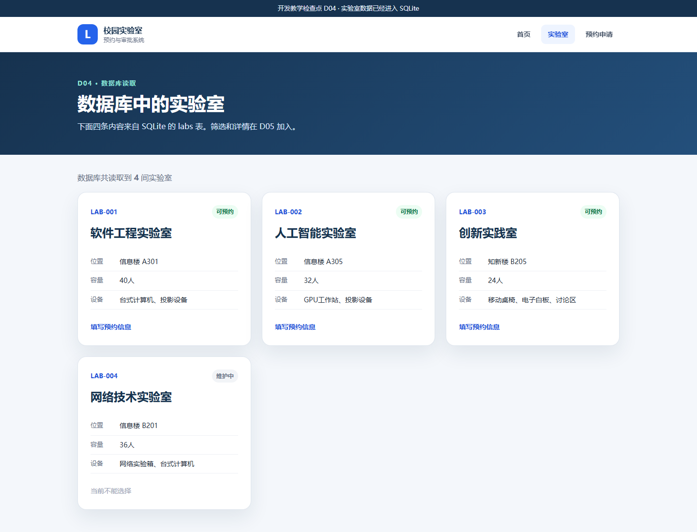
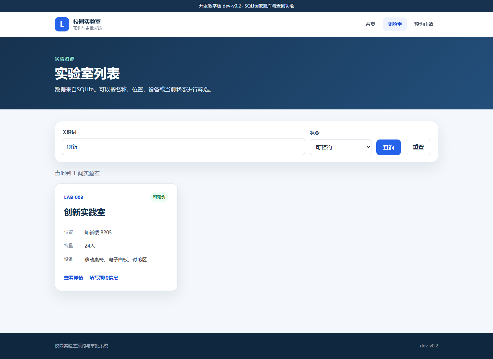
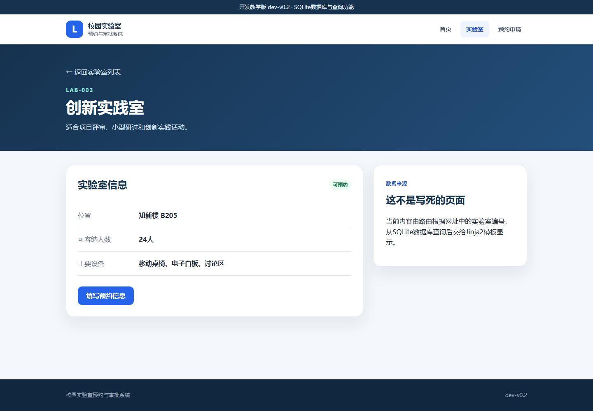

# 第2章　D04—D05：从内存数据到 V0.2 查询与详情

## 1. 本章最终要做到什么

V0.1 的实验室写在 `app.py` 的 Python 列表中。关闭程序不会丢失这几条固定代码，但程序不能长期新增、修改和查询业务数据。本章把实验室迁移到 SQLite，并在数据库基础上加入筛选和详情。

```text
D03 / dev-v0.1
Python 列表 → 模板
        ↓ D04
SQLite → SQLAlchemy 模型 → 基础查询 → 模板
        ↓ D05
SQLite → 条件查询 / 按编号查询 → 列表与详情
```

- D04 只完成一件事：数据库能够保存实验室，页面从数据库读取。
- D05 再完成一件事：用户可以按条件查询并打开某间实验室的详情。
- D05 是正式版本 `dev-v0.2`。

本章预计用时 70—90 分钟。学生仍然不自行编写 SQL 或 Python，只复制完整文件并观察数据来源的变化。

## 2. 本章新概念

| 概念 | 在本项目中的具体含义 |
|---|---|
| SQLite | 把数据保存在项目 `instance/campus_lab.db` 文件中的轻量数据库 |
| 表 | `labs` 表保存所有实验室记录 |
| 模型 | `models.py` 中的 `Lab` 类规定一条实验室数据有哪些字段 |
| ORM | 使用 Python 对象和 `select(Lab)` 操作数据，不要求学生手写 SQL |
| 种子数据 | 数据库第一次为空时自动写入的四间示例实验室 |
| 查询 | 根据全部、关键词、状态或编号从数据库取出需要的数据 |

教师讲解时只需抓住“长期保存、统一结构、按条件取用”三个价值，不展开数据库管理系统的内部原理。

---

# D04　数据库与实验室模型

## 3. D04 先看懂

### 3.1 起点与终点

- 起点：D03 / `dev-v0.1`，三间实验室来自 `app.py` 中的 `LABS` 列表。
- 终点：项目生成 SQLite 文件，四间实验室来自 `labs` 表。
- 可见变化：列表由 3 间变为 4 间，新增“创新实践室”；页面明确显示数据来自 SQLite。

### 3.2 本步最重要的文件

| 文件 | 职责 |
|---|---|
| `requirements.txt` | 新增 `Flask-SQLAlchemy==3.1.1` |
| `models.py` | 定义 `Lab` 模型和 `labs` 表字段 |
| `app.py` | 配置数据库地址、建表、初始化数据、执行查询 |
| `instance/campus_lab.db` | 系统首次启动后自动生成的个人数据库，不从课程资料复制 |

完整恢复包：[D04_数据库与实验室模型](../../教学资源/逐步开发代码/D04_数据库与实验室模型/)。

## 4. D04 逐步操作

### 操作 D04-1　确认 D03 起点并停止服务器

1. 启动当前项目，访问 `http://127.0.0.1:5000/labs`。
2. 确认顶部版本是 `dev-v0.1`，列表有 3 间实验室。
3. 回到服务器窗口按 `Ctrl+C`。

若起点不一致，先用上一章的 D03 完整恢复包恢复，不要带着未知状态继续。

### 操作 D04-2　替换依赖并重新初始化

源文件夹：

```text
<课程资料>\教学资源\逐步开发代码\D04_数据库与实验室模型
```

将 [`requirements.txt`](../../教学资源/逐步开发代码/D04_数据库与实验室模型/requirements.txt) 整文件替换到：

```text
C:\campus-lab-work\requirements.txt
```

然后双击 `初始化开发环境.bat`。脚本会继续使用原来的 `.venv`，只补装新出现的 Flask-SQLAlchemy，不会删除已经安装的 Flask 和 pytest。

### 操作 D04-3　新增数据模型

复制完整文件：

| 操作 | 完整源文件 | 目标文件 |
|---|---|---|
| 新增 | [`models.py`](../../教学资源/逐步开发代码/D04_数据库与实验室模型/models.py) | `C:\campus-lab-work\models.py` |

打开 `models.py`，只识别下面的对应关系：

```text
Lab 类                    → labs 表
一个 Lab 对象             → 表中的一行
id、name、location 等属性 → 表中的列
primary_key=True          → 每条记录的唯一编号
nullable=False            → 该字段不能为空
```

`is_available` 是一个便于页面使用的属性：当 `status` 为“可预约”时返回真。

### 操作 D04-4　替换数据库版程序和页面

完成下列整文件操作：

| 操作 | 完整源文件 | 目标文件 |
|---|---|---|
| 整文件替换 | [`app.py`](../../教学资源/逐步开发代码/D04_数据库与实验室模型/app.py) | `C:\campus-lab-work\app.py` |
| 整文件替换 | [`VERSION`](../../教学资源/逐步开发代码/D04_数据库与实验室模型/VERSION) | `C:\campus-lab-work\VERSION` |
| 整文件替换 | [`static/style.css`](../../教学资源/逐步开发代码/D04_数据库与实验室模型/static/style.css) | `C:\campus-lab-work\static\style.css` |
| 整文件替换 | [`templates/base.html`](../../教学资源/逐步开发代码/D04_数据库与实验室模型/templates/base.html) | `C:\campus-lab-work\templates\base.html` |
| 整文件替换 | [`templates/index.html`](../../教学资源/逐步开发代码/D04_数据库与实验室模型/templates/index.html) | `C:\campus-lab-work\templates\index.html` |
| 整文件替换 | [`templates/labs.html`](../../教学资源/逐步开发代码/D04_数据库与实验室模型/templates/labs.html) | `C:\campus-lab-work\templates\labs.html` |
| 整文件替换 | [`templates/reservation_form.html`](../../教学资源/逐步开发代码/D04_数据库与实验室模型/templates/reservation_form.html) | `C:\campus-lab-work\templates\reservation_form.html` |
| 整文件替换 | [`tests/test_app.py`](../../教学资源/逐步开发代码/D04_数据库与实验室模型/tests/test_app.py) | `C:\campus-lab-work\tests\test_app.py` |

新的 `app.py` 中有四个连续动作：

```text
指定 SQLite 文件位置
  → db.init_app(app) 连接数据库
  → db.create_all() 创建不存在的表
  → seed_labs() 在空表中写入四条种子数据
```

列表路由中的 `select(Lab).order_by(Lab.id)` 表示从 `labs` 表读取全部实验室并按编号排列。

### 操作 D04-5　统一启动脚本名称

从本步开始，后续版本统一使用 `启动系统.bat`：

| 操作 | 源文件 | 目标 |
|---|---|---|
| 删除 | 无 | 删除 `C:\campus-lab-work\启动dev-v0.1.bat` |
| 新增 | [`启动系统.bat`](../../教学资源/逐步开发代码/D04_数据库与实验室模型/启动系统.bat) | `C:\campus-lab-work\启动系统.bat` |

这不是功能变化，只是让后续所有版本使用同一个启动文件名。

### 操作 D04-6　首次启动并找到数据库文件

1. 双击 `启动系统.bat`。
2. 浏览器打开后先访问 `http://127.0.0.1:5000/`，顶部应显示 D04。
3. 回到文件资源管理器，打开 `C:\campus-lab-work\instance`。
4. 确认其中自动出现 `campus_lab.db`。

不要双击 `.db` 文件，也不要用记事本编辑它。它由程序管理。

### 操作 D04-7　核对数据库实验室列表

访问 `http://127.0.0.1:5000/labs`，检查：

- 页面显示“数据库共读取到 4 间实验室”；
- 有软件工程实验室、人工智能实验室、创新实践室、网络技术实验室；
- 网络技术实验室为“维护中”；
- 页面还没有查询框和详情按钮，这是 D04 的正确边界。



### 操作 D04-8　运行 D04 测试

停止服务器，双击 `运行测试.bat`。正确结果为：

```text
7 passed
```

测试使用临时数据库，不会改动学生的 `instance/campus_lab.db`。

## 5. D04 出错时怎么处理

- `No module named flask_sqlalchemy`：没有在替换依赖后重新运行初始化脚本。
- `unable to open database file`：项目文件夹无写权限；确认项目位于 `C:\campus-lab-work`。
- 页面仍只有 3 间实验室：仍在运行 D03 的旧服务器；停止后重新启动。
- `instance` 中没有数据库：先确认网页确实由 D04 的 `app.py` 启动。
- 修改种子列表后页面不变化：种子数据只在表为空时写入；课堂上不要靠改列表修改已有数据库。

恢复时保留 `.venv`，可删除学生项目中本步生成的 `instance` 文件夹，再用 D04 完整恢复包覆盖其他受控文件并重新启动。删除 `instance` 会清空个人数据；目前只有示例数据，因此 D04 阶段可以这样恢复。

D04 完成标志：SQLite 文件已经生成；`Lab` 模型与 `labs` 表已经建立；页面通过查询显示 4 间实验室。

---

# D05　查询与实验室详情

## 6. D05 先看懂

### 6.1 起点与终点

- 起点：D04，能从数据库读取全部实验室。
- 终点：能按关键词和状态筛选，并能根据网址中的编号打开详情。
- 正式版本：`dev-v0.2`。

D05 不改变 `Lab` 表的结构，也不重建数据库。它在已有数据上增加两种查询：

```text
列表查询：keyword + status → 0 到多间实验室
详情查询：lab_id          → 1 间实验室或 404
```

## 7. D05 逐步操作

### 操作 D05-1　停止 D04 并保留数据库

在服务器窗口按 `Ctrl+C`。不要删除 `instance/campus_lab.db`，因为 D05 要继续使用 D04 创建的数据。

### 操作 D05-2　替换查询版程序和页面

源文件夹：

```text
<课程资料>\教学资源\逐步开发代码\D05_V0.2查询与详情
```

| 操作 | 完整源文件 | 目标文件 |
|---|---|---|
| 整文件替换 | [`app.py`](../../教学资源/逐步开发代码/D05_V0.2查询与详情/app.py) | `C:\campus-lab-work\app.py` |
| 整文件替换 | [`VERSION`](../../教学资源/逐步开发代码/D05_V0.2查询与详情/VERSION) | `C:\campus-lab-work\VERSION` |
| 整文件替换 | [`templates/base.html`](../../教学资源/逐步开发代码/D05_V0.2查询与详情/templates/base.html) | `C:\campus-lab-work\templates\base.html` |
| 整文件替换 | [`templates/index.html`](../../教学资源/逐步开发代码/D05_V0.2查询与详情/templates/index.html) | `C:\campus-lab-work\templates\index.html` |
| 整文件替换 | [`templates/labs.html`](../../教学资源/逐步开发代码/D05_V0.2查询与详情/templates/labs.html) | `C:\campus-lab-work\templates\labs.html` |
| 整文件替换 | [`templates/reservation_form.html`](../../教学资源/逐步开发代码/D05_V0.2查询与详情/templates/reservation_form.html) | `C:\campus-lab-work\templates\reservation_form.html` |
| 整文件替换 | [`tests/test_app.py`](../../教学资源/逐步开发代码/D05_V0.2查询与详情/tests/test_app.py) | `C:\campus-lab-work\tests\test_app.py` |
| 新增 | [`templates/lab_detail.html`](../../教学资源/逐步开发代码/D05_V0.2查询与详情/templates/lab_detail.html) | `C:\campus-lab-work\templates\lab_detail.html` |

`models.py`、数据库和样式在 D04 已经正确，本步不替换。

### 操作 D05-3　认识条件查询

在 `app.py` 的 `lab_list()` 中，浏览器提交的内容先由下面两句取得：

```python
keyword = request.args.get("keyword", "").strip()
status = request.args.get("status", "").strip()
```

程序再逐步给 `select(Lab)` 增加条件。关键词会在名称、位置和设备中匹配；状态只接受“可预约”或“维护中”。最后执行查询并把结果交给 `labs.html`。

此处不要求学生记住 `where`、`or_` 的语法，只需理解“页面输入成为查询条件，数据库返回符合条件的记录”。

### 操作 D05-4　启动并完成一次组合筛选

1. 双击 `启动系统.bat`。
2. 打开 `http://127.0.0.1:5000/labs`。
3. 关键词输入 `创新`。
4. 状态选择 `可预约`。
5. 点击“查询”。
6. 页面应只剩 1 间“创新实践室”，地址栏应出现 `keyword` 和 `status` 参数。



再点击“重置”，四间实验室应重新出现。

### 操作 D05-5　打开数据库详情

1. 在创新实践室卡片中点击“查看详情”。
2. 地址应变为 `http://127.0.0.1:5000/labs/3`。
3. 页面应显示 LAB-003、知新楼 B205、24 人、主要设备和说明文字。



教师可将地址最后的 `3` 改成 `2`，让学生观察页面变成人工智能实验室；再改成 `999`，观察不存在的编号返回 404。由此说明“同一个模板 + 不同数据库记录”可以生成不同详情页。

### 操作 D05-6　运行正式版本测试

停止服务器，双击 `运行测试.bat`。正确结果为：

```text
10 passed
```

测试增加了筛选结果、详情数据和不存在编号 404 的检查。

## 8. D05 完整结果核对

```text
C:\campus-lab-work
├─ app.py
├─ models.py
├─ requirements.txt
├─ VERSION                         dev-v0.2
├─ instance
│  └─ campus_lab.db               个人运行数据，不提交版本库
├─ static
│  └─ style.css
├─ templates
│  ├─ base.html
│  ├─ index.html
│  ├─ labs.html
│  ├─ lab_detail.html
│  └─ reservation_form.html
├─ tests
│  └─ test_app.py
├─ 初始化开发环境.bat
├─ 启动系统.bat
└─ 运行测试.bat
```

本步完整恢复包：[D05_V0.2查询与详情](../../教学资源/逐步开发代码/D05_V0.2查询与详情/)。该快照与课程冻结的 `dev-v0.2` 终点逐文件一致。

## 9. D05 常见问题与恢复

- 查询总是显示全部：确认点击了“查询”，并确认 `app.py` 来自 D05。
- 点击详情出现 `TemplateNotFound`：没有把 `lab_detail.html` 放入 `templates`。
- 点击详情出现 `BuildError`：`app.py`、`labs.html` 或 `base.html` 混用了 D04 文件，统一复制 D05 版本。
- 列表数据异常或重复：正常的 `seed_labs()` 只在空表写入；如个人数据库曾被手工修改，可停止系统后删除 `instance`，让程序重建。
- 测试失败但网页正常：先检查测试文件是否已替换为 D05，测试数量应为 10。

D05 完成标志：数据保存在 SQLite；列表支持关键词与状态组合筛选；详情按实验室编号查询；10 项测试通过；系统到达正式版本 `dev-v0.2`。

## 10. 本章给教师的讲解主线

1. V0.1 的列表是假数据原型，适合确认页面，不适合真实业务。
2. D04 用模型规定数据结构，用 SQLite 保存，用查询读取。
3. D05 把用户输入变成查询条件，并用一个详情模板显示不同记录。
4. 数据库只是本章的数据层；登录、预约、审批仍在后续版本逐步增加。
