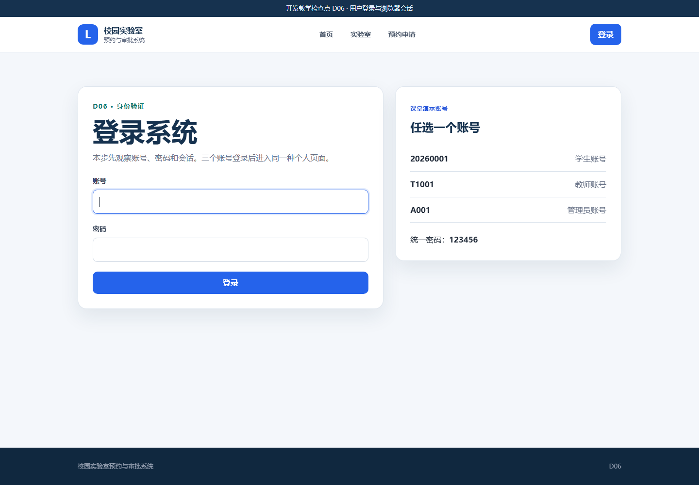
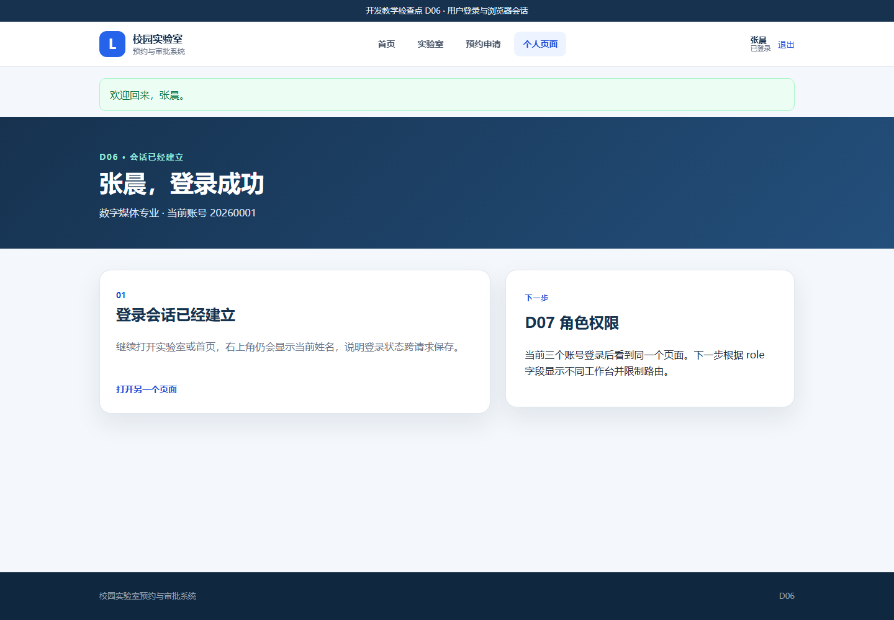
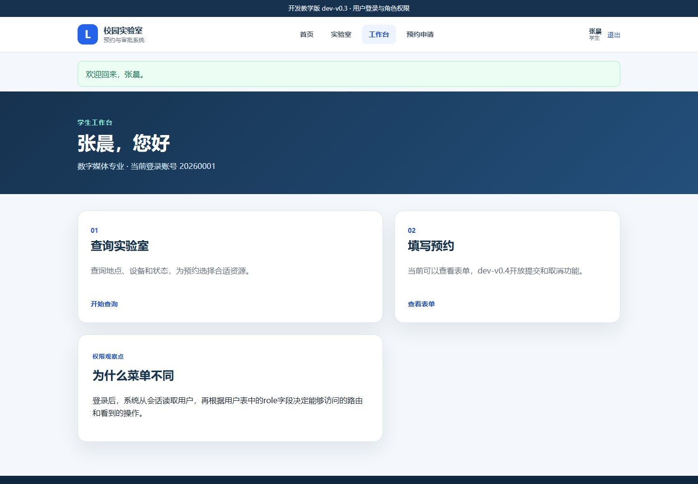
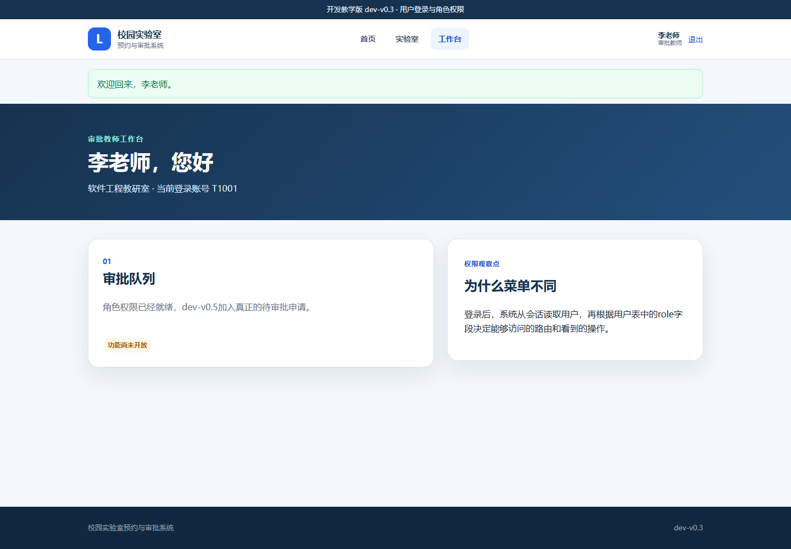

# 实验3　D06—D07：从登录会话到 V0.3 角色权限

| 项目 | 内容 |
|---|---|
| 建议用时 | 70—90 分钟 |
| 开发起点 | `dev-v0.2` 查询与详情 |
| 开发终点 | `dev-v0.3` 角色与权限 |
| 验收证据 | 登录与退出、3 种角色工作台、越权检查、14 项自动测试 |

## 3.1 实验目标与成果

V0.2 能查询实验室，但系统不知道正在操作的人是谁。本实验分两次解决身份问题：

```text
D06 身份认证：账号和密码正确吗？当前是谁？
  ↓
D07 权限控制：当前角色能看什么、能访问什么？
```

- D06 先实现用户表、密码哈希、登录、会话和退出，三个账号登录后进入同一种个人页面。
- D07 再按 `role` 分为学生、审批教师和实验室管理员，形成不同工作台和路由权限。
- D07 是正式版本 `dev-v0.3`。

关键不是记住 Session 的代码，而是通过三个账号亲手观察“认证”和“授权”不是同一件事。

## 3.2 实验账号与角色

| 账号 | 姓名 | 角色 | 密码 |
|---|---|---|---|
| `20260001` | 张晨 | 学生 | `123456` |
| `T1001` | 李老师 | 审批教师 | `123456` |
| `A001` | 王老师 | 实验室管理员 | `123456` |

这些账号只用于本机课堂演示。项目通过 `set_password()` 把密码转换为哈希后保存，数据库中不会直接出现 `123456`。

---

## 3.3 D06：用户登录与会话

### 3.3.1 任务说明

#### （1）起点与终点

- 起点：D05 / `dev-v0.2`，任何访问者看到相同页面。
- 终点：账号密码正确时建立会话；跨页面仍能识别姓名；退出后会话清除。
- 本步故意不按角色分菜单，以便单独观察“登录”本身。

#### （2）登录会话的五个连续动作

```text
提交账号和密码
  → 按 username 查询 User
  → check_password() 比较密码哈希
  → session["user_id"] 保存用户编号
  → 每次请求根据 user_id 得到 g.user
```

浏览器会话中只保存经过签名保护的用户编号，不保存明文密码，也不把整个用户对象发送给浏览器。

完整恢复包：[D06_用户登录与会话](../../教学资源/逐步开发代码/D06_用户登录与会话/)。

### 3.3.2 操作步骤

#### 操作 D06-1　确认 V0.2 起点并停止服务器

1. 启动系统，确认顶部显示 `dev-v0.2`。
2. 访问实验室列表，确认筛选和详情仍可使用。
3. 在服务器窗口按 `Ctrl+C`。
4. 保留 `instance/campus_lab.db`；D06 会在同一数据库中新增 users 表。

#### 操作 D06-2　替换 Python 文件

源文件夹：

```text
<课程资料>\教学资源\逐步开发代码\D06_用户登录与会话
```

| 操作 | 完整源文件 | 目标文件 |
|---|---|---|
| 整文件替换 | [`models.py`](../../教学资源/逐步开发代码/D06_用户登录与会话/models.py) | `D:\campus-lab-work\models.py` |
| 整文件替换 | [`app.py`](../../教学资源/逐步开发代码/D06_用户登录与会话/app.py) | `D:\campus-lab-work\app.py` |
| 整文件替换 | [`VERSION`](../../教学资源/逐步开发代码/D06_用户登录与会话/VERSION) | `D:\campus-lab-work\VERSION` |

在新的 `models.py` 中，`Lab` 仍然存在，前面功能没有丢失；它的上方新增 `User`。首次启动时 `db.create_all()` 只创建缺少的 users 表，不删除 labs 表和已有实验室。

在 `app.py` 中找到三个首次出现的位置：

- `SECRET_KEY`：对浏览器会话进行签名保护；
- `login()`：处理 GET 登录页面和 POST 登录提交；
- `load_logged_in_user()`：每次请求从会话恢复当前用户。

#### 操作 D06-3　替换页面和样式

| 操作 | 完整源文件 | 目标文件 |
|---|---|---|
| 整文件替换 | [`static/style.css`](../../教学资源/逐步开发代码/D06_用户登录与会话/static/style.css) | `D:\campus-lab-work\static\style.css` |
| 整文件替换 | [`templates/base.html`](../../教学资源/逐步开发代码/D06_用户登录与会话/templates/base.html) | `D:\campus-lab-work\templates\base.html` |
| 整文件替换 | [`templates/index.html`](../../教学资源/逐步开发代码/D06_用户登录与会话/templates/index.html) | `D:\campus-lab-work\templates\index.html` |
| 整文件替换 | [`templates/reservation_form.html`](../../教学资源/逐步开发代码/D06_用户登录与会话/templates/reservation_form.html) | `D:\campus-lab-work\templates\reservation_form.html` |
| 新增 | [`templates/login.html`](../../教学资源/逐步开发代码/D06_用户登录与会话/templates/login.html) | `D:\campus-lab-work\templates\login.html` |
| 新增 | [`templates/dashboard.html`](../../教学资源/逐步开发代码/D06_用户登录与会话/templates/dashboard.html) | `D:\campus-lab-work\templates\dashboard.html` |
| 整文件替换 | [`tests/test_app.py`](../../教学资源/逐步开发代码/D06_用户登录与会话/tests/test_app.py) | `D:\campus-lab-work\tests\test_app.py` |

`base.html` 用 `` 判断当前是否登录：未登录显示“登录”，已登录显示姓名、个人页面和“退出”。这属于界面显示；真正的访问保护仍由 Python 路由上的 `@login_required` 执行。

#### 操作 D06-4　启动并查看登录页

1. 双击 `启动系统.bat`。
2. 首页顶部应显示 D06，右上角出现“登录”。
3. 点击“登录”，或访问 `http://127.0.0.1:5000/login`。
4. 页面应显示三个演示账号和统一密码。



*图 3-1　D06 登录页*

#### 操作 D06-5　完成一次登录会话

1. 账号输入 `20260001`。
2. 密码输入 `123456`。
3. 点击“登录”。
4. 页面应显示“欢迎回来，张晨”和“张晨，登录成功”。
5. 点击“实验室”；右上角仍显示张晨，说明会话跨页面保持。
6. 再点击“个人页面”，回到个人页。



*图 3-2　D06 登录成功后的工作台*

#### 操作 D06-6　验证错误密码和退出

1. 点击右上角“退出”。
2. 再次进入登录页，账号仍输入 `20260001`，密码故意输入 `111111`。
3. 页面应提示“账号或密码错误”，不能进入个人页。
4. 改用正确密码登录，再点击退出。
5. 直接访问 `http://127.0.0.1:5000/dashboard`，系统应把未登录用户送回登录页并提示先登录。

#### 操作 D06-7　运行测试

停止服务器，双击 `运行测试.bat`。正确结果为：

```text
9 passed
```

### 3.3.3 故障排查与完成检查

- 正确账号仍提示错误：如果旧数据库曾被改动，停止服务器，把 `instance` 重命名为 `instance-old-D06` 后再启动，让演示用户重新生成。
- 登录后马上又变成未登录：检查 `app.py` 的 `SECRET_KEY` 是否完整复制，浏览器是否禁用了 Cookie。
- `no such table: users`：停止旧服务器，用 D06 的 `app.py` 重新启动；正常启动会自动建表。
- 登录页面没有样式：重新复制 D06 的 `style.css`。
- 个人页报 `TemplateNotFound`：`dashboard.html` 没有放入 `templates`。

D06 完成标志：正确密码能登录；错误密码被拒绝；姓名跨页面保持；退出后受保护的个人页不能访问。此时三个账号仍看到同一种个人页面。

---

## 3.4 D07：三角色与访问权限

### 3.4.1 任务说明

#### （1）起点与终点

- 起点：D06，系统知道当前用户，但还没有按角色限制功能。
- 终点：三个角色看到不同菜单和工作台；学生预约页只允许学生访问。
- 正式版本：`dev-v0.3`。

本步同时使用两层控制：

| 控制位置 | 作用 | 能否单独保证安全 |
|---|---|---|
| Jinja2 模板中的角色判断 | 不显示不属于当前角色的菜单 | 不能，用户仍可能手工输入网址 |
| Python 的 `@role_required(...)` | 在服务器端检查角色，不符合就返回 403 | 能，是实际权限边界 |

应特别注意：隐藏按钮只能改善用户体验，服务器端权限检查才真正保护系统。

### 3.4.2 操作步骤

#### 操作 D07-1　保留用户数据库并停止 D06

停止服务器，不删除 `instance/campus_lab.db`。User 模型在 D06 已完成，本步继续使用同一批账号。

#### 操作 D07-2　替换角色权限版文件

源文件夹：

```text
<课程资料>\教学资源\逐步开发代码\D07_V0.3角色与权限
```

| 操作 | 完整源文件 | 目标文件 |
|---|---|---|
| 整文件替换 | [`app.py`](../../教学资源/逐步开发代码/D07_V0.3角色与权限/app.py) | `D:\campus-lab-work\app.py` |
| 整文件替换 | [`VERSION`](../../教学资源/逐步开发代码/D07_V0.3角色与权限/VERSION) | `D:\campus-lab-work\VERSION` |
| 整文件替换 | [`templates/base.html`](../../教学资源/逐步开发代码/D07_V0.3角色与权限/templates/base.html) | `D:\campus-lab-work\templates\base.html` |
| 整文件替换 | [`templates/index.html`](../../教学资源/逐步开发代码/D07_V0.3角色与权限/templates/index.html) | `D:\campus-lab-work\templates\index.html` |
| 整文件替换 | [`templates/login.html`](../../教学资源/逐步开发代码/D07_V0.3角色与权限/templates/login.html) | `D:\campus-lab-work\templates\login.html` |
| 整文件替换 | [`templates/dashboard.html`](../../教学资源/逐步开发代码/D07_V0.3角色与权限/templates/dashboard.html) | `D:\campus-lab-work\templates\dashboard.html` |
| 整文件替换 | [`templates/reservation_form.html`](../../教学资源/逐步开发代码/D07_V0.3角色与权限/templates/reservation_form.html) | `D:\campus-lab-work\templates\reservation_form.html` |
| 整文件替换 | [`tests/test_app.py`](../../教学资源/逐步开发代码/D07_V0.3角色与权限/tests/test_app.py) | `D:\campus-lab-work\tests\test_app.py` |

`models.py` 和 `style.css` 在 D06 已经是本版本需要的内容，不替换。

新的 `app.py` 增加 `role_required(*roles)`。预约表单路由上方出现：

```python
@role_required("student")
```

这表示“先要求登录，再要求当前用户角色必须为 student”。

#### 操作 D07-3　观察学生工作台

1. 启动系统并登录 `20260001 / 123456`。
2. 工作台应显示“查询实验室”和“填写预约”。
3. 顶部菜单应包含“预约申请”。



*图 3-3　D07 学生工作台*

#### 操作 D07-4　观察审批教师工作台

1. 点击退出。
2. 登录 `T1001 / 123456`。
3. 工作台显示“审批队列”，并提示功能将在 V0.5 实现。
4. 顶部不应出现“预约申请”。



*图 3-4　D07 审批教师工作台*

#### 操作 D07-5　用手工网址验证服务器权限

保持审批教师登录，直接在地址栏输入：

```text
http://127.0.0.1:5000/reservations/new
```

页面应返回 `403 Forbidden`。这说明即使用户绕过菜单手工输入网址，服务器仍会拒绝越权访问。友好的 403 页面要到 D14 加入，目前看到浏览器默认错误页是正确结果。

#### 操作 D07-6　观察管理员工作台

1. 点击浏览器“后退”回到工作台并退出；如后退后仍是 403，直接访问首页再退出。
2. 登录 `A001 / 123456`。
3. 工作台显示“实验室维护”，但正式维护入口尚未开放。
4. 顶部同样不显示“预约申请”。


*图 3-5　D07 管理员工作台*

#### 操作 D07-7　运行正式版本测试

停止服务器，双击 `运行测试.bat`。正确结果为：

```text
14 passed
```

### 3.4.3 结果验收与关键文件核对

```text
D:\campus-lab-work
├─ app.py
├─ models.py                       User + Lab
├─ requirements.txt
├─ VERSION                         dev-v0.3
├─ instance\campus_lab.db          labs + users
├─ static\style.css
├─ templates
│  ├─ base.html
│  ├─ index.html
│  ├─ labs.html
│  ├─ lab_detail.html
│  ├─ reservation_form.html
│  ├─ login.html
│  └─ dashboard.html
└─ tests\test_app.py
```

本步完整恢复包：[D07_V0.3角色与权限](../../教学资源/逐步开发代码/D07_V0.3角色与权限/)。该快照与冻结的 `dev-v0.3` 终点逐文件一致。

### 3.4.4 故障排查与恢复

- 三个账号仍看到相同页面：`dashboard.html` 或 `app.py` 仍是 D06，统一替换 D07 文件。
- 教师能打开预约页：没有替换 D07 的 `app.py`，或旧服务器未停止。
- 学生也收到 403：检查数据库中的演示账号是否被改动；需要重建时先停止程序，把 `instance` 重命名为 `instance-old-D07`，再重新启动。
- 退出按钮报错：`base.html` 与 `app.py` 必须来自同一步。
- 看到 403 不知道如何返回：浏览器后退或直接输入首页地址；D14 才加入友好返回按钮。

D07 完成标志：三个账号分别出现学生、审批教师、管理员工作台；审批教师不能访问学生预约页；14 项测试通过；系统到达正式版本 `dev-v0.3`。

## 3.5 实验总结与思考

完成本实验后，应能说明以下内容：

1. 用户表回答“系统中有哪些人”。
2. 密码哈希回答“怎样避免保存明文密码”。
3. Session 回答“多次页面请求之间如何保持登录状态”。
4. `role` 字段和权限装饰器回答“登录后如何限制不同角色”。
5. 隐藏菜单改善使用体验，服务器端权限检查才形成安全边界。

思考：为什么只隐藏审批菜单，仍然不能阻止学生直接输入审批网址？
