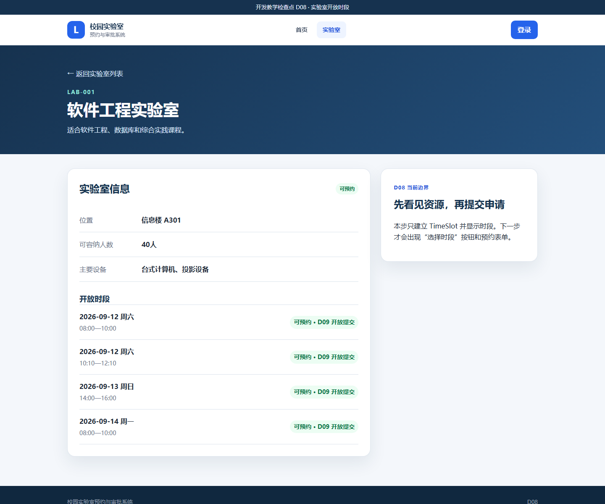
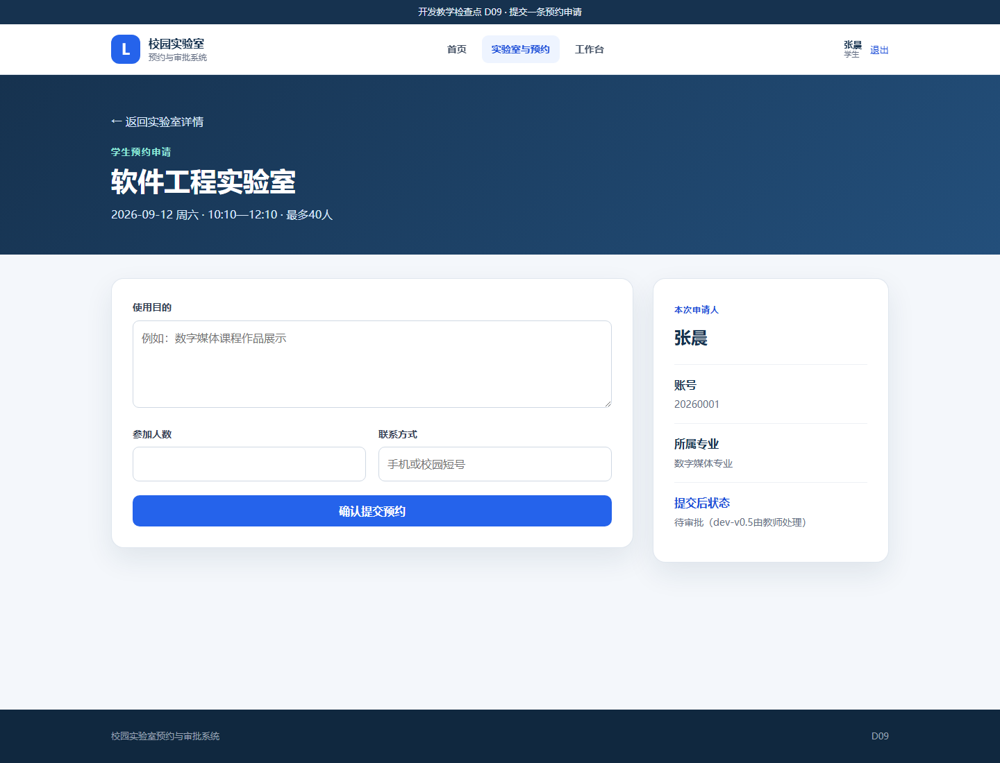
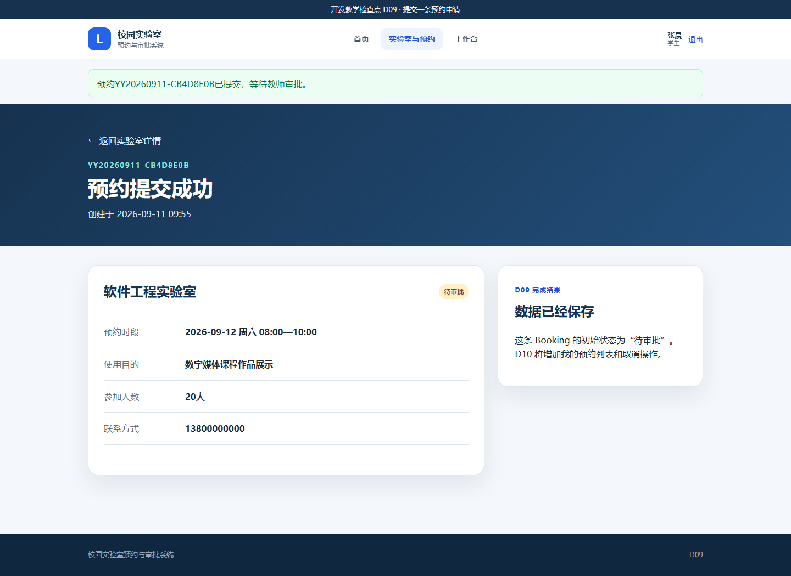
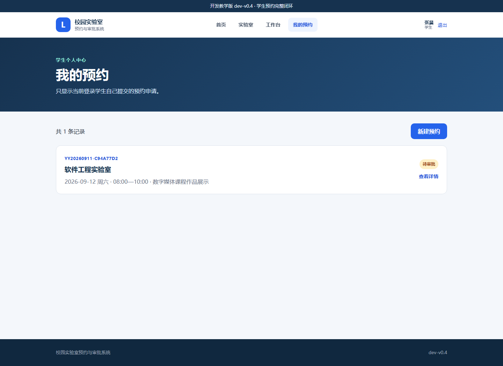
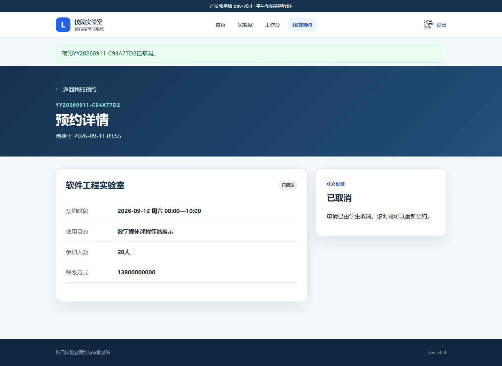

# 第4章　D08—D10：从开放时段到 V0.4 学生预约闭环

## 1. 本章最终要做到什么

本章第一次完成系统的核心业务。学生不再填写一个与时间无关的静态表单，而是先选择一间实验室的真实开放时段，再提交、查看和取消自己的预约。

```text
D08 资源准备：Lab → TimeSlot，页面显示未来开放时段
  ↓
D09 数据写入：学生 + TimeSlot + 表单 → Booking（待审批）
  ↓
D10 学生闭环：提交 → 我的预约 → 详情 → 取消
```

- D08 只显示时段，不出现可点击的提交入口。
- D09 可以提交并看到本次预约详情，但还没有预约列表和取消。
- D10 补齐查询与取消，是正式版本 `dev-v0.4`。

本章预计用时 100—120 分钟，是 16 步中操作量较大的一段。每一步都要实际运行，不能一次性覆盖到 D10。

## 2. 三个数据对象怎样连接

```text
User（学生）  1 ─── 多  Booking（预约）  多 ─── 1  TimeSlot（时段）  多 ─── 1  Lab（实验室）
```

一条预约必须回答四个问题：谁申请、申请哪个时段、这个时段属于哪间实验室、当前状态是什么。表单中的用途、人数、联系方式只是 Booking 的补充字段。

---

# D08　时段模型与可预约时段

## 3. D08 先看懂

### 3.1 起点与终点

- 起点：D07 / `dev-v0.3`，实验室只有总体“可预约/维护中”状态。
- 终点：每间实验室出现四条未来日期和时间，维护中的实验室时段自动不可预约。
- 当前仍不能提交预约；这不是缺陷，是 D08 的边界。

### 3.2 新模型 TimeSlot

| 字段 | 含义 | 页面上的表现 |
|---|---|---|
| `lab_id` | 这条时段属于哪间实验室 | 在对应实验室详情中出现 |
| `booking_date` | 开放日期 | `2026-09-12 周六` 等 |
| `start_time` / `end_time` | 开始与结束时间 | `08:00—10:00` |
| `is_open` | 管理上是否开放 | 关闭时显示不可预约 |

完整恢复包：[D08_时段模型与可预约时段](../../教学资源/逐步开发代码/D08_时段模型与可预约时段/)。

## 4. D08 逐步操作

### 操作 D08-1　确认角色版本起点

1. 启动系统并确认顶部版本为 `dev-v0.3`。
2. 学生登录后应看到“预约申请”，但表单不能提交。
3. 停止服务器，保留现有 `instance/campus_lab.db`。

### 操作 D08-2　替换模型和程序

源文件夹：

```text
<课程资料>\教学资源\逐步开发代码\D08_时段模型与可预约时段
```

| 操作 | 完整源文件 | 目标文件 |
|---|---|---|
| 整文件替换 | [`models.py`](../../教学资源/逐步开发代码/D08_时段模型与可预约时段/models.py) | `D:\campus-lab-work\models.py` |
| 整文件替换 | [`app.py`](../../教学资源/逐步开发代码/D08_时段模型与可预约时段/app.py) | `D:\campus-lab-work\app.py` |
| 整文件替换 | [`VERSION`](../../教学资源/逐步开发代码/D08_时段模型与可预约时段/VERSION) | `D:\campus-lab-work\VERSION` |

`models.py` 在 `Lab` 和 `TimeSlot` 两边分别定义关系。`Lab.time_slots` 可以找到某实验室的全部时段；`TimeSlot.lab` 可以从时段返回所属实验室。

`app.py` 在数据库没有时段时，为四间实验室各生成四条未来时段，共 16 条。日期用“今天 + 1 天”计算，因此任何上课日期都不会得到过期样例。

### 操作 D08-3　替换页面和样式

| 操作 | 完整源文件 | 目标文件 |
|---|---|---|
| 整文件替换 | [`static/style.css`](../../教学资源/逐步开发代码/D08_时段模型与可预约时段/static/style.css) | `D:\campus-lab-work\static\style.css` |
| 整文件替换 | [`templates/base.html`](../../教学资源/逐步开发代码/D08_时段模型与可预约时段/templates/base.html) | `D:\campus-lab-work\templates\base.html` |
| 整文件替换 | [`templates/index.html`](../../教学资源/逐步开发代码/D08_时段模型与可预约时段/templates/index.html) | `D:\campus-lab-work\templates\index.html` |
| 整文件替换 | [`templates/dashboard.html`](../../教学资源/逐步开发代码/D08_时段模型与可预约时段/templates/dashboard.html) | `D:\campus-lab-work\templates\dashboard.html` |
| 整文件替换 | [`templates/labs.html`](../../教学资源/逐步开发代码/D08_时段模型与可预约时段/templates/labs.html) | `D:\campus-lab-work\templates\labs.html` |
| 整文件替换 | [`templates/lab_detail.html`](../../教学资源/逐步开发代码/D08_时段模型与可预约时段/templates/lab_detail.html) | `D:\campus-lab-work\templates\lab_detail.html` |
| 删除 | 无 | 删除 `D:\campus-lab-work\templates\reservation_form.html` |
| 整文件替换 | [`tests/test_app.py`](../../教学资源/逐步开发代码/D08_时段模型与可预约时段/tests/test_app.py) | `D:\campus-lab-work\tests\test_app.py` |

原来的 `reservation_form.html` 被删除，因为新的正确流程已经变成“先打开实验室详情，再选择该实验室的具体时段”。D09 会新增与单个时段对应的 `reserve.html`。

### 操作 D08-4　启动并观察自动建表

1. 双击 `启动系统.bat`。
2. D08 的 `db.create_all()` 会在原数据库中新增 `time_slots` 表，不删除已有 users 和 labs。
3. 首页应显示“16 条时段”。

### 操作 D08-5　查看开放时段

1. 不登录也可以进入“实验室”。
2. 打开“软件工程实验室”的详情。
3. 页面应显示四条日期和时间，每条右侧为“可预约 · D09 开放提交”。
4. 返回列表并打开“网络技术实验室”，四条时段应全部显示“不可预约”，因为实验室本身处于维护中。



截图中的日期会随实际上课日期变化，只需核对日期在未来、时间段和状态正确。

### 操作 D08-6　运行测试

停止服务器并双击 `运行测试.bat`。正确结果为：

```text
8 passed
```

## 5. D08 常见问题与恢复

- 详情页没有时段：`models.py` 或 `app.py` 未替换，或仍在运行旧服务器。
- 报 `no such table: time_slots`：用 D08 程序停止后重新启动，让 `db.create_all()` 建表。
- 页面出现 `BuildError: reserve`：误复制了 D09 的 `lab_detail.html`；D08 页面不能出现选择按钮。
- 仍出现旧的“预约申请”菜单：`base.html` 仍是 D07。

D08 完成标志：数据库有 16 条 TimeSlot；实验室详情显示未来时段；维护中实验室不可预约；8 项测试通过。

---

# D09　提交一条预约申请

## 6. D09 先看懂

### 6.1 起点与终点

- 起点：D08，只能看到开放时段。
- 终点：学生选择时段，填写三项数据，系统生成 Booking 和唯一预约编号，状态为“待审批”。
- 本步提交成功后直接进入本次详情；“我的预约”和取消留给 D10。

### 6.2 Booking 的关键字段

| 字段 | 来源 |
|---|---|
| `booking_no` | 程序按日期和随机片段生成，例如 `YY20260911-CB4D8E0B` |
| `user_id` | 当前登录学生 `g.user` |
| `time_slot_id` | 学生刚才选择的 TimeSlot |
| `purpose`、`attendee_count`、`contact` | 学生表单 |
| `status` | 新建时默认为 `PENDING`，页面显示“待审批” |

完整恢复包：[D09_提交预约申请](../../教学资源/逐步开发代码/D09_提交预约申请/)。

## 7. D09 逐步操作

### 操作 D09-1　停止 D08，保留时段数据

停止服务器，不删除 `instance`。D09 会给原数据库新增 bookings 表，16 条时段继续使用。

### 操作 D09-2　加入 Booking 模型和提交路由

| 操作 | 完整源文件 | 目标文件 |
|---|---|---|
| 整文件替换 | [`models.py`](../../教学资源/逐步开发代码/D09_提交预约申请/models.py) | `D:\campus-lab-work\models.py` |
| 整文件替换 | [`app.py`](../../教学资源/逐步开发代码/D09_提交预约申请/app.py) | `D:\campus-lab-work\app.py` |
| 整文件替换 | [`VERSION`](../../教学资源/逐步开发代码/D09_提交预约申请/VERSION) | `D:\campus-lab-work\VERSION` |

新的 `TimeSlot.active_booking` 会检查当前时段是否已有待审批或已通过预约；若有，`is_available` 返回假，从源头防止重复占用。

`reserve(slot_id)` 同时处理两种请求：GET 显示表单，POST 读取表单、校验、写库并跳转到详情。

### 操作 D09-3　加入预约页面

| 操作 | 完整源文件 | 目标文件 |
|---|---|---|
| 整文件替换 | [`templates/base.html`](../../教学资源/逐步开发代码/D09_提交预约申请/templates/base.html) | `D:\campus-lab-work\templates\base.html` |
| 整文件替换 | [`templates/index.html`](../../教学资源/逐步开发代码/D09_提交预约申请/templates/index.html) | `D:\campus-lab-work\templates\index.html` |
| 整文件替换 | [`templates/dashboard.html`](../../教学资源/逐步开发代码/D09_提交预约申请/templates/dashboard.html) | `D:\campus-lab-work\templates\dashboard.html` |
| 整文件替换 | [`templates/lab_detail.html`](../../教学资源/逐步开发代码/D09_提交预约申请/templates/lab_detail.html) | `D:\campus-lab-work\templates\lab_detail.html` |
| 新增 | [`templates/reserve.html`](../../教学资源/逐步开发代码/D09_提交预约申请/templates/reserve.html) | `D:\campus-lab-work\templates\reserve.html` |
| 新增 | [`templates/booking_detail.html`](../../教学资源/逐步开发代码/D09_提交预约申请/templates/booking_detail.html) | `D:\campus-lab-work\templates\booking_detail.html` |
| 整文件替换 | [`tests/test_app.py`](../../教学资源/逐步开发代码/D09_提交预约申请/tests/test_app.py) | `D:\campus-lab-work\tests\test_app.py` |

### 操作 D09-4　打开与一个时段绑定的表单

1. 启动系统。
2. 登录学生账号 `20260001 / 123456`。
3. 打开软件工程实验室详情。
4. 在一条空闲时段右侧点击“选择时段”。
5. 页面顶部必须显示实验室、日期、时间和最多人数；这些值来自刚才选择的 TimeSlot，不由学生重复填写。



### 操作 D09-5　提交合法预约

按下面内容填写：

| 字段 | 输入内容 |
|---|---|
| 使用目的 | `数字媒体课程作品展示` |
| 参加人数 | `20` |
| 联系方式 | `13800000000` |

点击“确认提交预约”。正确结果：

- 顶部出现“预约……已提交，等待教师审批”；
- 页面标题为“预约提交成功”；
- 有以 `YY` 开头的预约编号；
- 状态为“待审批”；
- 实验室、时段、用途、人数和联系方式与输入一致。



预约编号中的日期和随机字符每个人都可能不同，这是正确现象。

### 操作 D09-6　观察一条必要业务规则

返回同一实验室详情。刚才已经提交的时段应变为“不可预约”，其他时段仍可选择。系统不是只把按钮隐藏，而是在服务器端的 `find_active_booking()` 中再次检查。

### 操作 D09-7　运行测试

停止服务器，双击 `运行测试.bat`。正确结果为：

```text
8 passed
```

## 8. D09 常见问题与恢复

- 点击时段返回 403：登录的不是学生账号。
- 点击时段返回 400：该时段已被预约或实验室维护中；选择另一条空闲时段。
- 提交后仍停留在表单：查看页面顶部的用途、人数或联系方式错误提示。
- 报 `no such table: bookings`：停止并重新启动 D09，让程序建表。
- 提交成功后找不到列表入口：D09 本来只有本次详情，D10 才加入列表。

D09 完成标志：合法表单生成 Booking；详情显示待审批；已占用时段不能重复提交；8 项测试通过。

---

# D10　学生预约完整闭环

## 9. D10 先看懂

### 9.1 起点与终点

- 起点：D09，只能在提交完成后看到本次预约。
- 终点：学生随时查看自己的预约列表和详情，并取消自己的待审批/已通过预约。
- 正式版本：`dev-v0.4`。

本步没有新增数据表，主要增加按当前用户查询和改变状态的路由。

## 10. D10 逐步操作

### 操作 D10-1　停止 D09 并保留已经提交的预约

停止服务器。不要删除 `instance/campus_lab.db`，否则刚才的预约会消失。D10 正是要证明数据在重新启动后仍然存在。

### 操作 D10-2　替换学生闭环文件

源文件夹：

```text
<课程资料>\教学资源\逐步开发代码\D10_V0.4学生预约闭环
```

| 操作 | 完整源文件 | 目标文件 |
|---|---|---|
| 整文件替换 | [`app.py`](../../教学资源/逐步开发代码/D10_V0.4学生预约闭环/app.py) | `D:\campus-lab-work\app.py` |
| 整文件替换 | [`VERSION`](../../教学资源/逐步开发代码/D10_V0.4学生预约闭环/VERSION) | `D:\campus-lab-work\VERSION` |
| 整文件替换 | [`templates/base.html`](../../教学资源/逐步开发代码/D10_V0.4学生预约闭环/templates/base.html) | `D:\campus-lab-work\templates\base.html` |
| 整文件替换 | [`templates/index.html`](../../教学资源/逐步开发代码/D10_V0.4学生预约闭环/templates/index.html) | `D:\campus-lab-work\templates\index.html` |
| 整文件替换 | [`templates/dashboard.html`](../../教学资源/逐步开发代码/D10_V0.4学生预约闭环/templates/dashboard.html) | `D:\campus-lab-work\templates\dashboard.html` |
| 整文件替换 | [`templates/booking_detail.html`](../../教学资源/逐步开发代码/D10_V0.4学生预约闭环/templates/booking_detail.html) | `D:\campus-lab-work\templates\booking_detail.html` |
| 新增 | [`templates/my_bookings.html`](../../教学资源/逐步开发代码/D10_V0.4学生预约闭环/templates/my_bookings.html) | `D:\campus-lab-work\templates\my_bookings.html` |
| 整文件替换 | [`tests/test_app.py`](../../教学资源/逐步开发代码/D10_V0.4学生预约闭环/tests/test_app.py) | `D:\campus-lab-work\tests\test_app.py` |

`models.py`、`lab_detail.html` 和 `reserve.html` 在 D09 已经是 V0.4 所需内容，本步不替换。

在新 `app.py` 中找到三个路由：

```text
GET  /my-bookings                    查询当前学生的全部预约
GET  /bookings/<booking_id>          查看一条属于当前学生的预约
POST /bookings/<booking_id>/cancel   把允许取消的预约改为 CANCELLED
```

查询和详情都检查 `g.user.id`，不能通过猜编号查看另一名学生的预约。

### 操作 D10-3　重新登录并查看持久化数据

1. 启动系统并登录 `20260001 / 123456`。
2. 顶部出现“我的预约”。
3. 进入列表，D09 提交的记录应仍然存在，状态为“待审批”。



如果 D09 没有保留记录，可以点击“新建预约”，重新选择一个空闲时段并提交，再回到列表。

### 操作 D10-4　打开详情并取消

1. 点击某条待审批预约的“查看详情”。
2. 检查详情中的预约编号、时段、用途、人数和联系方式。
3. 点击“取消预约”。
4. 浏览器询问是否确定时点击“确定”。
5. 页面顶部提示预约已取消，状态变为“已取消”，取消按钮消失。



返回实验室详情，原来被该预约占用的时段应再次变为可预约。取消不是删除记录，而是保留记录并改变状态。

### 操作 D10-5　运行正式版本测试

停止服务器并双击 `运行测试.bat`。正确结果为：

```text
18 passed
```

测试覆盖提交、非法人数、取消、本人数据隔离、角色限制和既有查询功能。

## 11. D10 完整结果核对

```text
D:\campus-lab-work
├─ app.py
├─ models.py                       User + Lab + TimeSlot + Booking
├─ VERSION                         dev-v0.4
├─ instance\campus_lab.db          含个人预约数据
├─ static\style.css
├─ templates
│  ├─ base.html
│  ├─ index.html
│  ├─ login.html
│  ├─ dashboard.html
│  ├─ labs.html
│  ├─ lab_detail.html
│  ├─ reserve.html
│  ├─ my_bookings.html
│  └─ booking_detail.html
└─ tests\test_app.py
```

本步完整恢复包：[D10_V0.4学生预约闭环](../../教学资源/逐步开发代码/D10_V0.4学生预约闭环/)。该快照与冻结的 `dev-v0.4` 终点逐文件一致。

## 12. D10 常见问题与恢复

- “我的预约”为空：确认登录账号与提交账号相同；列表只查当前用户。
- 取消后记录消失：复制错了模板或程序；正确设计是状态变为“已取消”，记录保留。
- 取消按钮不存在：只有待审批或已通过状态可以取消；已取消和已驳回不能再次取消。
- 另一位学生能看到本人的预约：立即检查 D10 的 `app.py` 是否完整，详情必须比较 `booking.user_id` 与 `g.user.id`。
- 数据已经混乱：先备份 `instance/campus_lab.db`。若无需保留课堂记录，再删除 `instance` 并由 D10 重建。

D10 完成标志：学生能够提交、列出、查看和取消自己的预约；取消后时段释放；18 项测试通过；系统到达正式版本 `dev-v0.4`。

## 13. 本章给教师的讲解主线

1. 实验室是资源，时段是可分配的具体资源单位。
2. 表单不重复收集能够由系统确定的实验室、日期和时间，减少错误。
3. Booking 用外键连接学生与时段，并用状态保存业务过程。
4. 服务器端校验决定是否写库，页面输入限制只能作为辅助。
5. 取消采用状态变化而不是删除，为后续审批、追踪和统计保留依据。
