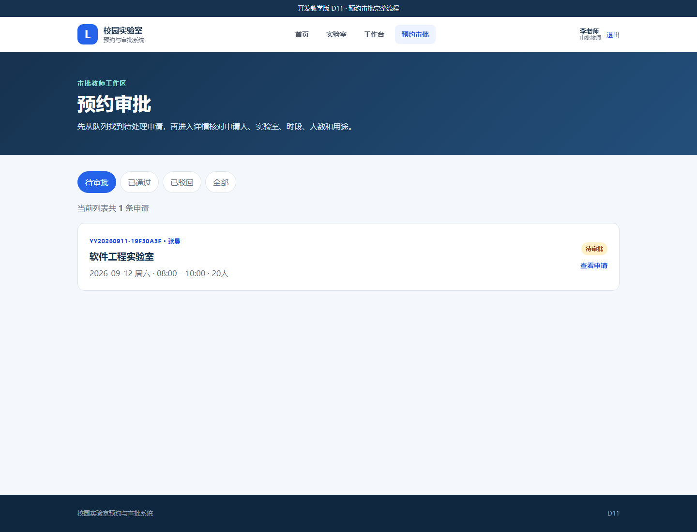
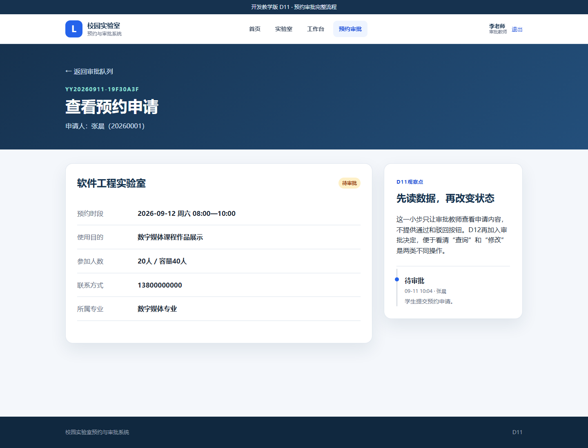
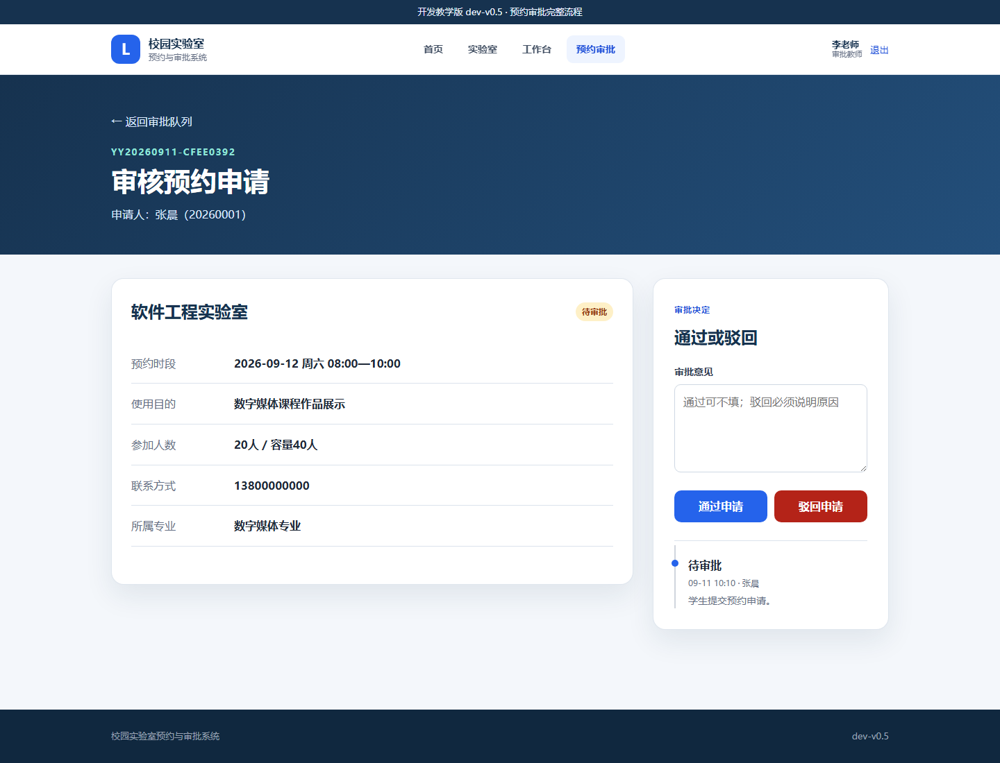
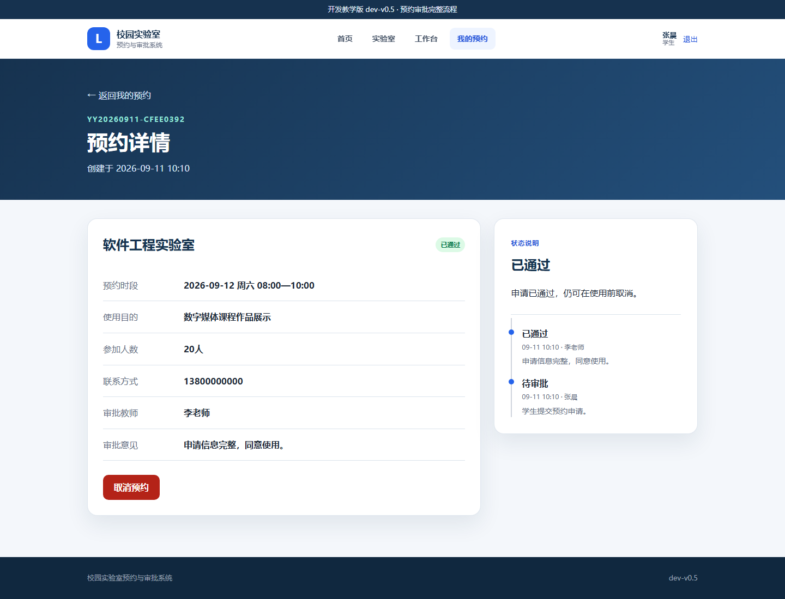

# 实验5　D11—D12：从审批队列到 V0.5 教师审批闭环

| 项目 | 内容 |
|---|---|
| 建议用时 | 70—90 分钟 |
| 开发起点 | `dev-v0.4` 学生预约闭环 |
| 开发终点 | `dev-v0.5` 教师审批闭环 |
| 验收证据 | 审批队列、审批结果、状态历史、22 项自动测试 |

## 5.1 实验目标与成果

D10 已经完成学生一侧的提交、查询和取消，但“待审批”还只是一个不会自动变化的文字。本实验加入审批教师，让同一条预约在学生端和教师端之间流转。

```text
学生提交预约（PENDING）
          ↓
D11：教师查看待审批队列和申请详情，只读不修改
          ↓
D12：教师通过（APPROVED）或驳回（REJECTED）
          ↓
学生重新查看同一条预约，看到审批人、意见和状态历史
```

- D11 只解决“教师到哪里找到需要处理的申请、需要核对哪些内容”。
- D12 才加入通过和驳回按钮以及状态修改，是正式版本 `dev-v0.5`。
- 两步分开后，可以清楚区分查询数据的 GET 请求与改变数据的 POST 请求。

操作时只处理一至两条预约，不需要反复制造大量数据。

## 5.2 实验原理：预约状态转换

```text
                     ┌──→ APPROVED（已通过）──→ CANCELLED（已取消）
PENDING（待审批） ───┤
                     └──→ REJECTED（已驳回）

PENDING（待审批）也可以由学生直接取消为 CANCELLED（已取消）
```

状态不是四个互不相关的标签。程序只允许规定的方向发生变化：教师不能重复审批已经处理的申请；已驳回和已取消的申请不能再次取消。

## 5.3 实验原理：审批数据与状态历史

Booking 在原有字段上增加三项审批结果：

| 字段 | 保存内容 | 示例 |
|---|---|---|
| `reviewed_by_id` | 哪位教师作出决定 | 李老师 |
| `review_comment` | 审批意见 | 申请信息完整，同意使用。 |
| `reviewed_at` | 作出决定的时间 | 2026-09-11 10:10 |

同时新增 `BookingHistory`。Booking 保存“现在是什么状态”，BookingHistory 保存“怎样一步步变成现在的状态”。一条预约可以对应多条历史记录。

---

## 5.4 D11：审批队列与审批详情

### 5.4.1 任务说明

#### （1）起点与终点

- 起点：D10 / `dev-v0.4`，只有学生预约闭环。
- 终点：审批教师登录后能看到待审批数量、审批队列和申请详情。
- 当前详情页没有通过、驳回按钮；这是刻意保留给 D12 的边界，不是遗漏。

完整恢复包：[D11_审批队列与审批详情](../../教学资源/逐步开发代码/D11_审批队列与审批详情/)。

#### （2）审批队列与审批详情的职责

```text
工作台：告诉教师有几条待办
   ↓
审批队列：从多条申请中选择一条
   ↓
审批详情：集中核对申请人、实验室、时段、人数、用途和联系方式
```

列表负责“找”，详情负责“看”。如果把全部字段和全部操作都堆在一张列表里，页面会复杂且容易误操作。

### 5.4.2 操作步骤

#### 操作 D11-1　准备一条待审批申请

1. 先用 D10 启动系统并登录学生账号 `20260001 / 123456`。
2. 进入“我的预约”。如果已有一条状态为“待审批”的申请，直接停止系统。
3. 如果在实验4中已经把申请取消，就打开一间可预约实验室，选择另一个空闲时段，填写下列内容并提交：

| 字段 | 输入内容 |
|---|---|
| 使用目的 | `数字媒体课程作品展示` |
| 参加人数 | `20` |
| 联系方式 | `13800000000` |

4. 确认新申请状态为“待审批”，停止服务器。
5. 保留 `D:\campus-lab-work\instance\campus_lab.db`，不要删除。D11 要继续读取这条预约。

#### 操作 D11-2　替换数据库模型和程序

源文件夹：

```text
<课程资料>\教学资源\逐步开发代码\D11_审批队列与审批详情
```

| 操作 | 完整源文件 | 目标文件 |
|---|---|---|
| 整文件替换 | [`models.py`](../../教学资源/逐步开发代码/D11_审批队列与审批详情/models.py) | `D:\campus-lab-work\models.py` |
| 整文件替换 | [`app.py`](../../教学资源/逐步开发代码/D11_审批队列与审批详情/app.py) | `D:\campus-lab-work\app.py` |
| 整文件替换 | [`VERSION`](../../教学资源/逐步开发代码/D11_审批队列与审批详情/VERSION) | `D:\campus-lab-work\VERSION` |

不要把一段代码插入旧文件。打开源文件，按 `Ctrl+A`、`Ctrl+C`，再到目标文件按 `Ctrl+A`、`Ctrl+V`，保存整个文件。

新 `models.py` 做了三件事：

1. 给 Booking 增加审批人、审批意见和审批时间；
2. 新建 BookingHistory 模型；
3. 用 `Booking.histories` 把一条预约与多条状态历史连接起来。

新 `app.py` 中的 `upgrade_database_schema()` 用于保留 D10 数据。`db.create_all()` 能创建新表，却不会自动给旧表增加字段，因此程序会检查旧 `bookings` 表并补齐三个审批字段；同时为 D10 已有预约补建“提交预约”历史，已取消记录还会补建“取消预约”历史。

#### 操作 D11-3　替换页面、样式和测试

| 操作 | 完整源文件 | 目标文件 |
|---|---|---|
| 整文件替换 | [`static/style.css`](../../教学资源/逐步开发代码/D11_审批队列与审批详情/static/style.css) | `D:\campus-lab-work\static\style.css` |
| 整文件替换 | [`templates/base.html`](../../教学资源/逐步开发代码/D11_审批队列与审批详情/templates/base.html) | `D:\campus-lab-work\templates\base.html` |
| 整文件替换 | [`templates/index.html`](../../教学资源/逐步开发代码/D11_审批队列与审批详情/templates/index.html) | `D:\campus-lab-work\templates\index.html` |
| 整文件替换 | [`templates/dashboard.html`](../../教学资源/逐步开发代码/D11_审批队列与审批详情/templates/dashboard.html) | `D:\campus-lab-work\templates\dashboard.html` |
| 整文件替换 | [`templates/booking_detail.html`](../../教学资源/逐步开发代码/D11_审批队列与审批详情/templates/booking_detail.html) | `D:\campus-lab-work\templates\booking_detail.html` |
| 新增 | [`templates/approvals.html`](../../教学资源/逐步开发代码/D11_审批队列与审批详情/templates/approvals.html) | `D:\campus-lab-work\templates\approvals.html` |
| 新增 | [`templates/approval_detail.html`](../../教学资源/逐步开发代码/D11_审批队列与审批详情/templates/approval_detail.html) | `D:\campus-lab-work\templates\approval_detail.html` |
| 整文件替换 | [`tests/test_app.py`](../../教学资源/逐步开发代码/D11_审批队列与审批详情/tests/test_app.py) | `D:\campus-lab-work\tests\test_app.py` |

本步未列出的 `login.html`、`labs.html`、`lab_detail.html`、`reserve.html` 和 `my_bookings.html` 沿用 D10，不需要重复替换。

#### 操作 D11-4　启动并完成数据库升级

1. 双击 `启动系统.bat`。
2. 首次启动 D11 时，程序自动创建 `booking_histories` 表、补齐 `bookings` 的审批字段，并为 D10 的已有预约补建状态历史。
3. 浏览器顶部应显示 `D11`。
4. 原有学生、实验室、时段和预约应仍然存在。

如果启动后出现数据库字段错误，先确认 `models.py` 和 `app.py` 都来自 D11；不要只替换其中一个。

#### 操作 D11-5　以审批教师身份查看队列

1. 如果当前登录的是学生，点击右上角“退出”。
2. 使用审批教师账号登录：`T1001 / 123456`。
3. 教师工作台应显示待审批数量。
4. 点击“进入审批队列”。
5. 页面应显示刚才的申请，并可在“待审批、已通过、已驳回、全部”之间切换。



*图 5-1　D11 审批队列*

教师账号看不到“我的预约”，学生账号不能访问审批队列。这是服务器端角色权限，不只是菜单不同。

#### 操作 D11-6　查看申请详情

1. 点击待审批记录右侧的“查看申请”。
2. 核对申请人、学号、所属专业、实验室、时段、用途、人数和联系方式。
3. 右侧应显示状态历史和“先读数据，再改变状态”。
4. 页面不应出现“通过申请”和“驳回申请”按钮。



*图 5-2　D11 只读审批详情*

D11 的两个新路由都是读取操作：

```text
GET /approvals                       读取审批队列
GET /approvals/<booking_id>          读取一条申请详情
```

#### 操作 D11-7　运行测试

停止服务器并双击 `运行测试.bat`。正确结果为：

```text
4 passed
```

四项测试专门检查 D11 的边界：页面显示 D11、教师可读队列与详情、学生无权进入、审批决定地址尚不存在。

### 5.4.3 故障排查与完成检查

- 教师队列为空：学生申请已经取消或已被处理；先以学生身份选择另一个空闲时段并提交。
- 登录后仍是学生工作台：账号应为大写字母开头的 `T1001`，不是学生学号。
- 报 `no such column: bookings.review_comment`：`app.py` 仍是旧文件或启动过程被中断；完整替换 D11 的 app.py 后重新启动。
- 能看队列却打不开详情：确认新增了 `approval_detail.html`，文件名不能改。
- D11 出现通过/驳回按钮：误复制了 D12 的 `approval_detail.html`；用 D11 恢复包覆盖。

D11 完成标志：教师能查看待审批队列和详情；学生不能进入审批区；没有改变状态的按钮；4 项测试通过。

---

## 5.5 D12：教师审批完整闭环

### 5.5.1 任务说明

#### （1）起点与终点

- 起点：D11，教师只能读取申请。
- 终点：教师可以通过或驳回待审批申请；学生能看到结果、审批意见和完整状态历史。
- 正式版本：`dev-v0.5`。

#### （2）使用 POST 提交审批决定的原因

```text
GET  /approvals/1                    只读取并显示申请
POST /approvals/1/decision           修改状态、写审批结果、增加历史记录
```

刷新或复制一个 GET 地址不应改变数据。审批决定会修改数据库，因此使用 POST，并在服务器端再次检查当前用户角色和预约状态。

### 5.5.2 操作步骤

#### 操作 D12-1　停止 D11 并保留待审批数据

停止服务器，保留 `instance/campus_lab.db`。D12 不要求重新提交；D11 队列中的待审批申请应继续存在。

#### 操作 D12-2　替换审批闭环文件

源文件夹：

```text
<课程资料>\教学资源\逐步开发代码\D12_V0.5教师审批闭环
```

| 操作 | 完整源文件 | 目标文件 |
|---|---|---|
| 整文件替换 | [`app.py`](../../教学资源/逐步开发代码/D12_V0.5教师审批闭环/app.py) | `D:\campus-lab-work\app.py` |
| 整文件替换 | [`VERSION`](../../教学资源/逐步开发代码/D12_V0.5教师审批闭环/VERSION) | `D:\campus-lab-work\VERSION` |
| 整文件替换 | [`templates/approvals.html`](../../教学资源/逐步开发代码/D12_V0.5教师审批闭环/templates/approvals.html) | `D:\campus-lab-work\templates\approvals.html` |
| 整文件替换 | [`templates/approval_detail.html`](../../教学资源/逐步开发代码/D12_V0.5教师审批闭环/templates/approval_detail.html) | `D:\campus-lab-work\templates\approval_detail.html` |
| 整文件替换 | [`templates/dashboard.html`](../../教学资源/逐步开发代码/D12_V0.5教师审批闭环/templates/dashboard.html) | `D:\campus-lab-work\templates\dashboard.html` |
| 整文件替换 | [`tests/test_app.py`](../../教学资源/逐步开发代码/D12_V0.5教师审批闭环/tests/test_app.py) | `D:\campus-lab-work\tests\test_app.py` |

`models.py` 和其他页面已经在 D11 达到本版本要求，本步不替换。

新 `approval_decision()` 路由按一个数据库事务完成四件事：

1. 检查预约仍是 `PENDING`；
2. 把状态改为 `APPROVED` 或 `REJECTED`；
3. 保存审批教师、意见和时间；
4. 新增一条 BookingHistory 后统一提交。

#### 操作 D12-3　打开审批表单

1. 启动系统，顶部应显示 `dev-v0.5`。
2. 登录 `T1001 / 123456`。
3. 进入“预约审批”，打开一条待审批申请。
4. 右侧应出现审批意见框、“通过申请”和“驳回申请”两个按钮。



*图 5-3　D12 教师审批表单*

#### 操作 D12-4　通过申请并由学生查看结果

1. 在审批意见中填写 `申请信息完整，同意使用。`。
2. 点击“通过申请”。
3. 教师详情页状态应立即变为“已通过”，表单按钮消失，时间线增加“已通过”。
4. 退出教师账号，登录学生账号 `20260001 / 123456`。
5. 进入“我的预约”，打开同一条记录。
6. 学生应看到“已通过”、审批教师“李老师”、审批意见以及两条状态历史。



*图 5-4　D12 学生查看审批结果*

教师和学生看到的是同一条 Booking，不是两份复制的数据。教师修改状态后，学生重新查询就能看到最新值。

#### 操作 D12-5　验证驳回规则

1. 学生选择另一个空闲时段，再提交一条预约。
2. 退出学生账号，登录 `T1001 / 123456`，打开新的待审批申请。
3. 审批意见只填写 `无`，点击“驳回申请”。页面应提示“驳回时请填写至少3个字的原因”，状态仍为待审批。
4. 把审批意见改为 `该时段已有课程安排。`，再次点击“驳回申请”。
5. 页面状态变为“已驳回”，时间线增加教师的驳回记录。
6. 返回审批队列，“待审批”中不再出现该记录，“已驳回”中可以找到。

驳回必须说明原因，因为学生需要知道怎样调整申请；通过意见可以不填，程序会保存默认说明“审批通过”。

#### 操作 D12-6　验证不能重复审批

对已经通过或驳回的记录，详情页只显示结果，不再显示审批按钮。即使直接重复提交审批请求，服务器也会因为状态不再是 `PENDING` 而拒绝操作。

#### 操作 D12-7　运行正式版本测试

停止服务器并双击 `运行测试.bat`。正确结果为：

```text
22 passed
```

测试覆盖既有查询、登录、预约和取消，同时新增教师通过、驳回原因、角色隔离、状态历史以及禁止重复审批。

### 5.5.3 结果验收与关键文件核对

```text
D:\campus-lab-work
├─ app.py
├─ models.py                       User + Lab + TimeSlot + Booking + BookingHistory
├─ VERSION                         dev-v0.5
├─ instance\campus_lab.db          保留学生申请、审批结果和状态历史
├─ static\style.css
├─ templates
│  ├─ base.html
│  ├─ index.html
│  ├─ login.html
│  ├─ dashboard.html
│  ├─ labs.html
│  ├─ lab_detail.html
│  ├─ reserve.html
│  ├─ my_bookings.html
│  ├─ booking_detail.html
│  ├─ approvals.html
│  └─ approval_detail.html
└─ tests\test_app.py
```

本步完整恢复包：[D12_V0.5教师审批闭环](../../教学资源/逐步开发代码/D12_V0.5教师审批闭环/)。该快照与冻结的 `dev-v0.5` 终点逐文件一致。

### 5.5.4 故障排查与恢复

- 点击审批后返回 400：申请可能已处理，或驳回原因少于3个字；回到审批队列重新确认状态。
- 教师已通过，学生仍显示待审批：学生应打开同一预约编号并刷新页面，不能查看另一条记录。
- 状态改变但没有历史：`models.py` 或 `app.py` 不是 D11/D12 对应版本；用 D12 恢复包完整核对。
- 页面提示找不到 `approval_decision`：`app.py` 仍是 D11；替换 D12 的 app.py 后重启。
- 通过后仍能看到审批按钮：`approval_detail.html` 未替换，或浏览器仍显示旧缓存；替换文件并按 `Ctrl+F5`。
- 数据已经混乱：停止程序，把 `instance` 重命名为 `instance-old-D12`，再由 D12 重建。确认新数据库、页面和 22 项测试都正确后，再决定是否保留旧数据备份。

D12 完成标志：教师能通过或驳回待审批申请；学生能看到结果与意见；每次状态变化有历史；处理后的申请不能重复审批；22 项测试通过；系统到达 `dev-v0.5`。

## 5.6 实验总结与思考

完成本实验后，应能说明以下内容：

1. 不同角色围绕同一业务对象协作，权限决定谁能查看、谁能修改。
2. 队列解决“查找待办”，详情解决“核对信息”，审批动作解决“改变状态”。
3. GET 用于读取数据，POST 用于提交状态改变；服务器在改变状态前必须再次校验。
4. 当前状态用于快速判断，状态历史用于说明过程，两者承担不同职责。
5. 审批不是简单更换页面标签，而是同时保存状态、审批人、意见、时间和历史。

思考：为什么系统既要保存预约的当前状态，又要另外保存每一次状态变化？
