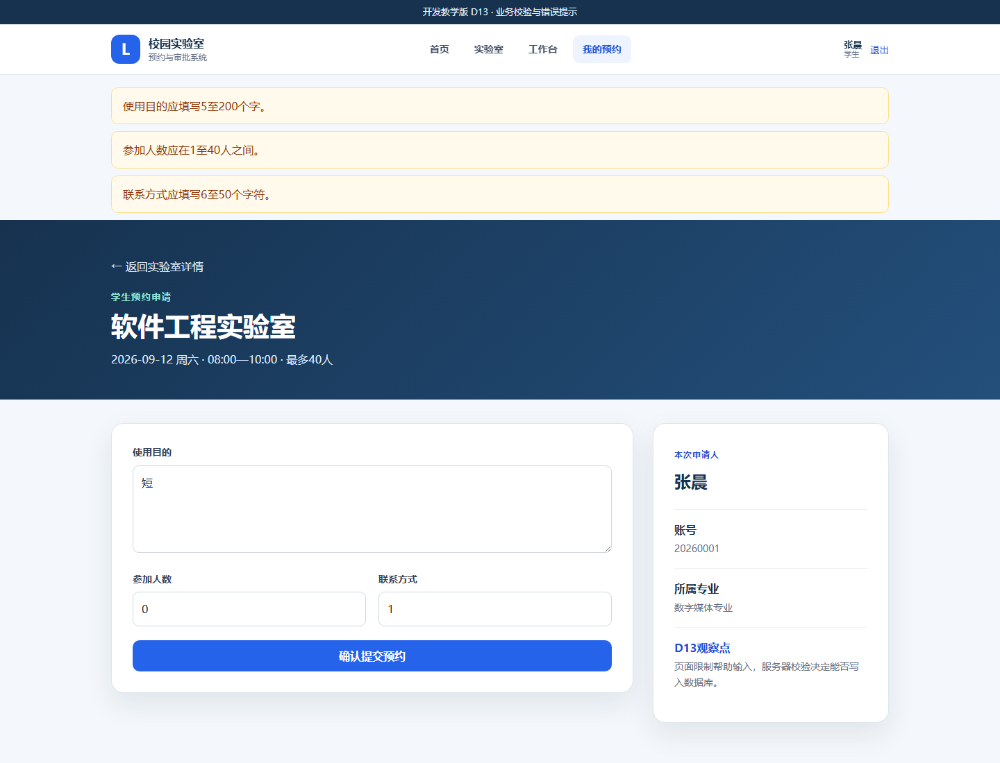
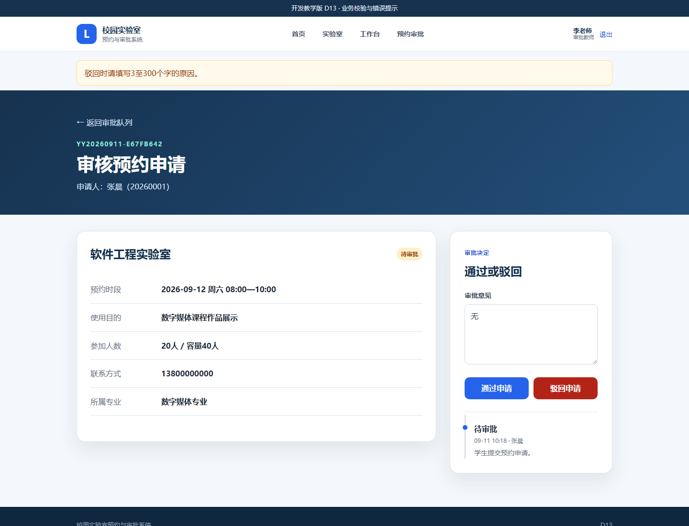
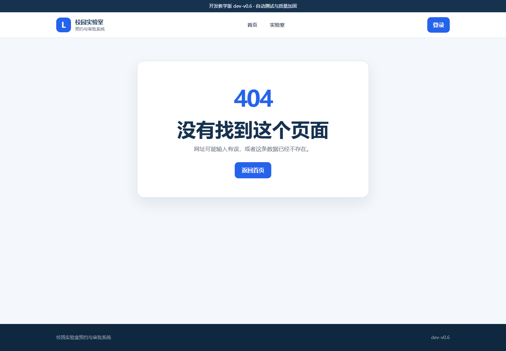
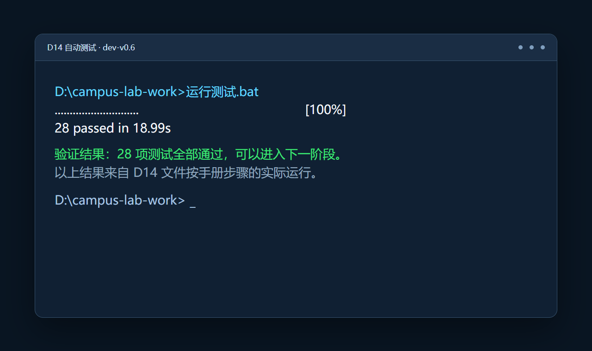

# 实验6　D13—D14：从业务校验到 V0.6 质量与安全加固

| 项目 | 内容 |
|---|---|
| 建议用时 | 80—100 分钟 |
| 开发起点 | `dev-v0.5` 教师审批闭环 |
| 开发终点 | `dev-v0.6` 质量与安全加固 |
| 验收证据 | 错误输入、CSRF、403/404 页面、28 项自动测试 |

## 6.1 实验目标与成果

V0.5 已经能够完成预约审批，但“正常操作能够成功”不等于“系统质量合格”。本实验开始主动处理错误输入、越权访问、伪造表单和错误网址，并用自动测试反复验证。

```text
D13：把输入规则集中到 validators.py
     错误输入 → 明确提示 → 不写入错误数据
  ↓
D14：在完整业务上增加安全与异常处理
     POST防伪 + 权限保护 + 友好错误页 + 完整自动测试
```

- D13 重点是业务校验：用途、人数、联系方式和驳回原因是否合理。
- D14 重点是基本安全与系统质量：请求来源、角色权限、异常页面和回归测试。
- D14 是正式版本 `dev-v0.6`。

质量不是在系统做完后“顺便点几下”，而是把规则写成可重复执行的检查。

## 6.2 实验原理：三层质量检查

| 层次 | 作用 | 能否单独作为最终保证 |
|---|---|---|
| 页面输入提示 | 帮助正常用户正确填写，例如说明用途至少5个字 | 不能，恶意或异常请求可以绕过浏览器页面 |
| 服务器业务校验 | 对每次请求重新检查，并决定是否写数据库 | 必须有，是业务数据的最后防线 |
| 自动测试 | 用固定输入反复验证正常路径和错误路径 | 用来证明规则没有在后续修改中失效 |

本实验所有规则最终都由服务器判断；页面提示只是帮助用户，不能代替服务器校验。

---

## 6.3 D13：业务校验与错误提示

### 6.3.1 任务说明

#### （1）起点与终点

- 起点：D12 / `dev-v0.5`，校验判断直接散落在预约和审批路由中。
- 终点：校验规则集中到 `validators.py`，网页能一次显示多条错误，错误数据不进入数据库。
- D13 不加入 CSRF 和自定义错误页，这两项留到 D14。

完整恢复包：[D13_业务校验与错误提示](../../教学资源/逐步开发代码/D13_业务校验与错误提示/)。

#### （2）单独建立 `validators.py` 的原因

路由的主要职责是组织操作流程：接收请求、调用规则、写入数据库、选择页面。输入规则如果全部挤在路由中，会越来越难读，也不方便单独测试。

```text
网页表单
   ↓
app.py 路由：负责流程
   ↓ 调用
validators.py：清洗数据 + 检查规则 + 返回错误列表
   ↓
无错误才写入数据库；有错误就返回原页面
```

`validate_booking_form()` 返回清洗后的预约数据和错误列表；`validate_approval_form()` 返回审批决定、审批意见和错误列表。它们不依赖浏览器，也不直接操作数据库。

### 6.3.2 操作步骤

#### 操作 D13-1　停止 V0.5 并保留业务数据

1. 确认 D12 的顶部版本为 `dev-v0.5`。
2. 停止服务器。
3. 保留 `D:\campus-lab-work\instance\campus_lab.db`。D13 不改变数据表，可以继续使用已有申请和审批记录。

#### 操作 D13-2　新增校验模块和测试配置

源文件夹：

```text
<课程资料>\教学资源\逐步开发代码\D13_业务校验与错误提示
```

| 操作 | 完整源文件 | 目标文件 |
|---|---|---|
| 新增 | [`validators.py`](../../教学资源/逐步开发代码/D13_业务校验与错误提示/validators.py) | `D:\campus-lab-work\validators.py` |
| 新增 | [`pytest.ini`](../../教学资源/逐步开发代码/D13_业务校验与错误提示/pytest.ini) | `D:\campus-lab-work\pytest.ini` |
| 新增 | [`tests/test_validators.py`](../../教学资源/逐步开发代码/D13_业务校验与错误提示/tests/test_validators.py) | `D:\campus-lab-work\tests\test_validators.py` |

打开 `validators.py`，只需要看清两部分：

- 先用 `strip()` 去掉输入两端多余空格，并把人数尝试转换为整数；
- 再把发现的每个问题加入 errors，而不是发现第一个问题就停止。

因此一次提交可以把三项错误全部告诉用户，避免“改一次、提交一次、再发现下一项”的低效体验。

#### 操作 D13-3　替换程序和表单页面

| 操作 | 完整源文件 | 目标文件 |
|---|---|---|
| 整文件替换 | [`app.py`](../../教学资源/逐步开发代码/D13_业务校验与错误提示/app.py) | `D:\campus-lab-work\app.py` |
| 整文件替换 | [`VERSION`](../../教学资源/逐步开发代码/D13_业务校验与错误提示/VERSION) | `D:\campus-lab-work\VERSION` |
| 整文件替换 | [`templates/base.html`](../../教学资源/逐步开发代码/D13_业务校验与错误提示/templates/base.html) | `D:\campus-lab-work\templates\base.html` |
| 整文件替换 | [`templates/index.html`](../../教学资源/逐步开发代码/D13_业务校验与错误提示/templates/index.html) | `D:\campus-lab-work\templates\index.html` |
| 整文件替换 | [`templates/reserve.html`](../../教学资源/逐步开发代码/D13_业务校验与错误提示/templates/reserve.html) | `D:\campus-lab-work\templates\reserve.html` |
| 整文件替换 | [`templates/approval_detail.html`](../../教学资源/逐步开发代码/D13_业务校验与错误提示/templates/approval_detail.html) | `D:\campus-lab-work\templates\approval_detail.html` |
| 整文件替换 | [`tests/test_app.py`](../../教学资源/逐步开发代码/D13_业务校验与错误提示/tests/test_app.py) | `D:\campus-lab-work\tests\test_app.py` |

不要在旧 app.py 中寻找行号插入代码。完整替换后，预约和审批路由都通过 import 调用 validators.py。

#### 操作 D13-4　启动并制造三项预约错误

1. 双击 `启动系统.bat`，确认顶部显示 `D13`。
2. 登录学生账号 `20260001 / 123456`。
3. 打开可预约实验室，选择一个空闲时段。
4. 按下表输入：

| 字段 | 故意输入 | 违反的规则 |
|---|---|---|
| 使用目的 | `短` | 少于5个字 |
| 参加人数 | `0` | 人数至少为1 |
| 联系方式 | `1` | 少于6个字符 |

5. 点击“确认提交预约”。
6. 页面顶部应一次出现三条错误，表单仍保留刚才的输入。



*图 6-1　D13 预约表单的多项校验提示*

7. 进入“我的预约”，确认没有因为这次错误提交而新增记录。

这一步证明“返回错误提示”和“不写数据库”必须同时成立。只显示错误但仍写入数据，仍然是严重缺陷。

#### 操作 D13-5　改正输入并正常提交

把三项内容改为：

```text
使用目的：数字媒体课程作品展示
参加人数：20
联系方式：13800000000
```

再次提交后应进入预约详情，状态为“待审批”。同一个路由既要拒绝错误输入，也要允许正确输入。

#### 操作 D13-6　验证驳回理由规则

1. 退出学生账号并登录审批教师 `T1001 / 123456`。
2. 打开刚才提交的待审批申请。
3. 在审批意见中填写 `无`，点击“驳回申请”。
4. 页面顶部应提示“驳回时请填写3至300个字的原因”，输入的 `无` 仍保留，申请状态仍为“待审批”。



*图 6-2　D13 驳回理由校验提示*

5. 把理由改为 `该时段已有课程安排。`，再次点击“驳回申请”，状态应变为“已驳回”。

#### 操作 D13-7　运行自动测试

停止服务器并双击 `运行测试.bat`。正确结果为：

```text
26 passed
```

其中 22 项是原有系统功能测试，新增 4 项直接调用校验函数，检查数据清洗、多项错误、驳回理由和允许无意见通过。

### 6.3.3 故障排查与完成检查

- 启动时提示 `No module named validators`：`validators.py` 没有复制到 app.py 同一层。
- 错误只出现一条：app.py 仍是 D12，或 validators.py 被改成发现错误后立即 return。
- 页面清空刚才的驳回理由：`approval_detail.html` 未替换为 D13。
- 错误输入也生成了预约：必须确认 app.py 只在 `if not errors` 内创建 Booking 和 commit。
- 测试只显示22项：缺少 `tests/test_validators.py`，或文件放错目录。

D13 完成标志：预约三项错误能够同时显示；错误数据不写库；短驳回理由不会改变状态；26 项测试通过。

---

## 6.4 D14：质量与安全加固

### 6.4.1 任务说明

#### （1）起点与终点

- 起点：D13，业务字段已经校验，但 POST 请求尚未验证来源，错误状态仍可能显示框架默认页面。
- 终点：所有 POST 表单具备 CSRF 令牌，越权和错误请求得到友好页面，完整测试通过。
- 正式版本：`dev-v0.6`。

#### （2）CSRF 防护原理

登录后，浏览器会自动携带本系统的会话 Cookie。恶意网页可能诱导浏览器向本系统发送一次“取消”或“审批”请求。CSRF 令牌要求表单同时携带一段只存在于当前会话中的随机值，让服务器能够判断请求是否来自本系统刚刚生成的页面。

```text
服务器显示表单：生成随机令牌 → 存入session → 隐藏在表单中
                                         ↓
用户提交表单：Cookie + 隐藏令牌 ───────→ 服务器比较
                                         ↓
                            相同：继续；缺失或不同：400拒绝
```

令牌不是验证码，学生不需要输入，也不应该复制到业务字段中。

### 6.4.2 操作步骤

#### 操作 D14-1　停止 D13 并保留数据库

停止服务器，保留 `instance/campus_lab.db`。D14 不改变数据模型，只改变请求保护、异常处理、页面和测试。

#### 操作 D14-2　替换安全与错误处理程序

源文件夹：

```text
<课程资料>\教学资源\逐步开发代码\D14_V0.6质量与安全加固
```

| 操作 | 完整源文件 | 目标文件 |
|---|---|---|
| 整文件替换 | [`app.py`](../../教学资源/逐步开发代码/D14_V0.6质量与安全加固/app.py) | `D:\campus-lab-work\app.py` |
| 整文件替换 | [`VERSION`](../../教学资源/逐步开发代码/D14_V0.6质量与安全加固/VERSION) | `D:\campus-lab-work\VERSION` |
| 整文件替换 | [`static/style.css`](../../教学资源/逐步开发代码/D14_V0.6质量与安全加固/static/style.css) | `D:\campus-lab-work\static\style.css` |
| 整文件替换 | [`tests/test_app.py`](../../教学资源/逐步开发代码/D14_V0.6质量与安全加固/tests/test_app.py) | `D:\campus-lab-work\tests\test_app.py` |

`validators.py`、`pytest.ini` 和 `tests/test_validators.py` 与 D13 相同，不需要重复替换。

新 app.py 的四个质量点：

1. `csrf_token()` 为当前会话生成随机令牌；
2. `protect_post_requests()` 在所有 POST 路由之前统一检查令牌；
3. 权限和业务异常调用 `abort()` 时给出具体说明；
4. 400、403、404 错误处理器把异常交给对应模板显示。

#### 操作 D14-3　替换所有含 POST 表单的页面

| 操作 | 完整源文件 | 目标文件 |
|---|---|---|
| 整文件替换 | [`templates/base.html`](../../教学资源/逐步开发代码/D14_V0.6质量与安全加固/templates/base.html) | `D:\campus-lab-work\templates\base.html` |
| 整文件替换 | [`templates/index.html`](../../教学资源/逐步开发代码/D14_V0.6质量与安全加固/templates/index.html) | `D:\campus-lab-work\templates\index.html` |
| 整文件替换 | [`templates/login.html`](../../教学资源/逐步开发代码/D14_V0.6质量与安全加固/templates/login.html) | `D:\campus-lab-work\templates\login.html` |
| 整文件替换 | [`templates/reserve.html`](../../教学资源/逐步开发代码/D14_V0.6质量与安全加固/templates/reserve.html) | `D:\campus-lab-work\templates\reserve.html` |
| 整文件替换 | [`templates/booking_detail.html`](../../教学资源/逐步开发代码/D14_V0.6质量与安全加固/templates/booking_detail.html) | `D:\campus-lab-work\templates\booking_detail.html` |
| 整文件替换 | [`templates/approval_detail.html`](../../教学资源/逐步开发代码/D14_V0.6质量与安全加固/templates/approval_detail.html) | `D:\campus-lab-work\templates\approval_detail.html` |

这些页面中的每一个 POST form 都新增同样的隐藏字段：

```html
<input type="hidden" name="_csrf_token" value="{{ csrf_token() }}">
```

登录、退出、提交预约、取消预约和审批都会修改系统状态，所以一个也不能遗漏。

#### 操作 D14-4　新增友好错误页

1. 在 `D:\campus-lab-work\templates` 下新建文件夹 `errors`。
2. 将下面三个完整文件复制进去：

| 操作 | 完整源文件 | 目标文件 |
|---|---|---|
| 新增 | [`templates/errors/400.html`](../../教学资源/逐步开发代码/D14_V0.6质量与安全加固/templates/errors/400.html) | `D:\campus-lab-work\templates\errors\400.html` |
| 新增 | [`templates/errors/403.html`](../../教学资源/逐步开发代码/D14_V0.6质量与安全加固/templates/errors/403.html) | `D:\campus-lab-work\templates\errors\403.html` |
| 新增 | [`templates/errors/404.html`](../../教学资源/逐步开发代码/D14_V0.6质量与安全加固/templates/errors/404.html) | `D:\campus-lab-work\templates\errors\404.html` |

400 表示请求不能处理，403 表示当前账号无权访问，404 表示请求的页面或数据不存在。三者原因不同，不能都写成“系统出错”。

#### 操作 D14-5　启动并验证正常操作没有被破坏

1. 双击 `启动系统.bat`，确认顶部显示 `dev-v0.6`。
2. 登录学生账号并打开预约表单。
3. 正常填写并提交一条预约，应仍能成功。
4. 退出学生账号并登录审批教师，正常审批该申请，也应成功。

安全保护加入后，正常流程必须保持可用。若所有 POST 都返回400，通常是某个表单页面漏掉了隐藏令牌。

#### 操作 D14-6　观察隐藏令牌

1. 在登录页按 `Ctrl+U` 打开网页源代码。
2. 按 `Ctrl+F` 搜索 `_csrf_token`。
3. 应看到一个 type 为 hidden 的 input 和一段随机值。
4. 返回页面并刷新，再观察令牌。它属于当前会话，用户不需要手工填写。

#### 操作 D14-7　查看友好 403 与 404

1. 登录学生账号。
2. 在地址栏输入 `http://127.0.0.1:5000/approvals`，应看到“当前账号不能访问”的 403 页面。
3. 退出或直接在地址栏输入 `http://127.0.0.1:5000/not-exist`。
4. 应看到“没有找到这个页面”，并有“返回首页”按钮。



*图 6-3　D14 自定义 404 页面*

错误页的目的不是掩盖问题，而是准确说明发生了什么，并给用户一个可继续操作的出口。

#### 操作 D14-8　运行正式版本测试

停止服务器并双击 `运行测试.bat`。正确结果为：

```text
28 passed
```



*图 6-4　D14 自动测试结果*

新增测试会直接发送一个不含 CSRF 令牌的 POST，确认服务器返回400；还会验证400、403、404都显示正确的自定义页面。自动测试负责稳定复现不适合课堂手工伪造的请求。

### 6.4.3 结果验收与关键文件核对

```text
D:\campus-lab-work
├─ app.py
├─ models.py
├─ validators.py
├─ pytest.ini
├─ VERSION                         dev-v0.6
├─ instance\campus_lab.db
├─ static\style.css
├─ templates
│  ├─ base.html
│  ├─ index.html
│  ├─ login.html
│  ├─ dashboard.html
│  ├─ labs.html
│  ├─ lab_detail.html
│  ├─ reserve.html
│  ├─ my_bookings.html
│  ├─ booking_detail.html
│  ├─ approvals.html
│  ├─ approval_detail.html
│  └─ errors
│     ├─ 400.html
│     ├─ 403.html
│     └─ 404.html
└─ tests
   ├─ test_app.py
   └─ test_validators.py
```

本步完整恢复包：[D14_V0.6质量与安全加固](../../教学资源/逐步开发代码/D14_V0.6质量与安全加固/)。该快照与冻结的 `dev-v0.6` 终点逐文件一致。

### 6.4.4 故障排查与恢复

- 登录、退出或提交表单全部返回400：含 POST 的模板漏掉 `_csrf_token`，按 D14 文件清单逐个覆盖。
- 页面提示 `csrf_token is undefined`：app.py 仍是 D13，但模板已经换成 D14；替换 D14 app.py 后重启。
- 404 仍是英文简陋页面：缺少 `templates/errors/404.html`，或 app.py 没有注册 errorhandler。
- 学生直接访问审批区仍显示框架错误：检查 D14 的 app.py 和 `errors/403.html`。
- 测试登录全部失败：测试请求也必须先获取当前 CSRF 令牌；不要把 test_app.py 与旧版本混用。
- 测试不是28项：核对 test_app.py、test_validators.py 和 pytest.ini 是否都来自 D14/D13。

D14 完成标志：正常表单仍可操作；缺少令牌的 POST 被拒绝；越权和错误网址有友好说明；28 项测试通过；系统到达 `dev-v0.6`。

## 6.5 实验总结与思考

完成本实验后，应能说明以下内容：

1. 正常路径成功只是最低要求，系统还必须正确处理错误路径。
2. 页面提示改善体验，服务器校验保护数据，自动测试防止规则回退。
3. 把校验提取为纯函数后，规则更容易阅读、复用和单独测试。
4. 身份认证、角色授权、业务校验和 CSRF 是不同层次的保护，不能互相替代。
5. 错误页面应说明“为什么不能继续、下一步去哪里”，不能只显示技术异常。

思考：页面已经限制了人数输入范围，为什么服务器仍然必须再次检查？
