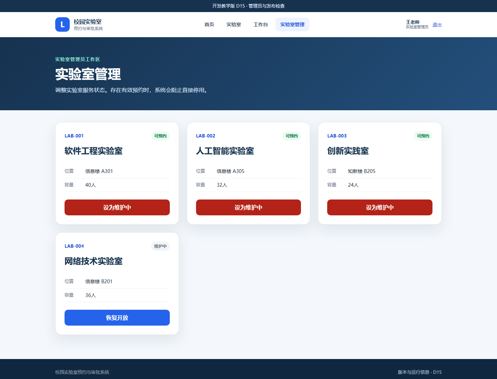
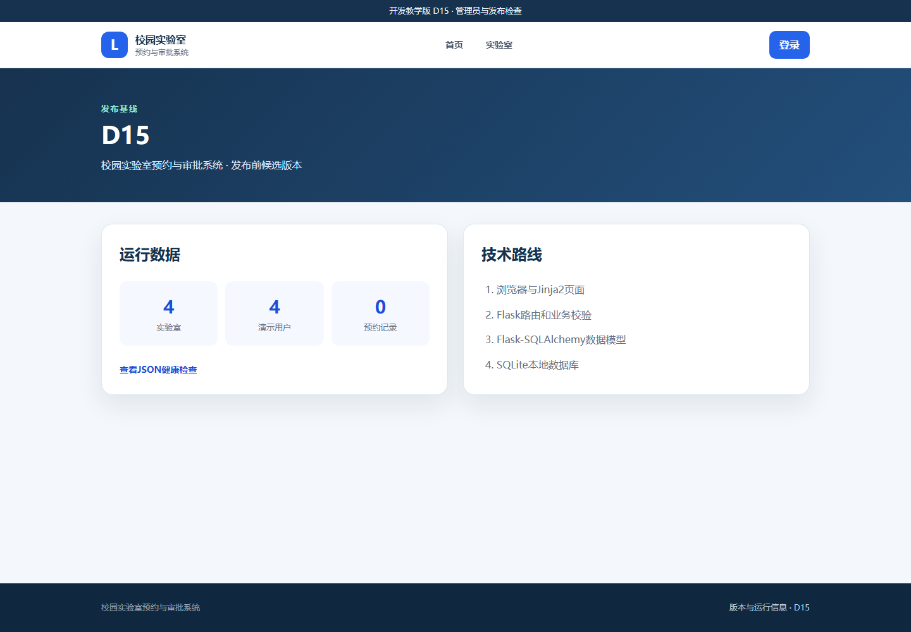
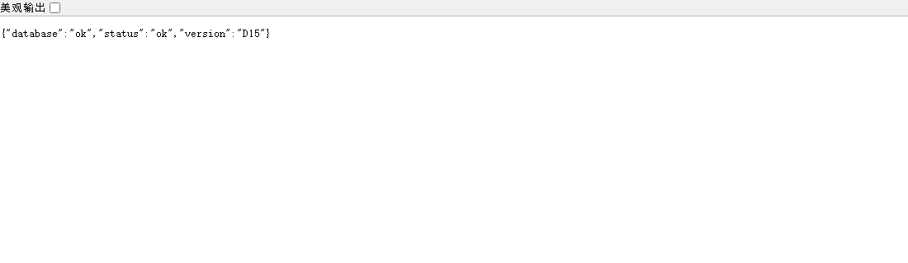
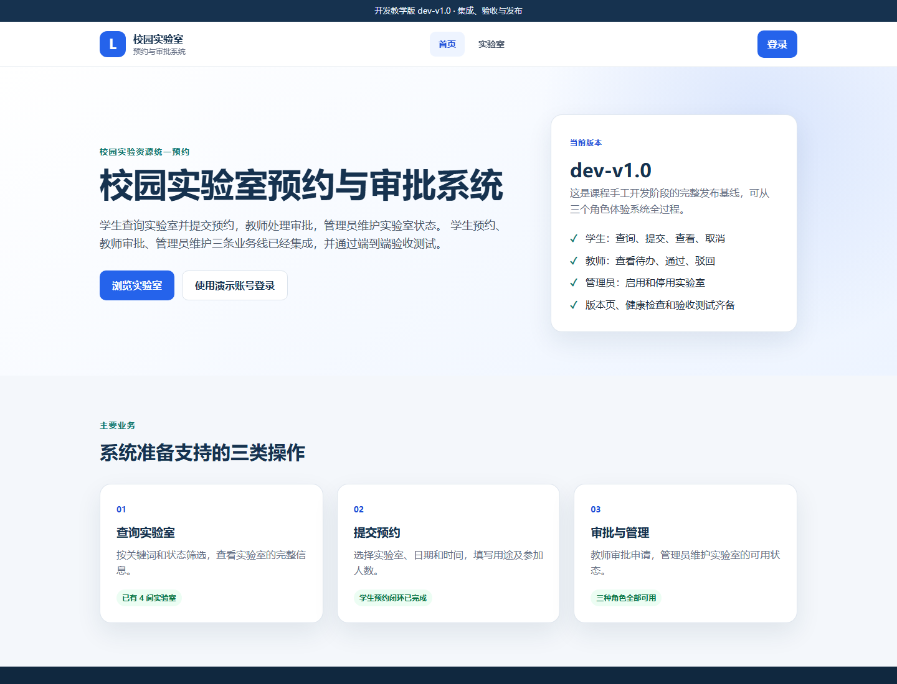
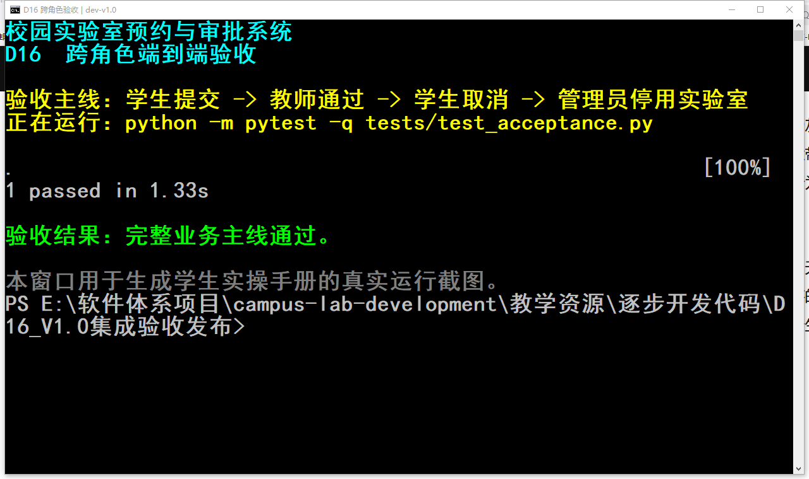
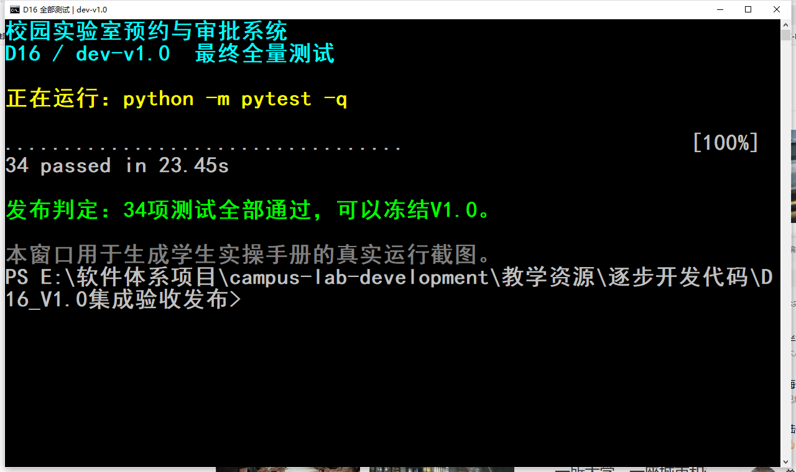

# 第7章　D15—D16：从管理员功能到 V1.0 集成验收发布

## 1. 本章最终要做到什么

本章完成 16 步开发过程的最后两个检查点。D15 补齐管理员和发布检查入口，D16 不再堆新业务功能，而是用一条跨角色流程证明各部分真正连接起来，然后冻结 V1.0。

```text
D15 发布前候选
学生功能 + 教师功能 + 管理员维护 + 版本信息 + 健康检查
                         ↓
D16 集成验收
学生提交 → 教师通过 → 学生取消 → 管理员停用实验室
                         ↓
34项测试全部通过 → 冻结 dev-v1.0
```

- D15 的目标是“功能完整，并能检查当前运行状态”。
- D16 的目标是“用证据确认系统完整，而不是再增加零散按钮”。
- `dev-v1.0` 是课程手工开发阶段的本地发布基线，适合课堂运行与验收，不等同于已经完成公网生产部署。

本章预计用时 80—100 分钟。

## 2. 管理员与审批教师不是同一种角色

| 角色 | 管理对象 | 典型操作 |
|---|---|---|
| 学生 | 自己的预约 | 查询、提交、查看、取消 |
| 审批教师 | 学生提交的预约 | 查看待办、通过、驳回 |
| 实验室管理员 | 实验室基础资源 | 开放或停用实验室 |

审批教师决定“一条申请能不能通过”，管理员决定“一间实验室当前是否提供服务”。把两个权限混在一起，会让职责边界模糊，也增加误操作风险。

---

# D15　管理员与发布检查

## 3. D15 先看懂

### 3.1 起点与终点

- 起点：D14 / `dev-v0.6`，学生和教师业务已经完成，管理员仍没有实际操作入口。
- 终点：管理员可以维护实验室状态；任何人可以查看版本页和健康检查。
- 当前版本显示为 `D15`，表示它仍是等待最终验收的教学检查点。

完整恢复包：[D15_管理员与发布检查](../../教学资源/逐步开发代码/D15_管理员与发布检查/)。

### 3.2 三个发布检查入口

```text
/admin/labs   给管理员：基础资源能否正常维护
/version      给人员查看：当前到底运行哪个版本、有哪些数据
/health       给程序检查：应用和数据库能否正常响应
```

版本页是给人阅读的 HTML；健康检查是给监控程序读取的 JSON。两者内容有联系，但用途不同。

## 4. D15 逐步操作

### 操作 D15-1　停止 V0.6 并保留已有数据

1. 确认 D14 的顶部版本为 `dev-v0.6`。
2. 停止服务器。
3. 保留 `C:\campus-lab-work\instance\campus_lab.db`。管理员将直接维护这份数据库中的实验室。

### 操作 D15-2　替换主程序和发布配置

源文件夹：

```text
<课程资料>\教学资源\逐步开发代码\D15_管理员与发布检查
```

| 操作 | 完整源文件 | 目标文件 |
|---|---|---|
| 整文件替换 | [`app.py`](../../教学资源/逐步开发代码/D15_管理员与发布检查/app.py) | `C:\campus-lab-work\app.py` |
| 整文件替换 | [`VERSION`](../../教学资源/逐步开发代码/D15_管理员与发布检查/VERSION) | `C:\campus-lab-work\VERSION` |
| 整文件替换 | [`static/style.css`](../../教学资源/逐步开发代码/D15_管理员与发布检查/static/style.css) | `C:\campus-lab-work\static\style.css` |
| 新增 | [`static/favicon.svg`](../../教学资源/逐步开发代码/D15_管理员与发布检查/static/favicon.svg) | `C:\campus-lab-work\static\favicon.svg` |

新 app.py 增加三类内容：

1. 管理员实验室列表和状态切换路由；
2. 版本页 `/version` 与健康检查 `/health`；
3. 从环境变量读取密钥、数据库地址和端口，并关闭 debug 模式。

环境变量是“部署时提供的配置”，代码不需要因为电脑、数据库或端口变化而反复修改。

### 操作 D15-3　新增管理员和版本页面

| 操作 | 完整源文件 | 目标文件 |
|---|---|---|
| 新增 | [`templates/admin_labs.html`](../../教学资源/逐步开发代码/D15_管理员与发布检查/templates/admin_labs.html) | `C:\campus-lab-work\templates\admin_labs.html` |
| 新增 | [`templates/version.html`](../../教学资源/逐步开发代码/D15_管理员与发布检查/templates/version.html) | `C:\campus-lab-work\templates\version.html` |
| 整文件替换 | [`templates/base.html`](../../教学资源/逐步开发代码/D15_管理员与发布检查/templates/base.html) | `C:\campus-lab-work\templates\base.html` |
| 整文件替换 | [`templates/dashboard.html`](../../教学资源/逐步开发代码/D15_管理员与发布检查/templates/dashboard.html) | `C:\campus-lab-work\templates\dashboard.html` |
| 整文件替换 | [`templates/index.html`](../../教学资源/逐步开发代码/D15_管理员与发布检查/templates/index.html) | `C:\campus-lab-work\templates\index.html` |
| 整文件替换 | [`tests/test_app.py`](../../教学资源/逐步开发代码/D15_管理员与发布检查/tests/test_app.py) | `C:\campus-lab-work\tests\test_app.py` |

`base.html` 给管理员增加“实验室管理”导航，并在页脚增加“版本与运行信息”。管理员切换状态的表单也包含 D14 已建立的 CSRF 令牌。

### 操作 D15-4　启动并进入管理员工作台

1. 双击 `启动系统.bat`，确认顶部显示 `D15`。
2. 使用管理员账号登录：`A001 / 123456`。
3. 工作台应显示实验室总数和开放数量。
4. 点击“进入实验室管理”。
5. 页面应显示四间实验室、当前位置、容量、状态和操作按钮。



学生和审批教师直接访问 `/admin/labs` 都应得到403，而不是只隐藏菜单。

### 操作 D15-5　恢复一间维护中的实验室

1. 找到“网络技术实验室”，当前状态应为“维护中”。
2. 点击“恢复开放”。
3. 页面顶部出现“网络技术实验室已恢复开放”。
4. 该卡片状态变为“可预约”，按钮变为“设为维护中”。
5. 打开公共实验室列表，网络技术实验室也应显示为可预约。

这证明管理员修改的是数据库中的同一个 Lab，其他页面重新查询后会看到新状态。

### 操作 D15-6　观察停用保护

1. 如果某间实验室存在待审批或已通过预约，尝试把它设为维护中。
2. 系统应显示“仍有待审批或已通过的预约，不能直接停用”。
3. 先处理或取消有效预约，再执行停用才能成功。

管理员不能让已经通过的预约突然失去实验室，这是一条跨模块业务规则。

课堂结束前可以把“网络技术实验室”再次设为维护中，使样例数据回到初始状态。

### 操作 D15-7　查看版本与运行信息

1. 点击页面底部“版本与运行信息 · D15”，也可以直接打开 `http://127.0.0.1:5000/version`。
2. 页面应显示版本 `D15`、4 间实验室、4 个演示用户和当前预约数量。
3. 右侧应显示本项目的四层技术路线。



预约数量会随每位学生前面的操作不同而变化，不要求与截图中的0完全一致。

### 操作 D15-8　查看 JSON 健康检查

1. 在版本页点击“查看JSON健康检查”。
2. 浏览器打开 `http://127.0.0.1:5000/health`。
3. 应看到以下三项，字段顺序可能不同：

```json
{"database":"ok","status":"ok","version":"D15"}
```



`status=ok` 表示应用能够响应，`database=ok` 表示程序实际执行了一次数据库查询，`version` 用来确认监控命中的是哪个版本。

### 操作 D15-9　运行发布前测试

停止服务器并双击 `运行测试.bat`。正确结果为：

```text
33 passed
```

新增测试检查管理员权限、状态切换、有效预约保护、表单令牌、版本页和健康检查。

## 5. D15 常见问题与恢复

- 管理员工作台仍显示“功能尚未开放”：dashboard.html 或 app.py 仍是 D14。
- 点击“实验室管理”提示页面不存在：缺少 admin_labs.html 或管理员路由没有复制。
- 所有实验室都不能停用：检查是否存在未处理/已通过预约；这可能是正确的业务保护。
- `/health` 返回404：app.py 未替换为 D15。
- 页面标签没有小图标：favicon.svg 未复制，或 base.html 仍是旧文件。
- 测试不是33项：tests/test_app.py 仍是 D14。

D15 完成标志：管理员能够维护实验室；有效预约阻止停用；版本页和健康检查可访问；33 项测试通过。

---

# D16　V1.0 集成验收与发布

## 6. D16 先看懂

### 6.1 起点与终点

- 起点：D15，所有功能已经存在，但还没有一条自动化流程跨越三种角色。
- 终点：端到端验收与全量测试通过，版本冻结为 `dev-v1.0`。
- D16 主要增加验收证据、公共测试夹具和项目说明，不再新增业务页面。

完整恢复包：[D16_V1.0集成验收发布](../../教学资源/逐步开发代码/D16_V1.0集成验收发布/)。

### 6.2 功能测试与验收测试的区别

| 检查 | 回答的问题 | 本项目示例 |
|---|---|---|
| 功能/规则测试 | 某个功能或规则单独是否正确 | 非管理员不能进入管理页 |
| 回归测试 | 旧功能在修改后是否仍正确 | 查询、登录、预约、审批仍全部通过 |
| 端到端验收 | 用户目标能否跨模块完整完成 | 学生提交到管理员停用的完整主线 |

验收测试不是把所有旧测试再写一遍，而是选择一条代表真实工作的主线，验证模块之间的数据能够连续传递。

## 7. D16 逐步操作

### 操作 D16-1　停止 D15 并保留课堂数据

停止服务器，保留 `instance/campus_lab.db`。最终版本可以在已有课堂数据上继续运行；自动测试仍使用独立临时数据库，不会破坏个人数据。

### 操作 D16-2　替换最终发布文件

源文件夹：

```text
<课程资料>\教学资源\逐步开发代码\D16_V1.0集成验收发布
```

| 操作 | 完整源文件 | 目标文件 |
|---|---|---|
| 整文件替换 | [`app.py`](../../教学资源/逐步开发代码/D16_V1.0集成验收发布/app.py) | `C:\campus-lab-work\app.py` |
| 整文件替换 | [`VERSION`](../../教学资源/逐步开发代码/D16_V1.0集成验收发布/VERSION) | `C:\campus-lab-work\VERSION` |
| 新增 | [`README.md`](../../教学资源/逐步开发代码/D16_V1.0集成验收发布/README.md) | `C:\campus-lab-work\README.md` |
| 整文件替换 | [`templates/base.html`](../../教学资源/逐步开发代码/D16_V1.0集成验收发布/templates/base.html) | `C:\campus-lab-work\templates\base.html` |
| 整文件替换 | [`templates/dashboard.html`](../../教学资源/逐步开发代码/D16_V1.0集成验收发布/templates/dashboard.html) | `C:\campus-lab-work\templates\dashboard.html` |
| 整文件替换 | [`templates/index.html`](../../教学资源/逐步开发代码/D16_V1.0集成验收发布/templates/index.html) | `C:\campus-lab-work\templates\index.html` |
| 整文件替换 | [`templates/version.html`](../../教学资源/逐步开发代码/D16_V1.0集成验收发布/templates/version.html) | `C:\campus-lab-work\templates\version.html` |

README.md 说明项目功能、账号、启动、测试和技术路线，是把项目交给其他人时最先阅读的入口。

### 操作 D16-3　加入验收测试

| 操作 | 完整源文件 | 目标文件 |
|---|---|---|
| 新增 | [`tests/conftest.py`](../../教学资源/逐步开发代码/D16_V1.0集成验收发布/tests/conftest.py) | `C:\campus-lab-work\tests\conftest.py` |
| 新增 | [`tests/test_acceptance.py`](../../教学资源/逐步开发代码/D16_V1.0集成验收发布/tests/test_acceptance.py) | `C:\campus-lab-work\tests\test_acceptance.py` |
| 整文件替换 | [`tests/test_app.py`](../../教学资源/逐步开发代码/D16_V1.0集成验收发布/tests/test_app.py) | `C:\campus-lab-work\tests\test_app.py` |

`conftest.py` 集中创建测试应用和测试客户端，test_app.py 与 test_acceptance.py 可以共同使用，不再各自重复准备数据库。

`test_acceptance.py` 的主线为：

```text
学生20260001登录
  → 选择空闲时段并提交预约
  → 教师T1001登录并通过
  → 学生重新登录并取消
  → 管理员A001登录并停用已经释放的实验室
  → 核对预约完整历史和实验室最终状态
```

### 操作 D16-4　启动并核对最终首页

1. 双击 `启动系统.bat`。
2. 顶部应显示 `开发教学版 dev-v1.0 · 集成、验收与发布`。
3. 首页右侧列出学生、教师、管理员、版本页、健康检查和验收测试。
4. 分别登录三个账号，确认各自导航和工作台正确。



### 操作 D16-5　单独运行跨角色验收

1. 停止正在运行的服务器。
2. 在 `C:\campus-lab-work` 文件夹的地址栏输入 `cmd` 并回车。
3. 在打开的命令窗口中执行：

```bat
.venv\Scripts\python.exe -m pytest -q tests\test_acceptance.py
```

4. 正确结果为：

```text
1 passed
```



验收使用临时数据库，因此运行后不会在个人“我的预约”中增加记录，也不会永久改变实验室状态。

### 操作 D16-6　运行全部回归测试

双击 `运行测试.bat`。正确结果为：

```text
34 passed
```



34 项包含查询、认证、权限、预约、审批、管理、校验、安全、错误页、运行检查和跨角色验收。只要出现 failed，就不能把当前代码认定为 V1.0 发布基线。

### 操作 D16-7　执行最终人工核对

按顺序完成一次简短检查：

1. 未登录能够访问首页、实验室列表、版本页和健康检查；
2. 学生只能操作自己的预约；
3. 审批教师能处理待审批申请，不能提交学生预约；
4. 管理员能维护实验室，不能越过有效预约保护；
5. 错误网址和越权访问有明确提示和返回入口；
6. 关闭系统并重新启动后，个人数据仍然存在；
7. VERSION 文件、页面顶部、版本页和 `/health` 都显示 `dev-v1.0`。

### 操作 D16-8　冻结课堂成果

1. 停止服务器。
2. 不要把 `.venv`、`instance/campus_lab.db`、`__pycache__` 和 `.pytest_cache` 当作发布源代码提交。
3. 保留完整源文件、requirements.txt、README.md、启动脚本和 tests。
4. 将当前文件夹复制为个人最终成果或按教师指定方式提交。
5. 后续若继续修改，应使用新的开发版本，不再悄悄改变已经验收的 V1.0 基线。

## 8. D16 最终文件树

```text
C:\campus-lab-work
├─ app.py
├─ models.py
├─ validators.py
├─ requirements.txt
├─ pytest.ini
├─ README.md
├─ VERSION                         dev-v1.0
├─ 初始化开发环境.bat
├─ 启动系统.bat
├─ 运行测试.bat
├─ instance\campus_lab.db          个人运行数据，不作为公共源代码提交
├─ static
│  ├─ favicon.svg
│  └─ style.css
├─ templates
│  ├─ base.html
│  ├─ index.html
│  ├─ login.html
│  ├─ dashboard.html
│  ├─ labs.html
│  ├─ lab_detail.html
│  ├─ reserve.html
│  ├─ my_bookings.html
│  ├─ booking_detail.html
│  ├─ approvals.html
│  ├─ approval_detail.html
│  ├─ admin_labs.html
│  ├─ version.html
│  └─ errors
│     ├─ 400.html
│     ├─ 403.html
│     └─ 404.html
└─ tests
   ├─ conftest.py
   ├─ test_app.py
   ├─ test_validators.py
   └─ test_acceptance.py
```

本步恢复包与冻结的 `dev-v1.0` 终点逐文件一致。

## 9. D16 常见问题与恢复

- 页面顶部仍显示 D15：app.py 或 VERSION 未替换，重启旧进程后再检查。
- 只运行出33项：缺少 test_acceptance.py 或 conftest.py，或 pytest.ini 未指向 tests。
- 测试提示 fixture `app` / `client` 不存在：conftest.py 文件名、目录或内容错误。
- 验收测试改变了个人数据库：测试配置不正确；应由 conftest.py 指向 tmp_path 下的临时数据库。
- `/health` 与页面版本不同：不同文件来自不同步骤；用 D16 恢复包完整核对。
- 双击启动后端口占用：先关闭旧的 Python 窗口，再启动一次；不要同时运行多个步骤。
- 最终文件差异太多无法判断：备份个人 instance 后，用 D16 恢复包整体恢复源文件，再运行34项测试。

D16 完成标志：页面显示 `dev-v1.0`；三个角色功能均可用；单条跨角色验收通过；34 项全量测试通过；源代码和说明文件完整。

## 10. 本章给教师的讲解主线

1. 管理员维护基础资源，审批教师处理业务申请，职责必须分开。
2. 发布前不仅看页面，还要确认版本、配置、数据库和健康状态。
3. 自动测试使用临时数据库，必须可重复执行且不污染学生个人数据。
4. 端到端验收用一条真实业务主线连接多个角色和模块。
5. 版本冻结代表“这组代码和测试证据已经共同确认”，后续变化应进入新版本。
