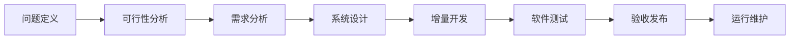
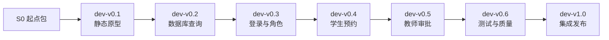
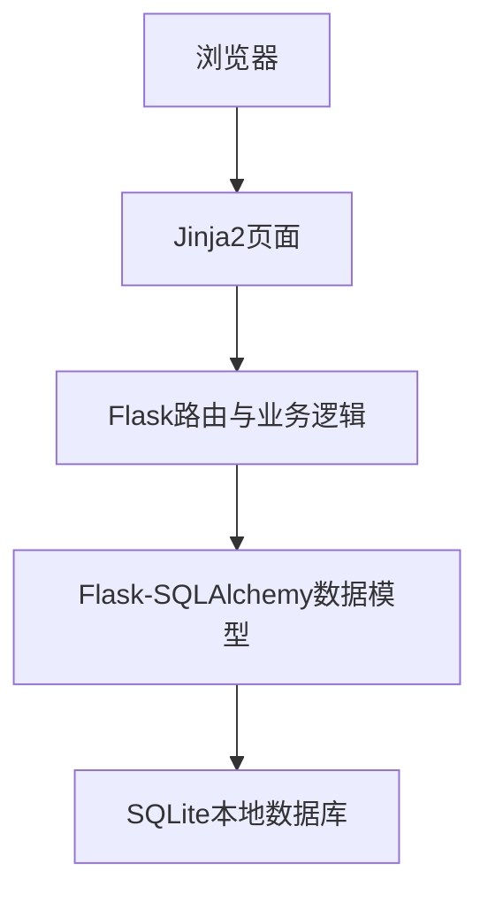

# S00 课程总体导学：四天完成一个软件系统

## 1. 欢迎进入软件项目开发课程

你每天都在使用软件：选课、购物、订票、点餐、预约、报修和报名。这些软件最初都不是一段代码，而是从一个需要解决的问题开始，逐渐经历分析、设计、开发、测试和发布。

本课程用4天、32课时完成一次完整的软件项目开发实践。贯穿课程的案例是：

> 校园实验室预约与审批系统

你不需要已经熟练掌握某一种编程语言，也不需要独立写出所有代码。课程更关注以下能力：

- 能从现实问题中找到软件需求。
- 能判断一个软件方案是否可行。
- 能用流程图、UML图和数据表表达设计。
- 能读懂一个Web项目由哪些文件和模块组成。
- 能按照确定的起点和步骤，把系统升级到下一个版本。
- 能设计测试用例，判断功能是否真正正确。
- 能用Git保存、比较和恢复软件版本。
- 能使用AI辅助开发，同时验证AI给出的结果。

## 2. 这四天最终要做出什么

课程结束时，你将拥有一个可以在自己电脑上运行的Web系统。它通过浏览器使用，数据保存在本地SQLite数据库中。

系统包含三类用户。

| 用户 | 演示账号 | 可以完成的主要工作 |
| --- | --- | --- |
| 学生 | `20260001` | 查询实验室、选择时段、提交预约、查看结果、取消预约 |
| 审批教师 | `T1001` | 查看待审批申请、通过申请、填写原因后驳回申请 |
| 实验室管理员 | `A001` | 查看实验室状态、设为维护中、恢复开放 |

三个账号的演示密码均为：

```text
123456
```

最终系统还具备以下能力：

- 按关键词和状态查询实验室。
- 根据网址中的编号显示实验室详情。
- 区分未登录、学生、审批教师和管理员的权限。
- 对预约人数、使用目的和联系方式进行校验。
- 为每条预约生成唯一编号。
- 保存预约提交、审批和取消的状态历史。
- 阻止重复审批、越权访问和不合法操作。
- 显示400、403和404错误页面。
- 提供版本信息页和JSON健康检查接口。
- 通过34项自动测试和一条三角色端到端验收流程。

## 3. 先从最终产品建立整体印象

第一次接触项目时，不需要马上理解代码。先观察系统解决了什么问题，以及不同用户怎样合作完成一件事。

### 3.1 公共页面

系统启动后，首页地址是：

```text
http://127.0.0.1:5000/
```

在首页可以看到：

- 系统名称和当前版本。
- “浏览实验室”入口。
- “使用演示账号登录”入口。
- 学生预约、教师审批和管理员维护三类主要业务。

实验室列表地址是：

```text
http://127.0.0.1:5000/labs
```

请观察：

1. 页面显示了几间实验室。
2. 哪些实验室处于“可预约”状态。
3. 哪间实验室处于“维护中”状态。
4. 关键词和状态筛选解决了什么问题。

### 3.2 学生业务

以学生账号登录后，完整操作顺序是：

```text
登录
→ 查询实验室
→ 打开实验室详情
→ 选择一个开放时段
→ 填写用途、人数和联系方式
→ 提交预约
→ 查看“待审批”状态
```

学生只能查看自己的预约，不能进入教师审批页面和管理员页面。

### 3.3 教师审批业务

退出学生账号，再以审批教师账号登录。完整操作顺序是：

```text
登录
→ 打开预约审批
→ 查看学生申请
→ 核对实验室、时间、用途和人数
→ 选择通过或驳回
→ 填写审批意见
```

审批完成后，同一条申请不能再次审批。学生重新登录后可以看到审批结果和审批意见。

### 3.4 管理员业务

以管理员账号登录后，可以进入实验室管理页面。

请观察两条业务规则：

- 没有有效预约的实验室可以设为维护中。
- 仍有待审批或已通过预约的实验室不能直接停用。

第二条规则说明：一个按钮能否点击，并不只取决于页面，还取决于系统中的业务数据和规则。

## 4. 为什么选择这个案例

校园实验室预约系统规模不大，但包含了软件开发中最常见的核心内容。

| 软件开发内容 | 当前系统中的对应实例 |
| --- | --- |
| 多种用户 | 学生、审批教师、管理员 |
| 信息查询 | 实验室列表、筛选和详情 |
| 表单提交 | 登录、预约、审批、实验室启停 |
| 数据保存 | 用户、实验室、时段、预约、状态历史 |
| 身份认证 | 账号和密码登录 |
| 权限控制 | 不同角色进入不同功能 |
| 业务流程 | 学生提交，教师审批，学生查看结果 |
| 状态变化 | 待审批、已通过、已驳回、已取消 |
| 异常处理 | 输入错误、越权、数据不存在 |
| 软件测试 | 手工测试、自动测试、系统验收 |
| 版本管理 | 七个Git标签记录增量开发过程 |

完成这个案例后，你可以把相同的结构迁移到会议室预约、设备借用、活动报名、宿舍报修等系统中。

## 5. 软件不是直接从代码开始的

本课程按照一个简化但完整的软件生命周期推进。



### 5.1 问题定义

先回答“为什么需要这个软件”。例如，原有实验室预约依靠消息或纸质登记，信息分散、审批过程不透明。

### 5.2 可行性分析

判断“这个项目是否值得做、是否做得出来”。需要考虑技术、费用、操作和时间。

### 5.3 需求分析

回答“系统必须做什么”。需求来自学生、教师、管理员和学校管理要求，而不是来自程序员的个人喜好。

### 5.4 系统设计

回答“系统准备怎样实现”。包括系统结构、页面、模块、数据库、权限和业务状态设计。

### 5.5 增量开发

不是一次写出全部系统，而是从简单版本逐步增加能力。每一次升级都有明确的起点和终点。

### 5.6 软件测试

通过测试用例检查需求是否实现，同时发现错误、记录缺陷并在修复后重新测试。

### 5.7 验收与发布

从用户角度执行完整业务，确认系统达到约定标准，再冻结版本并交付使用。

## 6. 七个版本怎样逐步形成完整系统



| 版本 | 这个版本解决的主要问题 | 完成后的可见结果 |
| --- | --- | --- |
| dev-v0.1 | 先让网站能够运行并看到主要页面 | 首页、实验室列表和静态预约表单 |
| dev-v0.2 | 数据不能一直写死在Python代码中 | SQLite数据库、筛选和详情查询 |
| dev-v0.3 | 系统不知道当前操作者是谁 | 登录、退出、三类角色工作台 |
| dev-v0.4 | 学生还不能真正完成预约 | 选择时段、提交、查看、取消 |
| dev-v0.5 | 学生申请还没有人处理 | 审批队列、通过、驳回、状态历史 |
| dev-v0.6 | 正常功能能用，但异常和安全仍需检查 | 独立校验、表单防伪、错误页、28项测试 |
| dev-v1.0 | 管理员和最终交付尚未完成 | 三角色集成、健康检查、34项测试和发布基线 |

七个版本不是七个互不相关的软件，而是同一个软件在不同时间点的状态。

## 7. 每次版本升级都经历一个小生命周期

每个版本实验都采用相同的学习方式。

```text
运行起点
→ 发现当前问题
→ 明确本版需求和验收标准
→ 阅读局部设计
→ 按步骤增加或替换代码
→ 观察页面和数据变化
→ 执行手工测试
→ 运行自动检查
→ Git提交并建立版本标签
```

代码会在实验文档中明确给出。你需要完成的不是凭空默写，而是：

- 确认代码应该放在哪个文件。
- 按步骤复制或替换完整内容。
- 每完成一步就观察运行结果。
- 能指出关键代码解决了什么问题。
- 能根据错误信息找到出错的步骤。
- 能通过测试证明当前版本已经完成。

## 8. 项目使用的技术路线

最终系统使用一条较短的技术链路。



现在只需要形成以下初步认识：

- **浏览器**负责显示页面并接收输入。
- **Jinja2**把数据库中的数据放入HTML页面。
- **Flask**根据网址决定执行哪个功能，并处理业务规则。
- **Flask-SQLAlchemy**帮助Python程序读写数据库。
- **SQLite**把数据保存在电脑上的一个文件中，不需要单独安装数据库服务器。

这些技术将在后续版本中分别出现，不需要在第一课全部记住。

## 9. 四天学习路线

| 天数 | 主题 | 主要成果 |
| --- | --- | --- |
| 第一天 | 总体认识、环境、Git、问题、可行性、需求、设计、V0.1起步 | 理解项目全貌并让第一个页面运行 |
| 第二天 | 完成V0.1，完成V0.2、V0.3，进入V0.4 | 数据库、登录角色和预约主线 |
| 第三天 | 完成V0.4、V0.5、V0.6和V1.0 | 审批、测试、质量、集成和发布 |
| 第四天 | AI辅助开发 | 独立完成并验证一个同类小系统 |

## 10. 最终需要保留的学习成果

课程结束时，请保留以下成果：

1. 七个版本的项目代码和Git提交记录。
2. 问题定义与可行性分析结果。
3. 编号化需求和验收标准。
4. 系统设计图和核心UML图。
5. 各版本手工测试结果。
6. 软件缺陷与回归测试记录。
7. `dev-v1.0`最终验收结果。
8. AI辅助开发的小系统及开发记录。

这些成果共同证明你经历了软件项目开发全过程，而不仅仅是运行了一份现成代码。

## 11. 本章观察与思考

### 练习1：识别角色

根据最终系统演示，写出学生、审批教师和管理员各自最重要的一项操作。

本练习不需要修改代码，无需恢复。

### 练习2：识别业务流

按先后顺序排列以下事件：

```text
教师通过申请
学生查看结果
学生提交预约
学生选择实验室时段
```

本练习不需要修改代码，无需恢复。

### 练习3：识别生命周期

判断下面三项分别属于需求、设计还是测试：

1. “学生只能查看自己的预约。”
2. “预约表使用`user_id`记录申请人。”
3. “使用另一名学生账号访问预约详情，预期返回403。”

本练习不需要修改代码，无需恢复。

### 练习4：理解版本

说明为什么`dev-v0.3`不能替代`dev-v1.0`，以及为什么仍然要保留`dev-v0.3`。

本练习不需要修改代码，无需恢复。

## 12. 本章完成检查

完成本章后，请逐项确认：

- [ ] 我知道课程最终要完成什么系统。
- [ ] 我能说出学生、审批教师和管理员的主要功能。
- [ ] 我能按顺序说出软件生命周期的主要阶段。
- [ ] 我知道系统会通过七个版本逐步完成。
- [ ] 我知道每次升级都需要经过需求、设计、实现和测试。
- [ ] 我知道课程不要求凭空默写全部代码，但要求理解结构并验证结果。
- [ ] 我知道最终成果不仅包括代码，还包括需求、设计、测试和版本记录。

如果以上各项均能完成，就可以进入S01《开发环境配置与常用工具》。
