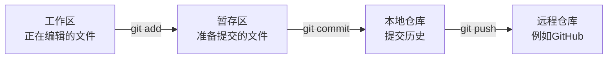

# S02 Git与软件版本管理

## 1. 本章任务

本章要建立个人开发项目，并用Git保存它的第一个可恢复状态：

> S0起点基线

这个起点还没有网站页面，只有开发环境所需的三个文件。后续每完成一个版本，就在同一个个人仓库中提交一次，并建立对应的版本标签。

完成本章后，你应当能够：

- 说明Git解决了什么问题。
- 区分工作区、暂存区和提交历史。
- 建立个人本地仓库并配置提交身份。
- 通过`.gitignore`排除虚拟环境和运行数据。
- 查看改动、暂存文件、提交文件和恢复未提交改动。
- 区分“提交”“分支”“标签”和“GitHub远程仓库”。
- 形成干净、可继续开发的S0基线。

## 2. 为什么开发软件需要Git

如果不用版本管理，项目文件夹很容易变成：

```text
最终版/
最终版2/
最终版_真的最终版/
最终版_修复后/
```

这些文件夹无法清楚回答：

- 哪一次修改增加了登录功能？
- 当前错误是从哪个版本开始出现的？
- 两个版本到底改了哪些文件？
- 误改代码后怎样回到上一次正确状态？
- 交付的V1.0对应哪一份代码？

Git把一组相关修改保存为一次**提交**，为提交生成唯一编号，并保留前后关系。它不是简单备份软件，而是一套可比较、可追踪、可恢复的变更记录。

## 3. Git的三个区域和一段历史



### 3.1 工作区

你在文件夹中直接看到和编辑的文件属于工作区。保存文件只说明磁盘内容发生了变化，还没有形成Git版本。

### 3.2 暂存区

暂存区用于选择“这一次准备提交哪些修改”。执行`git add`只是把指定内容放入暂存区，还没有提交。

### 3.3 本地仓库

执行`git commit`后，暂存区内容成为一条本地提交。即使没有网络，本地提交、查看历史、比较和恢复都可以使用。

### 3.4 远程仓库

GitHub等远程仓库用于异地保存和交换提交。Git和GitHub不是同一个概念：

- Git是版本管理工具。
- GitHub是提供远程Git仓库的网站。

本章先把本地仓库做正确，不依赖GitHub账号和网络。

## 4. 六个核心术语

| 术语 | 本课程中的含义 |
| --- | --- |
| 仓库 repository | 保存项目文件和完整版本历史的目录 |
| 提交 commit | 一次有明确目的、可以恢复的项目快照 |
| 提交号 hash | Git为每次提交生成的唯一标识 |
| 主分支 main | 个人项目持续向前开发的主线 |
| 标签 tag | 指向某个重要提交的固定版本名称 |
| 忽略规则 `.gitignore` | 明确哪些本机文件不应进入仓库 |

七个正式版本将使用以下标签：

```text
dev-v0.1
dev-v0.2
dev-v0.3
dev-v0.4
dev-v0.5
dev-v0.6
dev-v1.0
```

标签不是另存一份代码。它是在提交历史中的一个固定路标。

## 5. 检查并安装Git

### 5.1 检查命令

打开一个新PowerShell，执行：

```powershell
git --version
```

成功时会显示类似：

```text
git version 2.x.x.windows.x
```

具体小版本可以不同。只要命令可用，并支持`git init -b main`即可完成本课程。

### 5.2 安装时的选择

如果提示无法识别`git`，使用教师提供的Git for Windows安装程序。普通情况下保持默认选项即可，并确保允许在命令行中使用Git。

安装完成后必须关闭旧终端，重新打开PowerShell，再执行`git --version`。

## 6. 建立个人S0项目目录

### 6.1 区分演示项目和个人开发项目

S00和S01中运行的是课程演示项目，用来观察最终产品和检查环境。本章开始建立另一份个人开发目录。此后所有代码修改都在个人开发目录中完成，不修改课程演示项目和教学资源原件。

教师提供的起点资源目录为：

```text
教学资源\S0_起点包
```

其中只有三个文件：

```text
S0_起点包/
├─ .gitignore
├─ requirements.txt
└─ 初始化开发环境.bat
```

### 6.2 复制并重命名

1. 在文件资源管理器中找到`教学资源\S0_起点包`。
2. 复制整个文件夹到`D:\software-course`。
3. 把复制出来的文件夹改名为`my-campus-lab`。
4. 不要在`教学资源`原件中直接操作。

个人项目的建议路径为：

```text
D:\software-course\my-campus-lab
```

如果使用其他磁盘，请在后面的命令中替换实际盘符和路径。

### 6.3 打开个人项目终端

```powershell
Set-Location "D:\software-course\my-campus-lab"
Get-ChildItem -Force
```

`-Force`会显示以点开头的`.gitignore`。确认三个起点文件都存在。

如果个人项目中还没有`.venv`，可以双击`初始化开发环境.bat`。环境目录将由`.gitignore`排除，不会进入版本历史。

## 7. 初始化本地仓库

### 7.1 创建仓库和主分支

确认终端位于个人项目根目录，然后执行：

```powershell
git init -b main
```

成功时会出现`Initialized empty Git repository`，项目中会新增隐藏的`.git`目录。

如果旧版Git不支持`-b`参数，依次执行：

```powershell
git init
git branch -M main
```

`.git`保存本地版本历史和配置，不要手工修改或删除。

### 7.2 配置当前仓库的提交身份

提交必须记录作者。下面以学生张三、学号20260001为例：

```powershell
git config user.name "张三"
git config user.email "20260001@example.local"
```

请把姓名和学号替换成自己的真实信息。这里没有使用`--global`，因此只配置当前课程仓库，不改变电脑上其他项目的设置。

核对配置：

```powershell
git config --local user.name
git config --local user.email
```

必须显示刚才填写的姓名和邮箱形式。

## 8. 查看第一次状态

执行：

```powershell
git status
```

此时三个起点文件尚未被Git跟踪，应出现在`Untracked files`中。

再执行简洁状态：

```powershell
git status --short
```

预期类似：

```text
?? .gitignore
?? requirements.txt
?? 初始化开发环境.bat
```

`??`表示“Git尚未跟踪这个文件”。

### 8.1 检查忽略规则是否生效

`.gitignore`的准确内容为：

```gitignore
.venv/
__pycache__/
.pytest_cache/
*.py[cod]
instance/
```

如果已经创建`.venv`，普通`git status`不应列出它。需要观察被忽略项目时执行：

```powershell
git status --short --ignored
```

其中可能出现：

```text
!! .venv/
```

`!!`表示“文件存在，但按照规则被Git忽略”。这正是预期结果。

虚拟环境、Python缓存、测试缓存和本地数据库都可以重新生成，而且不同电脑上的内容不同，因此不应该提交。

## 9. 建立S0基线提交

### 9.1 明确选择三个文件

执行：

```powershell
git add .gitignore requirements.txt "初始化开发环境.bat"
```

本章不使用`git add .`，是为了清楚知道这次选择了哪些文件。

再次查看：

```powershell
git status --short
```

预期三个文件前面显示`A`：

```text
A  .gitignore
A  requirements.txt
A  初始化开发环境.bat
```

`A`表示文件已经加入暂存区，准备进入第一次提交。

### 9.2 创建提交

```powershell
git commit -m "chore: create S0 baseline"
```

提交信息由两部分组成：

- `chore`表示项目准备或维护工作，不是业务功能。
- `create S0 baseline`说明这次提交建立课程起点。

### 9.3 查看历史和状态

```powershell
git log --oneline --decorate -1
git status
```

预期结果：

- 日志中只有一条S0提交，前面有一段由数字和字母组成的提交号。
- 当前分支是`main`。
- 状态显示`nothing to commit, working tree clean`。

每位同学的提交号可能不同，因为作者和提交时间不同；这不影响结果。

## 10. 完整理解一次变更流程

下面用一个临时改动观察工作区和暂存区，最后恢复到干净状态。

### 10.1 在工作区产生改动

用编辑器打开`requirements.txt`，在最后临时增加一行：

```text
# git practice
```

保存后执行：

```powershell
git status --short
git diff -- requirements.txt
```

预期看到文件前面为` M`，差异中新增了一行。此时改动只在工作区。

### 10.2 把改动放入暂存区

```powershell
git add requirements.txt
git status --short
git diff --staged -- requirements.txt
```

此时状态中的`M`移动到左侧，`git diff --staged`显示准备提交的内容。

### 10.3 取消暂存，但保留文件改动

```powershell
git restore --staged requirements.txt
```

这一步只把文件移出暂存区，`# git practice`仍然在工作区文件中。

### 10.4 放弃临时改动

```powershell
git restore requirements.txt
git status
```

现在`requirements.txt`恢复为S0提交中的内容，仓库重新显示干净。

注意：`git restore 文件名`会丢弃该文件尚未提交的修改。执行前必须确认这些修改确实不需要保留。本练习中的改动是特意创建的临时内容，所以可以恢复。

## 11. 提交、分支和标签的区别

```text
提交：保存一次项目状态
分支：可以继续向前移动的开发线
标签：固定指向某个重要提交的版本名称
```

后续课程的历史将逐渐形成：

```text
S0提交
  ↓
V0.1提交  ← dev-v0.1
  ↓
V0.2提交  ← dev-v0.2
  ↓
……
  ↓
V1.0提交  ← dev-v1.0
```

S0只建立基线提交，不建立正式版本标签。七个标签分别留给七个可以运行和验收的版本。

后续章节会在对应版本完成并测试通过后使用：

```powershell
git tag -a dev-v0.1 -m "Complete development version 0.1"
```

本章不要提前执行这条命令，因为V0.1功能尚未完成。

## 12. 常用查看命令

| 目的 | 命令 |
| --- | --- |
| 查看当前状态 | `git status` |
| 查看简洁状态 | `git status --short` |
| 查看尚未暂存的差异 | `git diff` |
| 查看已经暂存的差异 | `git diff --staged` |
| 查看简洁提交历史 | `git log --oneline --decorate` |
| 查看某次提交内容 | `git show 提交号` |
| 查看已跟踪文件 | `git ls-files` |
| 查看标签 | `git tag --list` |

Git命令主要是在询问三件事：现在是什么状态、改变了什么、历史上发生过什么。

## 13. 常见问题与恢复方法

### 问题1：在错误目录执行了`git init`

现象：`git status`列出了大量与课程无关的文件，或项目文件反而没有出现。

先执行：

```powershell
Get-Location
git rev-parse --show-toplevel
```

不要在不确定范围时删除`.git`。把两个命令的输出交给教师确认，再处理错误仓库。

### 问题2：提交时提示`Author identity unknown`

当前仓库没有作者信息。回到第7.2节，执行本地`git config user.name`和`git config user.email`，再重新提交。

### 问题3：`.venv`出现在待提交文件中

检查：

1. `.gitignore`是否位于个人项目根目录。
2. 第一行是否准确为`.venv/`。
3. 是否曾经在添加忽略规则之前执行过`git add .venv`。

如果只是不小心暂存、还没有提交，执行：

```powershell
git restore --staged .venv
git status
```

不要提交整个虚拟环境。

### 问题4：`git commit`后仍有文件未提交

提交只保存暂存区内容。执行`git status`查看遗漏文件，再判断它应该提交、忽略还是删除，不要直接重复使用`git add .`掩盖问题。

### 问题5：看不懂长日志，无法退出

Git可能使用分页器显示长内容。按`q`退出。课程中优先使用：

```powershell
git --no-pager log --oneline --decorate
```

### 问题6：误改了文件

先执行`git diff`确认差异。如果确定要回到最近提交：

```powershell
git restore 文件名
```

不要使用`git reset --hard`处理普通课堂错误；它会同时放弃多个尚未提交的修改，范围过大。

## 14. S0最终核对

### 14.1 文件内容

`requirements.txt`必须为：

```text
Flask==3.1.3
pytest==9.1.1
```

`.gitignore`必须为：

```gitignore
.venv/
__pycache__/
.pytest_cache/
*.py[cod]
instance/
```

`初始化开发环境.bat`必须能完成以下两项检查：

- `.venv\Scripts\python.exe`存在。
- 用该解释器导入Flask和pytest成功。

### 14.2 仓库状态

依次执行：

```powershell
git branch --show-current
git ls-files
git log --oneline --decorate -1
git status --short
```

必须得到：

- 当前分支为`main`。
- 已跟踪文件只有`.gitignore`、`requirements.txt`和`初始化开发环境.bat`。
- 最新提交信息包含`create S0 baseline`。
- 最后一条状态命令没有输出，表示工作区干净。

## 15. 本章操作练习

### 练习1：解释状态符号

分别说明`??`、`A`、` M`和`!!`在本章操作中代表什么。

本练习不修改文件，无需恢复。

### 练习2：查看提交中的文件，而不是工作区文件

执行：

```powershell
git show HEAD:requirements.txt
```

说明`HEAD`在当前仓库中指向哪一次提交。

本练习不修改文件，无需恢复。

### 练习3：观察忽略文件

比较下面两个命令的输出：

```powershell
git status --short
git status --short --ignored
```

说明为什么`.venv`只应出现在第二个结果中。

本练习不修改文件，无需恢复。

### 练习4：练习安全恢复

在`requirements.txt`末尾临时增加自己的学号，保存后先用`git diff`确认，再用`git restore requirements.txt`恢复。

恢复检查：

```powershell
git diff -- requirements.txt
```

命令没有输出，表示恢复成功。

### 练习5：判断版本动作

判断下面动作应该使用“保存文件”“`git add`”“`git commit`”还是“建立标签”：

1. 编辑器中的修改先写入磁盘。
2. 选择本次准备提交的三个文件。
3. 保存一次完整的V0.1开发结果。
4. 把已经通过测试的提交命名为`dev-v0.1`。

本练习不修改文件，无需恢复。

## 16. 本章完成检查

只有以下项目全部通过，才进入S03《软件生命周期、问题定义与可行性分析》。

- [ ] 我在个人目录中操作，没有修改教学资源原件。
- [ ] `git --version`能够正常显示。
- [ ] 当前仓库分支为`main`。
- [ ] 提交身份使用我自己的姓名和学号。
- [ ] `.venv`和`instance`不会进入提交。
- [ ] S0提交只跟踪三个规定文件。
- [ ] 我能解释工作区、暂存区和本地仓库的区别。
- [ ] 我能用`git diff`查看修改，并用`git restore`恢复练习改动。
- [ ] `git status --short`最终没有输出。
- [ ] 我没有提前建立`dev-v0.1`标签。

至此，个人项目已经有了明确起点。后续所有版本都将在这条提交历史上逐步形成。
