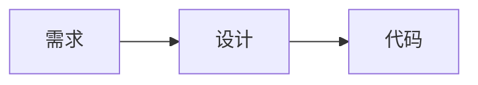
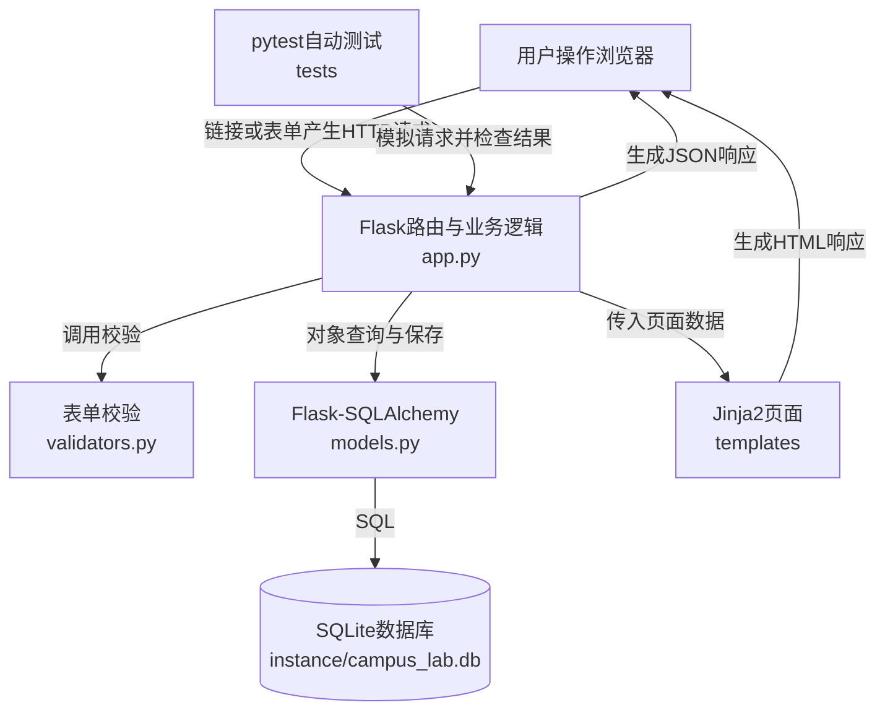
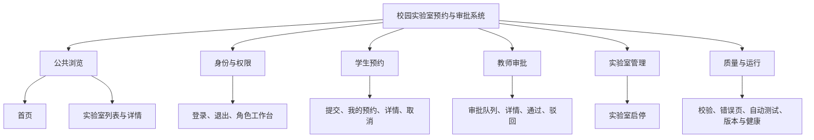
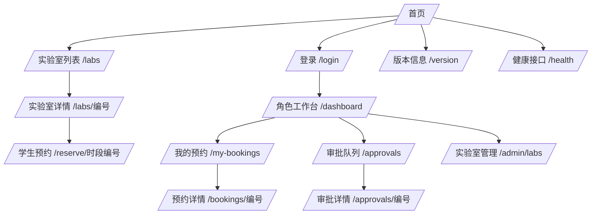
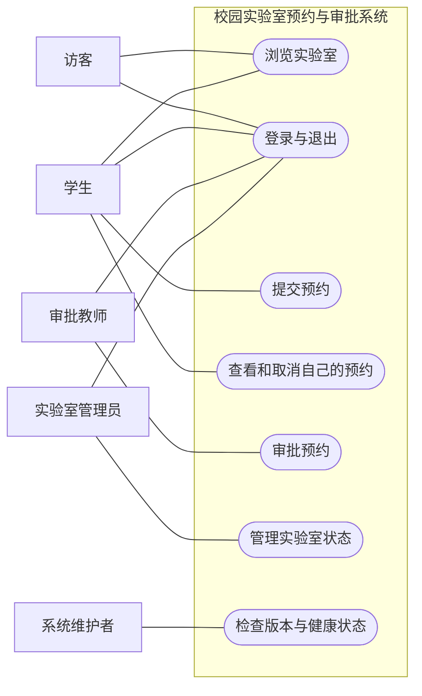
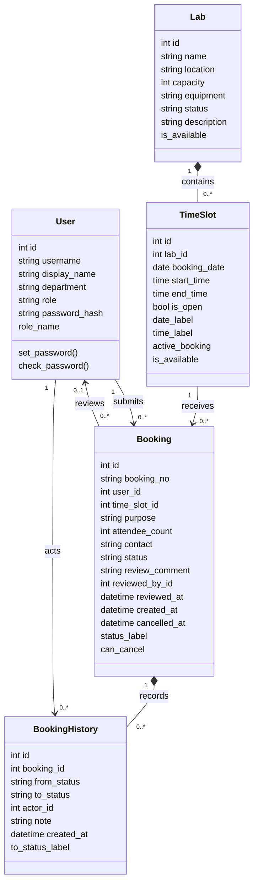
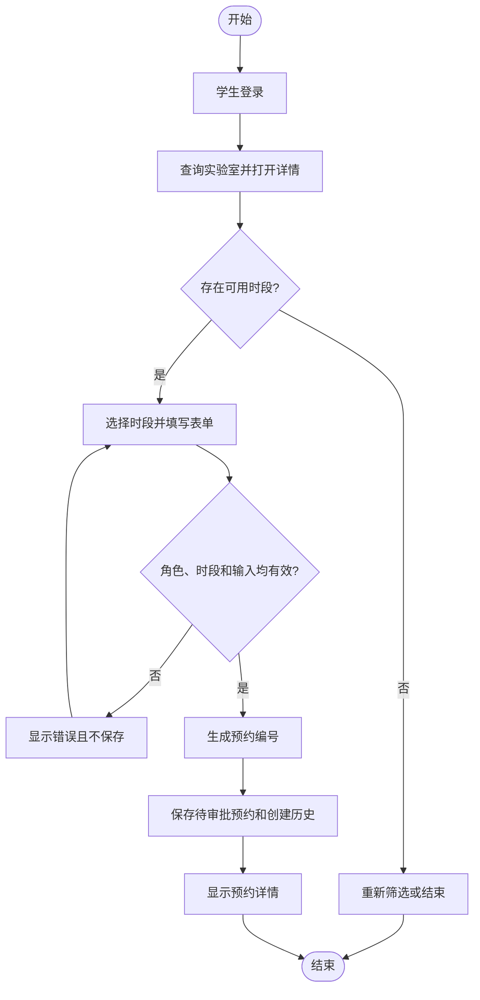
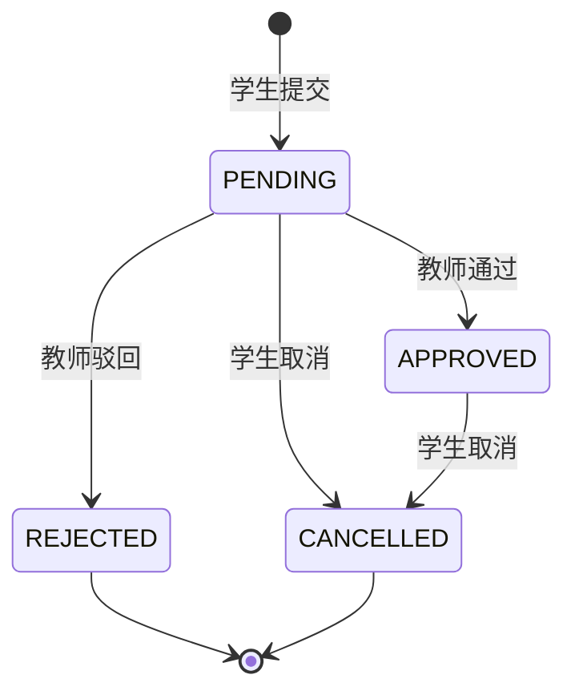
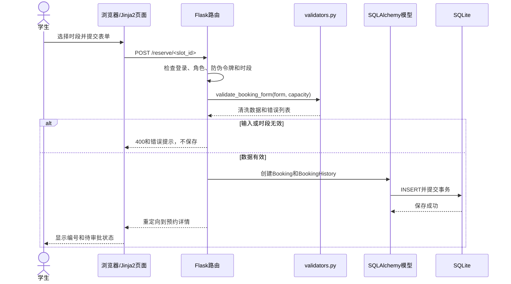

# S05 系统设计与UML建模

## 1. 本章任务

需求分析规定“系统必须做什么”，系统设计开始回答：

> 为了实现这些需求，系统由哪些部分组成，数据怎样组织，页面怎样连接，业务对象怎样协作？

本章使用1课时，完成《学生项目开发记录册》第10—13节。你将使用文本化绘图工具Mermaid构建并理解8张设计图：

1. 技术架构图。
2. 功能模块图和页面导航图（两张）。
3. 简化用例图。
4. 核心类图。
5. 预约活动图。
6. 预约状态图。
7. 提交预约顺序图。

图的源文本可以复制、修改和重新生成。课程关注图是否准确表达系统，不考查颜色、阴影和装饰。

## 2. 需求和设计的边界

| 内容 | 属于需求 | 属于设计 |
| --- | --- | --- |
| 学生能够查看自己的预约 | 是 | 不是 |
| 使用`/my-bookings`作为列表网址 | 不是 | 是 |
| 学生不能查看他人的预约 | 是 | 不是 |
| `Booking.user_id`记录申请人 | 不是 | 是 |
| 系统应保存预约状态历史 | 是 | 不是 |
| 使用`BookingHistory`表保存变化 | 不是 | 是 |

同一需求可以有不同设计方案。设计必须满足需求，但不应把某个技术实现误认为用户的原始需要。

## 3. 本章使用的画图方式

### 3.1 Mermaid是什么

Mermaid用简短文本描述图。例如：

````markdown

````

在支持Mermaid的Markdown查看器中，上述文本会生成三个节点和两条箭头。即使当前编辑器暂时不能渲染，源文本仍然能够提交和检查。

### 3.2 基本操作

1. 打开个人《学生项目开发记录册》。
2. 把本章指定的完整`mermaid`代码块复制到对应章节。
3. 在支持Mermaid的课程讲义查看界面或Markdown预览中观察图。
4. 按操作要求修改一个节点或关系。
5. 确认图仍能生成，并用文字解释它回答的问题。

如果使用图形化绘图软件，也必须保留节点名称、关系和方向；不要只复制一张无法修改的截图。

### 3.3 四种核心UML视角

| 图 | 主要回答的问题 |
| --- | --- |
| 用例图 | 哪类用户使用系统完成什么目标 |
| 活动图 | 一段业务按什么条件和顺序流转 |
| 类图 | 系统保存哪些对象、属性和关系 |
| 顺序图 | 一次请求中各组件按什么先后协作 |

架构图、页面导航图和状态图不是为了凑数量，它们分别补充系统分层、页面入口和对象状态变化。

## 4. 总体技术架构

本项目选择单体、服务器端页面渲染结构。浏览器、应用和数据库均运行在学生自己的电脑上。



### 4.1 每一层的职责

| 层或目录 | 主要职责 | 不应承担的职责 |
| --- | --- | --- |
| 浏览器 | 显示页面、收集输入、发出请求 | 不能作为最终权限判断者 |
| `templates/` | HTML结构、Jinja2数据显示、表单和导航 | 不直接读写数据库 |
| `app.py` | 路由、登录会话、权限、业务流程、响应 | 不保存页面样式 |
| `validators.py` | 清洗并校验预约和审批输入 | 不决定页面导航 |
| `models.py` | 数据表、对象关系和与数据相关的属性 | 不处理浏览器请求 |
| SQLite | 持久保存用户、实验室、时段、预约和历史 | 不生成HTML页面 |
| `tests/` | 构造条件、执行请求、判断实际结果 | 不成为正式业务功能 |

### 4.2 为什么选择这条结构

- 从浏览器到数据库的链路短，便于非计算机专业学生追踪一次请求。
- SQLite是一个本地文件，不需要安装和维护独立数据库服务。
- 页面与路由在同一个Python项目中，32课时内能够完成完整生命周期。
- 仍然保留页面、业务、校验、数据和测试的职责边界，便于理解基本架构思想。

这是一项根据课程条件作出的设计决策，不代表所有软件都应该采用同一结构。

### 操作1：建立架构图

1. 把本节完整架构图复制到记录册第10节。
2. 在图下用不超过100字说明浏览器一次预约请求怎样到达SQLite，再怎样返回页面。
3. 将测试节点的箭头改为指向Flask路由，而不是直接指向数据库。

可见结果：图包含浏览器、模板、Flask、校验、数据模型、SQLite和测试七类节点；箭头能够形成请求与响应链路。

恢复方法：图无法生成时，用本节原始代码块整体替换个人版本，再逐行重新修改。

## 5. 功能模块与源码位置



| 模块 | 主要需求 | 首次完整版本 | 主要源码位置 |
| --- | --- | --- | --- |
| 公共浏览 | REQ-01、REQ-02 | dev-v0.2 | `app.py`、`templates/index.html`、`templates/labs.html`、`templates/lab_detail.html` |
| 身份与权限 | REQ-03、REQ-08 | dev-v0.3，dev-v0.6加固 | `app.py`、`models.py`、`templates/login.html`、`templates/dashboard.html` |
| 学生预约 | REQ-04、REQ-05 | dev-v0.4 | `app.py`、`models.py`、预约相关模板 |
| 教师审批 | REQ-06 | dev-v0.5 | `app.py`、`models.py`、审批相关模板 |
| 实验室管理 | REQ-07 | dev-v1.0 | `app.py`、`templates/admin_labs.html` |
| 质量与运行 | REQ-08—REQ-10 | dev-v0.6、dev-v1.0 | `validators.py`、`tests/`、错误页、`VERSION` |

模块是按职责组织功能，不要求每个模块对应一个Python文件。本项目规模较小，主要路由仍集中在`app.py`，到V0.6才把可独立测试的输入校验提取到`validators.py`。

## 6. 页面与路由导航设计



设计阅读方法：

- 箭头表示主要导航或操作去向，不表示所有浏览器返回路径。
- 路径中的“编号”在程序中写成`<int:lab_id>`、`<int:slot_id>`或`<int:booking_id>`。
- `/health`返回JSON，其他主要入口返回HTML页面。
- V0.1—V0.3中的`/reservations/new`只是静态原型入口；V0.4选择真实时段后改为`/reserve/<int:slot_id>`。

### 操作2：核对模块和页面

1. 把功能模块图复制到记录册第11节上方。
2. 完成第11节六行模块表。
3. 把页面导航图放在表格下方。
4. 用REQ-01—REQ-10逐项检查，确保每条需求至少能在一个模块中找到实现位置。

可见结果：需求、模块、页面三层可以互相追踪；图中不存在当前项目从未实现的“注册”“短信”或“支付”页面。

恢复方法：误加范围外页面时删除对应节点和箭头，再用S04范围表检查。

## 7. 简化用例图

标准UML用例图把角色放在系统边界之外，把用户目标放在边界之内。Mermaid没有独立的用例图语法，本课程用圆角节点表达用例，保留“角色—用例—系统边界”三个关键概念。



用例图不画页面跳转、数据库表和函数。它只回答“谁为了什么目标使用系统”。

### 操作3：构建并解释用例图

1. 把完整代码块复制到记录册第13节“用例图”位置。
2. 找出系统边界内7个用例分别对应哪些REQ编号。
3. 在图下写一句话解释为什么“学生”和“审批教师”都连接登录，却不能连接到对方的核心用例。

可见结果：5类角色位于系统边界外，7个用例位于边界内；角色和用例的连线符合权限要求。

恢复方法：连线改错时，依据S04第5节角色表恢复，不依据页面颜色猜测权限。

## 8. 数据设计与核心类图

最终系统保存五类核心数据对象。

| 实体 | 现实含义 | 关键字段 | 关键关系 |
| --- | --- | --- | --- |
| `User` | 系统用户 | `username`、`display_name`、`department`、`role`、`password_hash` | 一个学生可提交多条预约；用户也可作为审批人或历史操作人 |
| `Lab` | 一间实验室 | `name`、`location`、`capacity`、`equipment`、`status`、`description` | 一间实验室包含多个开放时段 |
| `TimeSlot` | 某实验室的一个日期和时间段 | `lab_id`、`booking_date`、`start_time`、`end_time`、`is_open` | 属于一间实验室，可关联多条历史预约 |
| `Booking` | 学生的一次预约申请 | `booking_no`、`user_id`、`time_slot_id`、`purpose`、`attendee_count`、`contact`、`status` | 属于一个学生和一个时段，可有多条状态历史 |
| `BookingHistory` | 一次预约状态变化 | `booking_id`、`from_status`、`to_status`、`actor_id`、`note`、`created_at` | 属于一条预约，并记录操作人 |

### 8.1 核心类图



### 8.2 怎样阅读数量关系

- `Lab "1" *-- "0..*" TimeSlot`：一间实验室可以包含零个或多个时段，一个时段只属于一间实验室。
- `User "1" --> "0..*" Booking`：一名学生可以提交多条预约，每条预约有且只有一个申请人。
- `Booking "1" *-- "0..*" BookingHistory`：一条预约可以产生多次状态记录，历史依附于预约。
- `reviewed_by_id`允许为空，因为刚提交的待审批预约还没有审批人。

类图不是数据库建表语句，但本项目类和数据表高度对应，因此字段名直接采用最终源码名称。请特别注意实体名是`TimeSlot`，不是`LabSlot`。

### 操作4：建立数据表和类图

1. 填写记录册第12节五个实体。
2. 把类图复制到第13节“类图”位置。
3. 在图中找到支持RULE-02、RULE-04和RULE-06的类及关系。
4. 在图下写出`Booking.status`与`BookingHistory.to_status`的区别。

可见结果：类图中恰有5个核心类，关系与上表一致，字段使用最终源码名称。

恢复方法：类图无法生成时先检查每个`class`的大括号是否成对，再用本节完整代码覆盖恢复。

## 9. 预约活动图

活动图强调流程、判断和分支。



这里必须有失败分支。若删除两个判断节点，这张图就不能表达REQ-08和RULE-02、RULE-03。

## 10. 预约状态图

状态图描述一个`Booking`对象可以从什么状态变成什么状态。



最终系统使用四个英文状态值：

| 状态值 | 页面文字 | 允许的下一步 |
| --- | --- | --- |
| `PENDING` | 待审批 | 教师通过、教师驳回、学生取消 |
| `APPROVED` | 已通过 | 学生取消 |
| `REJECTED` | 已驳回 | 无 |
| `CANCELLED` | 已取消 | 无 |

不存在“已通过再次审批”“已驳回再改为通过”的箭头，这正是系统阻止重复审批的设计依据。

### 操作5：建立活动图和状态图

1. 把活动图和状态图复制到记录册第13节。
2. 在活动图中标出哪个判断失败会导致400、哪个角色错误会导致403。
3. 根据状态图回答：为什么取消一条已通过预约后，对应时段可以重新开放。

可见结果：活动图有成功与失败路径；状态图只有源码允许的5条状态转换。

恢复方法：如果误加状态转换，用本节状态表逐行恢复，不要根据个人设想新增“撤回审批”等范围外功能。

## 11. 提交预约顺序图

顺序图按从上到下的时间顺序显示一次请求中各组件的协作。



顺序图与架构图的区别：架构图说明长期存在的组成关系；顺序图说明“一次提交预约”发生时的先后消息。

### 操作6：建立顺序图

1. 把顺序图复制到记录册第13节。
2. 在图下列出“服务端校验发生在保存数据库之前”的两个证据。
3. 说明失败分支为什么不能执行`INSERT`。

可见结果：从学生到SQLite再回到页面的顺序完整，成功与失败分支清楚。

恢复方法：如果箭头顺序改乱，按照“请求—校验—保存—响应”四阶段恢复。

## 12. 设计与需求追踪检查

| 需求 | 关键设计证据 |
| --- | --- |
| REQ-01、REQ-02 | 公共浏览模块、首页/列表/详情导航、`Lab`与`TimeSlot` |
| REQ-03 | 身份与权限模块、`User.role`、角色与用例关联 |
| REQ-04、REQ-05 | 学生预约模块、活动图、`Booking`及状态图 |
| REQ-06 | 教师审批模块、`reviewed_by_id`、状态转换与历史 |
| REQ-07 | 实验室管理模块、`Lab.status`、实验室与有效预约关系 |
| REQ-08 | 校验组件、权限检查、顺序图失败分支和错误响应 |
| REQ-09 | `tests/`节点、可独立校验函数和端到端协作 |
| REQ-10 | 单机部署结构、`VERSION`、版本页和健康接口 |

如果一条需求在所有设计图中都找不到位置，设计可能遗漏；如果图中出现没有需求来源的复杂模块，可能超出范围。

### 操作7：完成设计记录

在记录册第13节表格中，为用例图、活动图、类图和顺序图分别填写：

- 图所在位置。
- 这张图回答的问题。
- 它支持的REQ编号。

保存并重新打开记录册，确认所有Mermaid代码围栏成对，没有把图放进上一个代码块内部。

本操作不修改业务源码；记录册损坏时使用教学资源空模板恢复结构，再迁移已完成内容。

## 13. 一课时课堂推进

```text
0—5分钟：区分需求与设计，认识四类UML视角
5—12分钟：复制并解释总体架构图
12—19分钟：完成模块与页面导航图
19—25分钟：构建简化用例图
25—33分钟：核对五个实体并构建类图
33—39分钟：构建预约活动图和状态图
39—43分钟：构建提交预约顺序图
43—45分钟：执行需求—设计追踪检查
```

课时结束标志：记录册第10—13节完成；能够用不同图回答“谁使用、系统有什么、数据是什么、流程怎样走、组件怎样协作”。

## 14. 本章练习

### 练习1：选择正确的图

为下面问题选择最合适的图：

1. “学生和审批教师分别能做什么？”
2. “预约从待审批可以变成哪些状态？”
3. “一次提交中校验和数据库保存谁先发生？”
4. “实验室和时段是什么数量关系？”

本练习不修改代码；无需恢复。

### 练习2：发现错误关系

某类图写成“一条`Booking`属于多名学生”。说明它与哪条需求或规则冲突，并写出正确数量关系。

本练习只修改个人设计图；恢复时使用本章第8节核心类图。

### 练习3：补充失败路径

假设活动图只有“填写—保存—成功”。补充“人数超过实验室容量”的判断、错误结果和返回位置。

本练习只修改个人活动图；恢复时使用本章第9节原图。

### 练习4：追踪一个字段

从RULE-05出发，说明为什么类图中的`Booking`需要`review_comment`、`reviewed_by_id`和`reviewed_at`三个字段。

本练习不修改代码；无需恢复。

### 练习5：判断设计变更影响

如果把SQLite改成独立MySQL服务器，指出架构图、部署条件、环境文档和可行性结论中至少哪些内容必须同步修改。

本练习不修改代码；无需恢复。

## 15. 本章完成检查

只有以下项目全部通过，才进入S06《从S0到dev-v0.1：静态原型》。

- [ ] 我能区分需求和设计。
- [ ] 架构图包含浏览器、模板、Flask、校验、模型、SQLite和测试。
- [ ] 每个模块都能追踪到REQ编号和首次实现版本。
- [ ] 页面导航图只包含项目实际规划的入口。
- [ ] 用例图中角色在系统边界外、用户目标在边界内。
- [ ] 数据设计使用`User`、`Lab`、`TimeSlot`、`Booking`和`BookingHistory`五个准确名称。
- [ ] 类图的申请人、时段、审批人和历史关系正确。
- [ ] 活动图同时包含成功和失败路径。
- [ ] 状态图只有允许的5条状态转换。
- [ ] 顺序图在数据库保存之前完成权限、时段和输入校验。
- [ ] 四类UML图都能正常生成或保留完整可检查的Mermaid源文本。
- [ ] 需求—设计追踪表没有遗漏REQ-01—REQ-10。
- [ ] 本章没有修改业务源码，也没有建立版本标签。
